# 04 — System Architecture

**Document:** System Architecture Specification
**Project:** Reliability-First AI Gateway
**Status:** Living document (v1.0) — **binding architectural blueprint**
**Audience:** Engineering Leadership, Architects, Enterprise Customers, Auditors, Investors, Future Engineering Teams
**Classification:** Internal — Architecture Standard
**Builds on (approved, frozen):** `00-Project-Vision.md`, `01-Problem-Statement.md`, `02-Business-Requirements.md`, `03-Non-Functional-Requirements.md`

> **Authority and scope.** This document defines the complete high-level architecture. Every future module must conform to it. It stays at the **system-architecture level**: components, boundaries, responsibilities, interactions, data-flow, and evolution. It does **not** define code, classes, interface/API surface, or package structures — those are the province of module-level design documents that must, in turn, conform to this one. Every material architectural decision references the NFR(s) from `03` (as `NFR-*`), the business requirement(s) from `02` (as `BR-*`), and/or the problem(s) from `01` (as `PRB-*`) it satisfies. Where trade-offs exist, alternatives are compared and the choice justified.
>
> **Diagram convention.** Diagrams use the C4 model (Context → Container → Component) and UML-style sequences, rendered in Mermaid so they display in-repo. They are architectural, not implementation, artifacts.

---

## Table of Contents

1. Executive Summary · 2. Architecture Vision · 3. Architectural Goals · 4. Architectural Constraints · 5. Guiding Principles · 6. System Context Diagram · 7. Enterprise Context · 8. External Systems · 9. Internal Systems · 10. Container Diagram · 11. Component Diagram · 12. Layered Architecture · 13. Service Boundaries · 14. Domain Boundaries · 15. Bounded Contexts · 16. Request Lifecycle · 17. Streaming Lifecycle · 18. Structured Output Lifecycle · 19. Tool Calling Lifecycle · 20. Provider Routing Lifecycle · 21. Retry Lifecycle · 22. Cache Lifecycle · 23. Authentication Flow · 24. Authorization Flow · 25. Configuration Flow · 26. Secret Management Flow · 27. Event Architecture · 28. Messaging Strategy · 29. Plugin Architecture · 30. SDK Architecture · 31. REST API Strategy · 32. Admin Portal Architecture · 33. Multi-Tenant Architecture · 34. Deployment Architecture · 35. Multi-Region Strategy · 36. Disaster Recovery Architecture · 37. Scalability Strategy · 38. Security Architecture · 39. Observability Architecture · 40. Logging Architecture · 41. Metrics Architecture · 42. Tracing Architecture · 43. Audit Architecture · 44. Storage Strategy · 45. Database Strategy · 46. In-Memory / Cache Tier Strategy · 47. Queue Strategy · 48. Object/File Storage Strategy · 49. Configuration Management · 50. Versioning Strategy · 51. Backward Compatibility · 52. Upgrade Strategy · 53. Plugin Extension Points · 54. Future Module Strategy · 55. Architecture Decision Summary · 56. Risks · 57. Alternatives Considered · 58. Open Questions · 59. Architecture Principles Checklist · 60. Traceability Matrix

---

## 1. Executive Summary

The Reliability-First AI Gateway is an enterprise control plane positioned between enterprise applications and any number of AI model providers. Its architecture must deliver the guarantees that the frozen documents promise: reliability, provider independence, security, governance, observability, compliance, streaming correctness, structured-output correctness, and enterprise scalability — while adding minimal, bounded overhead to the request path.

The architecture is organized around one dominant structural decision that determines everything else: a strict separation between a **stateless Data Plane** that processes every request on the hot path, and a **Control Plane** that manages configuration, policy, identity, secrets, tenancy, observability storage, audit, and administration off the hot path. This separation is the same pattern proven at scale by edge and service-mesh platforms, and it is what allows the gateway to be simultaneously extremely available (`NFR-AV-001`), low-overhead (`NFR-PERF-001`), horizontally scalable (`NFR-SCALE-001`), and independently operable and upgradable (`NFR-UPG-001`).

Within the Data Plane, the request path is a pipeline of single-responsibility stages — ingress, authentication, authorization/policy enforcement, routing, provider invocation through adapters, reliability handling, correctness enforcement (structured output, streaming, tool calls), accounting, and telemetry emission. The pipeline is designed so that each stage's latency is individually budgeted (`NFR-LAT-001`) and each correctness and safety invariant is enforced by a dedicated stage that cannot be bypassed (BRULE-2). Provider-specific differences are absorbed entirely at the edge of the domain, in **Provider Adapters** — the classic ports-and-adapters (hexagonal) boundary — so that the gateway's core domain is provider-agnostic (`BR-006`, `PRB-007`).

The architecture is Domain-Driven: it is decomposed into bounded contexts (Identity & Access, Governance, Routing & Provider Integration, Reliability, Correctness, Accounting, Observability & Audit, Secrets & Configuration, Extensibility, and Control/Administration), each owning its model and exposing explicit boundaries. It is event-driven for everything off the hot path (telemetry, audit, accounting, analytics), so that observability and audit completeness (`NFR-OBS-001`, `NFR-AUD-001`) are achieved without adding synchronous latency to requests. It is zero-trust internally: no component implicitly trusts another; identity, authorization, and encryption apply between components as well as at the edge (`NFR-AUTH-001`, `NFR-AUTHZ-001`, `NFR-ENC-001`). It is plugin-extensible at defined extension points that can never weaken core guarantees (`BR-029`, BRULE-2). And it is designed for multi-region, multi-tenant operation with strong isolation and residency enforcement (`NFR-REL-002`, `NFR-MR-001`).

This document specifies the components, their responsibilities and failure modes, the boundaries between them, the lifecycles of the critical flows, the deployment and data strategies, the extension model, and the ten-year evolution path. It is the reference against which every subsequent module design is reviewed.

---

## 2. Architecture Vision

The architecture exists to make one thing true: **that placing the gateway on the request path always increases reliability, control, and safety, and never becomes the weakest link.** Concretely, the architecture is designed so that:

- The gateway's own availability and correctness **exceed** those of the systems it fronts (`NFR-AV-001`, `NFR-REL-001`), so it is never the reason a request fails.
- Provider heterogeneity and instability are **absorbed** at a single boundary, so applications depend on a stable, neutral contract (`BR-006`, `BR-007`).
- Correctness of output structure, streaming, and tool calls is **enforced** by dedicated, non-bypassable stages, so a probabilistic model never silently corrupts enterprise data (`NFR-SO-001`, `NFR-STRM-001`, `NFR-SO-003`, BRULE-1).
- Governance, security, and compliance are **enforced at the boundary** with no bypass path, so control is real, not advisory (`BR-015`, `NFR-AUTHZ-001`, BRULE-2).
- Everything is **observed and recorded** as a side-effect of the architecture, not as an add-on, so audit and debugging are always possible (`NFR-OBS-001`, `NFR-AUD-001`).
- The platform **scales, fails over, upgrades, and evolves** without customer disruption, so it can be trusted as long-lived infrastructure (`NFR-SCALE-001`, `NFR-FO-001`, `NFR-UPG-001`).

The vision is an architecture whose shape *is* the reliability guarantee — where correctness and control are structural properties, not features that could be turned off or coded around.

---

## 3. Architectural Goals

| Goal | Description | Primary NFR/BR |
|---|---|---|
| G-1 Reliability supremacy | Gateway reliability and correctness exceed the systems it fronts | NFR-AV-001, NFR-REL-001/002/003 |
| G-2 Low, bounded overhead | Hot path adds minimal, budgeted latency and resource cost | NFR-PERF-001/002, NFR-LAT-001 |
| G-3 Provider independence | Core domain is provider-agnostic; differences isolated in adapters | BR-006, PRB-007 |
| G-4 Enforced correctness | Structured output, streaming, tool-call integrity enforced structurally | NFR-SO-*, NFR-STRM-001 |
| G-5 Enforced governance & security | Central policy, zero-trust, no bypass | BR-015, NFR-AUTHZ-001, BRULE-2 |
| G-6 Total observability & audit | Complete, correlated, audit-grade records by construction | NFR-OBS-001, NFR-AUD-001 |
| G-7 Horizontal scalability | Near-linear scale-out; no single point of failure | NFR-SCALE-001, NFR-HA-001 |
| G-8 Multi-tenant isolation | Absolute data/quota isolation between tenants | NFR-REL-002, BRULE-7 |
| G-9 Multi-region & residency | Regional continuity and residency confinement | NFR-MR-001, NFR-DR-001 |
| G-10 Safe evolvability | Backward-compatible, non-disruptive upgrade and extension | NFR-VER-001, NFR-UPG-001, BR-029 |

---

## 4. Architectural Constraints

Constraints are inherited from the frozen documents and are non-negotiable inputs to design.

- **C-1 — Invariants are absolute.** Isolation, no-silent-delivery, audit integrity, secret non-exposure, sensitive-data protection, residency confinement, and no-authz-bypass have zero error budget and apply at all tiers (`03` Appendix D, BRULE-1/2/5/7).
- **C-2 — Neutrality.** No structural favoring of any provider (BRULE-4, OOS-7).
- **C-3 — No bypass.** No supported path may weaken reliability, security, or governance (BRULE-2, OOS-8).
- **C-4 — Latency budget.** The hot path must fit within the added-latency budgets (`NFR-PERF-001`, `NFR-LAT-001`).
- **C-5 — Tiering.** Guarantees differ by service tier, but invariants do not (`03` Section 64).
- **C-6 — Statelessness on the hot path.** Data-plane request processing must be stateless to satisfy scalability, elasticity, and HA (`NFR-SCALE-001`, `NFR-ELAS-001`, `NFR-HA-001`).
- **C-7 — Transparency of limits.** Where guarantees are probabilistic (grounding, injection defense), architecture must expose, not hide, residual risk (BRULE-9, OOS-6).
- **C-8 — Deployment flexibility.** Must support the deployment models regulated customers require (`BR-031`, `NFR-MR-001`).

---

## 5. Guiding Principles

The mandated design principles, and how the architecture realizes each:

- **Cloud Native** — containerized, orchestrated, immutable, horizontally scaled, declarative config (`NFR-SCALE-001`, `NFR-DEP-001`).
- **Domain-Driven Design** — bounded contexts with explicit models and boundaries (Sections 14–15).
- **Hexagonal (Ports & Adapters)** — provider-agnostic core; providers, datastores, identity providers, and notification sinks are adapters behind ports (Sections 13, 19). This is the structural basis of provider independence (`BR-006`).
- **SOLID** — single-responsibility stages, dependency inversion at ports, extensibility without core modification (open/closed via plugins, Section 29).
- **Stateless** — hot-path components hold no per-request durable state; state lives in the control plane / data tier (C-6).
- **Event-Driven** — off-hot-path concerns (telemetry, audit, accounting, analytics) are event streams (Sections 27–28), so observability adds no synchronous latency.
- **API-First** — every capability is exposed through explicit, versioned contracts (data-plane request contract, admin/control contract), designed before implementation (Section 31, 50–51).
- **Plugin Architecture** — defined extension points with guarantee-preserving sandboxing (Sections 29, 53).
- **Zero Trust** — mutual authentication, least-privilege authorization, and encryption between all components; no implicit trust (Section 38, `NFR-AUTH/AUTHZ/ENC`).
- **High Availability** — no single point of failure; zone/region redundancy (Sections 34–36, `NFR-HA-001`).
- **Horizontal Scaling** — stateless scale-out; shared-nothing hot path (Section 37).
- **Provider Agnostic** — see Hexagonal (C-2, `BR-006`).
- **Immutable Infrastructure** — no in-place mutation; replace-not-patch deployments (Section 52, `NFR-UPG-001`).
- **Loose Coupling / High Cohesion** — contexts communicate via explicit contracts and events; each context is internally cohesive (Sections 13–15, 27).
- **Backward Compatibility** — versioned contracts, deprecation discipline (Sections 50–51, `NFR-VER-001`).

---

## 6. System Context Diagram

The gateway sits between enterprise applications and providers, surrounded by the enterprise's identity, networking, observability, and governance systems.

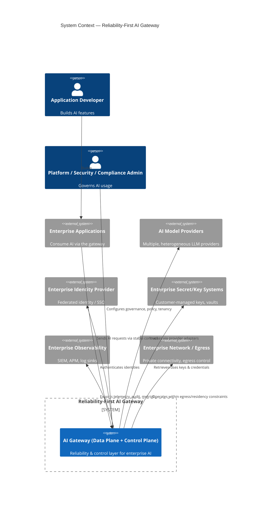

**Boundary decisions.** Applications and their end-user experience are outside the boundary (OOS-3). Providers and their internals are outside (we route around them, we do not control them; `03` EP-3). Enterprise identity, secrets, observability sinks, and networking are integrated-with, not owned — the gateway federates to them (`BR-021`, `BR-026`, `NFR-OBS-001`). Everything that enforces reliability, correctness, governance, and observability at the boundary is **inside**.

---

## 7. Enterprise Context

The gateway is deployed into an enterprise's operating environment and must fit its constraints:

- **Identity** — federates to the enterprise IdP for user/service identity; does not become a competing identity source (`BR-021`).
- **Networking** — operates within private connectivity, controlled egress, and regional routing; never assumes open public egress (`BR-026`, `NFR-NET-001`, `PRB-017`).
- **Observability** — exports to the enterprise's existing SIEM/APM/log platforms in addition to its own stores, so the gateway augments rather than replaces enterprise observability (`NFR-OBS-001`).
- **Governance** — the enterprise's platform/security/compliance functions author policy that the gateway enforces (`BR-015`, `BR-016`).
- **Compliance** — the gateway provides controls and evidence; the enterprise owns its compliance posture (COMP-7, OOS-5).

The gateway is therefore a **good citizen** of the enterprise: it federates, exports, and enforces, rather than replacing existing systems.

---

## 8. External Systems

| External System | Relationship | Integration Boundary | Key Constraint |
|---|---|---|---|
| Enterprise Applications | Consumers | Stable request contract + SDKs (Sections 30–31) | Backward compatibility (NFR-VER-001) |
| AI Model Providers | Upstreams | Provider Adapters (port/adapter) | Neutrality, semantic absorption (BR-006) |
| Identity Provider (SSO/federation) | Trust anchor | Authentication adapter | Zero trust, standards-based (NFR-AUTH-001) |
| Secret/Key Management (incl. customer-managed keys) | Key source | Secret adapter | Non-exposure, rotation (NFR-SEC-SM-001, NFR-ENC-001) |
| Enterprise Observability (SIEM/APM) | Telemetry sink | Export adapters | Governed export, no leakage (NFR-LOG-001) |
| Enterprise Network/Egress | Environment | Deployment/networking | Egress control, residency (NFR-NET-001) |

All external integrations are **adapters** behind ports (hexagonal), so the core is insulated from each external system's specifics and each can be swapped or extended without touching the core (`BR-006`, `BR-007`).

---

## 9. Internal Systems

The internal architecture is two planes:

- **Data Plane (hot path, stateless):** processes every request. Ingress, Identity, Authorization/Policy Enforcement, Router, Provider Adapters, Reliability Engine, Streaming Engine, Correctness Engines (structured output, tool-call), Accounting Emitter, Telemetry Emitter, Cache access. Optimized for latency and correctness (`NFR-PERF-*`, `NFR-SO-*`).
- **Control Plane (management, stateful):** manages everything off the hot path. Configuration & Policy service, Policy Decision distribution, Identity/Tenant management, Secret/Credential management, Observability backend, Audit store & service, Accounting/Cost service, Admin portal, Plugin registry, Analytics. Optimized for correctness, durability, governance (`NFR-AUD-001`, `NFR-COMP-001`).

The two planes communicate asynchronously and via cached, versioned configuration snapshots, so **control-plane unavailability does not stop the data plane** (it degrades gracefully to last-known-good config), a key availability decision (`NFR-AV-001`, EP-10).

---

## 10. Container Diagram

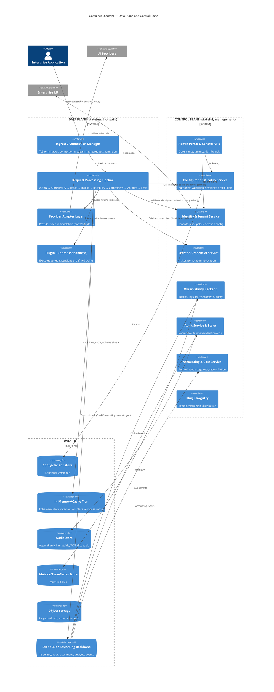

**Key container decisions and their justifications:**

- **Data plane pulls *cached, versioned* config/identity/secret snapshots** rather than calling the control plane per request → keeps hot-path latency low and decouples availability (`NFR-PERF-001`, `NFR-AV-001`). Trade-off: bounded propagation delay for config changes, accepted and made explicit (Section 25).
- **All off-hot-path outputs go to an event bus asynchronously** → observability/audit/accounting completeness without synchronous latency (`NFR-OBS-001`, `NFR-AUD-001`, `NFR-LAT-001`). Trade-off: eventual-consistency of dashboards, acceptable; audit uses at-least-once + durability to guarantee zero loss (`NFR-AUD-001`, Section 47).
- **Polyglot data tier by data class** → each data class gets the store matched to its access and durability needs (Section 44).

---

## 11. Component Diagram

The Data Plane request pipeline decomposed into single-responsibility components (each is a stage; order is the request path).

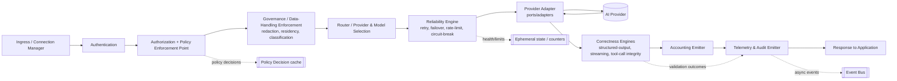

Components receiving the full specification template (Section: *For Every Major Component*) are: Ingress, Authentication, Authorization & Policy Enforcement, Governance/Data-Handling, Router, Reliability Engine, Provider Adapter Layer, Correctness Engines (structured-output, streaming, tool-call), Accounting, Observability/Telemetry & Audit Emission, Secret & Credential Service, Configuration & Policy Service, Plugin Runtime, and Control-Plane Admin. These specifications appear inline in Sections 13–43 where each component's lifecycle and boundary are discussed, and are summarized in the Traceability Matrix (Section 60).

---

## 12. Layered Architecture

The system is layered to enforce dependency direction (dependencies point inward, per hexagonal/clean architecture):

```
┌──────────────────────────────────────────────────────────────┐
│  L5  Delivery / Adapters (outer)                               │
│      Ingress, Provider Adapters, Identity Adapter, Export      │
│      Adapters, Secret Adapter, SDKs, Admin/Control APIs        │
├──────────────────────────────────────────────────────────────┤
│  L4  Application Services (use cases / orchestration)          │
│      Request pipeline orchestration, reliability orchestration,│
│      correctness orchestration, accounting, governance apply   │
├──────────────────────────────────────────────────────────────┤
│  L3  Domain (provider-agnostic core)                           │
│      Routing policy, reliability policy, correctness rules,    │
│      governance model, accounting model, tenancy & isolation   │
├──────────────────────────────────────────────────────────────┤
│  L2  Cross-cutting (zero-trust, observability, config)         │
│      Identity/authz primitives, telemetry, audit, config,      │
│      secrets — available to all layers via ports               │
├──────────────────────────────────────────────────────────────┤
│  L1  Platform (cloud-native runtime, data tier)                │
│      Orchestration, storage, cache tier, event bus, network    │
└──────────────────────────────────────────────────────────────┘
```

**Rule:** the Domain (L3) has **no dependency on any provider, datastore, or framework** — those are reached only through ports implemented by adapters in L5 (`BR-006`, SOLID dependency inversion). This is what makes provider independence and technology-neutrality structural rather than aspirational, and what allows adapters and stores to evolve without touching the core (`NFR-VER-001`, G-10).

---

## 13. Service Boundaries

Boundaries are drawn so that each service is independently deployable, scalable, and ownable, with communication only through explicit contracts.

- **Data-Plane services** are boundary-drawn by *stage responsibility* but co-located on the hot path for latency (a single logical pipeline, deployed as a scalable unit) — because splitting the hot path into many network-hopping microservices would violate the latency budget (`NFR-LAT-001`). This is a deliberate departure from naive microservice decomposition, justified in Section 57.
- **Control-Plane services** are separate, independently scalable services (Config/Policy, Identity/Tenant, Secret, Observability, Audit, Cost, Admin, Registry), because they have different scaling, durability, and availability profiles and must be independently upgradable (`NFR-UPG-001`, `NFR-SCALE-001`).
- **Ports** define the boundary between the domain and the outside: Provider port, Identity port, Secret port, Persistence ports, Telemetry/Audit sink port, Notification port. Adapters implement them.

**Boundary invariant:** cross-boundary communication is authenticated, authorized, and encrypted (zero trust, Section 38); no boundary exposes a bypass of correctness/governance (BRULE-2).

---

## 14. Domain Boundaries

The problem domain is partitioned into cohesive areas, each owning a distinct concern and vocabulary:

1. **Identity & Access** — who is calling, what they may do, tenant isolation.
2. **Governance** — policy definition and enforcement over traffic and data.
3. **Routing & Provider Integration** — provider/model selection and neutral invocation.
4. **Reliability** — retry, failover, rate limiting, circuit breaking.
5. **Correctness** — structured output, streaming integrity, tool-call integrity.
6. **Accounting & Cost** — authoritative usage/cost measurement.
7. **Observability & Audit** — telemetry and audit-grade records.
8. **Secrets & Configuration** — credential and config lifecycle.
9. **Extensibility** — plugins and SDKs.
10. **Administration** — tenancy, control, dashboards.

Each maps to a bounded context (Section 15) and to problem families from `01` and requirement domains from `02`.

---

## 15. Bounded Contexts

| Bounded Context | Core Model (vocabulary) | Owns | Boundary Type | Maps To |
|---|---|---|---|---|
| Identity & Access | Principal, Tenant, Role, Scope, Session | AuthN/AuthZ, isolation | Upstream to all (shared kernel for identity) | BR-021, NFR-AUTH/AUTHZ-001 |
| Governance | Policy, Rule, DataClass, Decision | Policy authoring & enforcement | Upstream to pipeline | BR-015/016, PRB-016 |
| Routing & Provider Integration | Route, ProviderProfile, ModelProfile, Health | Selection & neutral invocation | Ports/adapters to providers | BR-006, PRB-007 |
| Reliability | Attempt, Budget, CircuitState, Backoff | Retry/failover/limit/break | Wraps invocation | BR-003/004, NFR-FO/RTY |
| Correctness | Schema, Conformance, StreamSegment, ToolCall | Validation, repair, integrity | Post-invocation gate | BR-001/002, NFR-SO/STRM |
| Accounting & Cost | UsageEvent, CostModel, Attribution, Budget | Metering & reconciliation | Event producer | BR-012/013, NFR-COST-001 |
| Observability & Audit | Telemetry, Trace, AuditRecord, SLI | Records & evidence | Event consumer/store | NFR-OBS/AUD-001 |
| Secrets & Configuration | Secret, ConfigSnapshot, Version | Lifecycle & distribution | Control-plane service | NFR-SEC-SM/CFG-001 |
| Extensibility | Plugin, ExtensionPoint, Capability | Vetting & execution | Sandbox host | BR-029, Section 29 |
| Administration | Account, Dashboard, ControlAction | Tenancy & control | Control-plane service | BR-015, Section 32 |

**Context mapping:** Identity & Access is a *shared kernel* (identity is used everywhere). Governance is *upstream* of the pipeline (decisions flow down). Correctness is a *downstream gate* on Routing output. Observability & Audit is a *conformist consumer* of events from all contexts. This mapping keeps coupling explicit and directional (loose coupling / high cohesion).

---

## 16. Request Lifecycle

The canonical non-streaming request. Each stage is budgeted (`NFR-LAT-001`) and each safety/correctness stage is non-bypassable (BRULE-2).

```mermaid
sequenceDiagram
  autonumber
  participant App as Application
  participant In as Ingress
  participant Au as Authentication
  participant Az as Authorization/Policy (PEP)
  participant Gv as Governance/Data-Handling
  participant Rt as Router
  participant Re as Reliability Engine
  participant Pa as Provider Adapter
  participant Pr as Provider
  participant Co as Correctness Engine
  participant Ac as Accounting
  participant Em as Telemetry/Audit Emitter

  App->>In: Request (mTLS, stable contract)
  In->>In: TLS terminate, admit, assign request identity
  In->>Au: Admitted request
  Au->>Au: Authenticate (federated), attribute principal/tenant
  Au->>Az: Authenticated request
  Az->>Az: Authorize (deny-by-default), evaluate policy (cached decisions)
  Az->>Gv: Authorized request
  Gv->>Gv: Classify data, apply redaction, set residency constraints
  Gv->>Rt: Governed request
  Rt->>Rt: Select provider/model per policy, health, cost, residency
  Rt->>Re: Routing decision
  Re->>Pa: Invoke (with retry/limit/circuit policy)
  Pa->>Pr: Provider-native call (within egress/residency)
  Pr-->>Pa: Provider response
  Pa-->>Re: Neutralized response
  Re-->>Co: Response (or failover/retry outcome)
  Co->>Co: Validate structure/tool-calls; repair-or-reject per policy (recorded)
  Co->>Ac: Correct, accounted-ready response
  Ac->>Ac: Measure tokens/cost authoritatively, attribute
  Ac->>Em: Emit telemetry + audit + accounting events (async)
  Em-->>App: Response (or explicit, recorded failure)
```

**Lifecycle guarantees:** every request is authenticated (`NFR-AUTH-001`), authorized deny-by-default (`NFR-AUTHZ-001`), governed for data handling/residency (`BR-018`, `NFR-MR-001`), correctness-checked before delivery (`NFR-SO-001`, BRULE-1), authoritatively accounted (`NFR-COST-001`), and fully recorded (`NFR-OBS-001`, `NFR-AUD-001`). No stage can be skipped for a protected request (C-3).

---

## 17. Streaming Lifecycle

Streaming requires integrity across fragments and correct handling of mid-stream failure without buffering the whole response (`NFR-STRM-001`, `NFR-PERF-002`).

```mermaid
sequenceDiagram
  autonumber
  participant App
  participant In as Ingress (stream mgr)
  participant Re as Reliability Engine
  participant Pa as Provider Adapter
  participant Pr as Provider
  participant St as Streaming Engine
  participant Em as Emitter

  App->>In: Streaming request
  In->>Re: Admitted (auth/authz/gov already applied)
  Re->>Pa: Invoke streaming
  Pa->>Pr: Native stream open
  loop Each fragment
    Pr-->>Pa: Fragment (token/tool-call segment)
    Pa-->>St: Neutralized fragment
    St->>St: Reassemble, verify ordering & integrity, reconstruct tool-calls
    St-->>App: Forward validated fragment (low added jitter)
    St-->>Em: Emit incremental telemetry (async)
  end
  alt Mid-stream failure
    Pr-->>Pa: Error / truncation
    Pa-->>St: Failure signal
    St-->>App: Surface explicit error (never silent truncation)
    St-->>Em: Record failure event
  else Clean completion
    Pr-->>Pa: End of stream
    St-->>App: Finalize; integrity verified
    St->>Em: Emit final accounting + audit
  end
```

**Streaming decisions:** fragments are forwarded incrementally (no full-response buffering) to meet first-token and jitter budgets (`NFR-PERF-002`); integrity is verified as fragments pass through, and any mid-stream failure is **surfaced explicitly and recorded**, never silently truncated (`NFR-STRM-001`, BRULE-1). Long-lived stream connections are managed with strict resource lifecycle to prevent leaks (`NFR-CONC-001`, `PRB-020`).

---

## 18. Structured Output Lifecycle

Enforces conformance with near-zero escape, distinguishing detection (owned) from post-enforcement success (partly model-bounded) per `NFR-SO-001/002`.

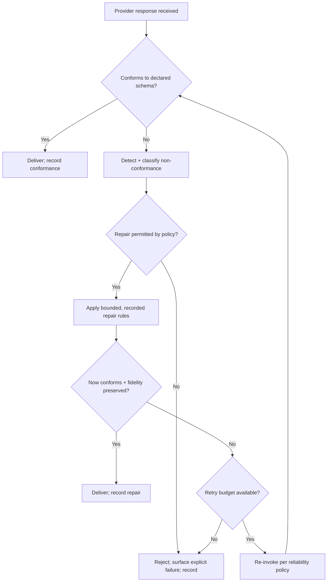

**Guarantees:** detection ≥ 99.99%, escape ≤ 0.01% (`NFR-SO-001`); repair never changes semantics beyond recorded rules (BRULE-1/9); where repair/retry is disallowed, the gateway guarantees *explicit failure*, not silent delivery (`NFR-REL-003`). Post-enforcement success is measured and attributed transparently (`NFR-SO-002`, OOS-6). The same lifecycle governs tool-call argument validation (Section 19).

---

## 19. Tool Calling Lifecycle

Tool/function calls trigger real actions, so integrity and pre-execution validation are critical (`NFR-SO-003`, `PRB-005`).

```mermaid
sequenceDiagram
  autonumber
  participant Pr as Provider
  participant Pa as Provider Adapter
  participant Co as Correctness (tool-call)
  participant Az as Authorization
  participant App as Application (executes tool)

  Pr-->>Pa: Tool-call (possibly streamed/fragmented)
  Pa-->>Co: Neutralized tool-call representation
  Co->>Co: Reconstruct faithfully; validate args vs declared schema
  alt Valid + authorized
    Co->>Az: Confirm tool invocation permitted (policy)
    Az-->>Co: Allow
    Co-->>App: Deliver validated tool-call for execution
  else Invalid or unauthorized
    Co-->>App: Block; surface explicit error; record
  end
```

**Guarantees:** 100% of tool-call arguments are validated against declared structure before execution is permitted; corrupted-call escape ≤ 0.01% (`NFR-SO-003`); tool invocation is subject to authorization/policy (`NFR-AUTHZ-001`, `BR-030`). The gateway validates and governs; it does **not** execute tools (execution stays in the application, OOS boundary), but it can enforce policy on which tools may be invoked (`BR-030`).

---

## 20. Provider Routing Lifecycle

Routing selects provider/model by policy, health, cost, latency, and residency — the mechanism of provider independence and safe failover (`BR-006`, `BR-008`, `NFR-FO-001`, `NFR-MR-001`).

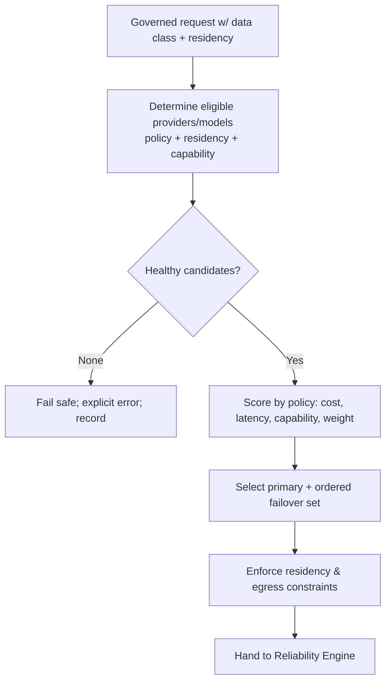

**Routing decisions:** eligibility is filtered by residency and policy *before* scoring, so no request can be routed to a non-compliant destination (`NFR-MR-001`, C-1). Failover order is precomputed so failover is fast (`NFR-FO-001`). Neutrality is enforced: no provider is structurally preferred; weighting is customer-policy-driven (BRULE-4).

---

## 21. Retry Lifecycle

Bounded, budgeted, safe recovery — never a storm, never a duplicated consequential action (`NFR-RTY-001`, `PRB-009`, BRULE-8).

```mermaid
flowchart TD
  Inv[Invoke provider] --> Res{Outcome}
  Res -- Success --> Done[Return]
  Res -- Transient failure --> Idem{Idempotent / safe to retry?}
  Idem -- No --> SurfaceNI[Surface failure; no unsafe retry; record]
  Idem -- Yes --> Budget{Retry budget available? (<=10%)}
  Budget -- No --> Shed[Shed; surface; record]
  Budget -- Yes --> Back[Backoff + jitter; try next in failover set]
  Back --> Inv
  Res -- Permanent failure --> Surface[Surface explicit error; record]
```

**Retry decisions:** retry budget capped at 10% of volume (SRE convention) to prevent storms; exponential backoff with jitter; non-idempotent/consequential operations are **not** retried without idempotency guarantees (zero duplicate consequential actions, `NFR-RTY-001`). Retries coordinate with rate limits and failover order (Sections 20, 37).

---

## 22. Cache Lifecycle

Caching is optimization; correctness and governance dominate (`NFR-CACHE-001`, BRULE-1/5/7).

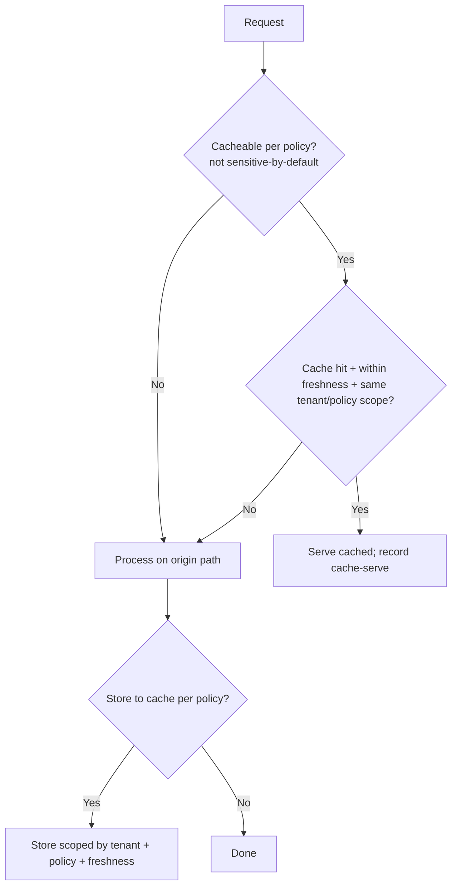

**Cache decisions:** caching is **disabled by default for sensitive data** and never crosses tenant/policy boundaries (`NFR-REL-002`, `NFR-CACHE-001`, BRULE-7); a cache miss is always served correctly by the origin path within latency SLOs (no reliability SLO depends on hit-rate, `NFR-CACHE-002`). Cache lives in the in-memory tier (Section 46).

---

## 23. Authentication Flow

Every request authenticated and attributed; federates to enterprise IdP (`NFR-AUTH-001`, `BR-021`, zero trust).

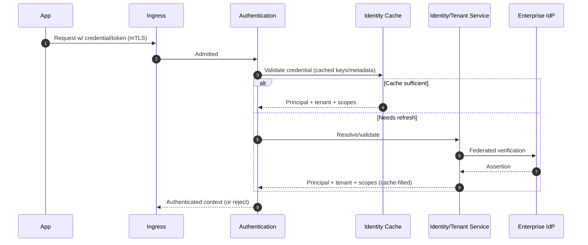

**Auth decisions:** validation material is cached with bounded lifetime for hot-path speed (`NFR-PERF-001`), while trust is anchored in the enterprise IdP (zero trust). Strong/MFA required for administrative access (`NFR-AUTH-001`). No anonymous access to protected functions (100% coverage).

---

## 24. Authorization Flow

Deny-by-default, least-privilege, consistent, non-bypassable (`NFR-AUTHZ-001`, BRULE-2).

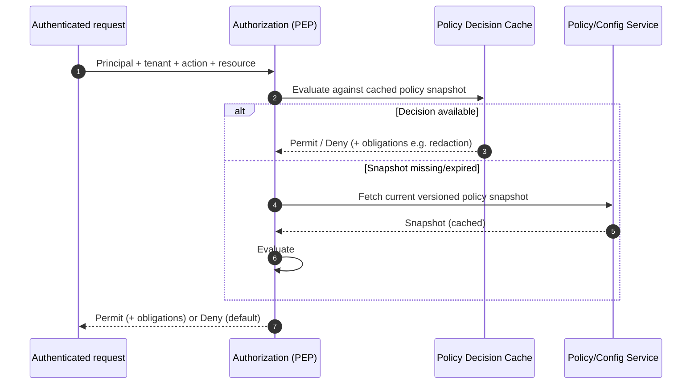

**Authz decisions:** policy is evaluated against a **versioned, cached snapshot** (PEP/PDP split; decisions local, policy distributed) → consistent enforcement at hot-path speed (`NFR-AUTHZ-001`, `NFR-PERF-001`). Default is deny; obligations (e.g., mandated redaction) flow into the Governance stage. There is no path to reach Routing without passing Authorization (C-3).

---

## 25. Configuration Flow

Config authored centrally, validated, versioned, and distributed as immutable snapshots the data plane pulls and caches (`NFR-CFG-001`, `NFR-AV-001`).

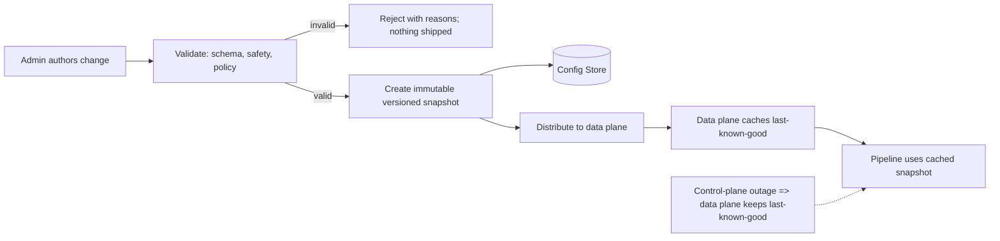

**Config decisions:** immutable, versioned snapshots → reproducibility, safe rollback, and drift detection (`NFR-CFG-001`, immutable-infra principle). Data plane runs on last-known-good if the control plane is unavailable → availability decoupling (`NFR-AV-001`, EP-10). Trade-off: bounded config-propagation delay (seconds), explicitly accepted; invariant/security changes can be marked high-priority for faster propagation.

---

## 26. Secret Management Flow

Secrets stored, rotated, revoked, never exposed; short-lived material cached on the hot path (`NFR-SEC-SM-001`, `NFR-ENC-001`).

```mermaid
sequenceDiagram
  autonumber
  participant Pipe as Data-plane pipeline
  participant SCache as Secret Cache (short-lived)
  participant SSvc as Secret Service
  participant KMS as Key Mgmt / Customer-Managed Keys

  Pipe->>SCache: Need provider credential
  alt Valid cached (short TTL)
    SCache-->>Pipe: Credential material
  else Miss/expired
    Pipe->>SSvc: Request (authorized, attributed)
    SSvc->>KMS: Decrypt/issue (rotation-aware)
    KMS-->>SSvc: Material
    SSvc-->>SCache: Deliver w/ short TTL
    SCache-->>Pipe: Credential material
  end
  Note over SSvc,KMS: Rotation & revocation propagate; revocation effective <= 5 min
```

**Secret decisions:** secrets encrypted at rest (AES-256), supported by customer-managed keys at higher tiers (`NFR-ENC-001`); hot-path caching uses short TTLs to balance latency vs revocation speed (revocation effective ≤ 5 min, `NFR-SEC-SM-001`); secrets never appear in logs/records/telemetry (zero-exposure invariant, C-1).

---

## 27. Event Architecture

Everything off the hot path is an event, giving observability/audit/accounting completeness without synchronous latency.

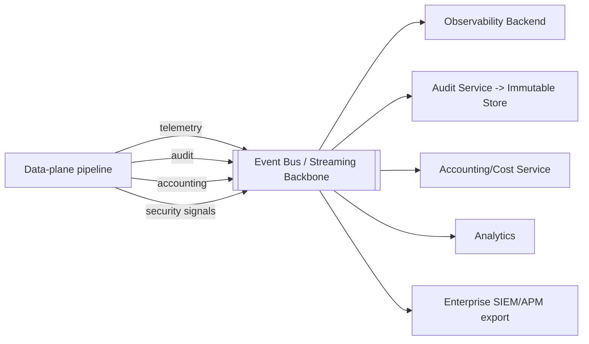

**Event decisions:** at-least-once delivery with durability for audit/accounting streams → **zero record loss** (`NFR-AUD-001`, `NFR-COST-001`); ordering and correlation identifiers preserved for reconstruction across retries/failover/streams (`NFR-OBS-001`, `NFR-TRC-001`); backpressure bounds the bus (`NFR-Q-001`). Event-driven design is the reason observability adds no synchronous latency (`NFR-LAT-001`).

---

## 28. Messaging Strategy

- **Hot-path internal communication:** in-process within the pipeline unit (no network hop per stage) for latency (`NFR-LAT-001`); mTLS for any cross-service hot-path call that is unavoidable (zero trust).
- **Off-hot-path:** asynchronous event streaming (event bus / streaming backbone; e.g., a partitioned log-class system) with at-least-once + durability for audit/accounting, best-effort-with-buffering for high-volume telemetry (Sections 27, 47).
- **Control-plane:** request/response for administrative actions; event notification for config/secret propagation.
- **Delivery semantics by stream:** audit/accounting = no loss (durable, at-least-once, idempotent consumers); operational telemetry = high-reliability with graceful degradation; analytics = best-effort. This differentiation matches cost to criticality (Section 63 invariants vs KPIs).

---

## 29. Plugin Architecture

Extensibility without weakening guarantees (`BR-029`, BRULE-2, open/closed principle).

**Model:** the core exposes **defined extension points** at safe pipeline positions (Section 53). Plugins run in a **sandboxed Plugin Runtime** that constrains their capabilities, resource use, and access, and are subject to the same authorization, observability, and governance as first-class stages.

**Guarantee preservation:** a plugin can *add* behavior at a point (e.g., an additional data-classification check, a custom routing signal, a custom telemetry export) but **cannot** bypass authentication, authorization, governance, correctness, accounting, or audit stages, and cannot cross tenant boundaries (C-1, C-3). Plugins are vetted and versioned via the Plugin Registry.

**Trade-off:** sandboxing adds overhead and constrains what plugins can do, versus a more permissive model. We choose safety over flexibility (EP-1) — plugins extend within the guarantee envelope, never outside it. Overhead of enabled plugins is budgeted and disclosed (`NFR-PERF-003`).

---

## 30. SDK Architecture

SDKs are thin, stable adapters over the data-plane request contract, providing the provider-agnostic, stable developer experience (`BR-028`, `NFR-SDK-001`, `PRB-021`).

- **Thin by design:** intelligence lives in the gateway, not the SDK, so SDKs stay small, consistent across languages, and rarely need breaking changes (`NFR-VER-001`).
- **Consistent across languages:** a shared contract and behavior model → uniform semantics regardless of language (`NFR-SDK-001`).
- **Stability:** backward compatibility within a major version; documented support matrix and windows (`NFR-VER-001`, `NFR-SDK-001`).
- **Insulation:** SDKs shield applications from provider and ecosystem churn — the whole point of `PRB-021/022`.
- **Extension:** SDKs surface, but do not implement, gateway capabilities; provider-specific behavior never leaks into the SDK (neutrality).

---

## 31. REST API / Contract Strategy

*(Contract strategy at the architecture level; concrete interface definitions are deferred to module design.)*

- **Two contract surfaces:** the **Data-Plane request contract** (applications → gateway) and the **Control-Plane admin contract** (admins/automation → control plane). They have different security, versioning, and availability profiles.
- **API-First & versioned:** contracts are designed before implementation, explicitly versioned, backward-compatible within a major version, with ≥ 12-month deprecation windows at Enterprise tier (`NFR-VER-001`, `NFR-IF-001`).
- **Provider-neutral:** the request contract is stable regardless of provider (`BR-006`).
- **Limits:** documented, enforced request/response limits protect stability (`NFR-IF-002`).
- **Consistency:** uniform error semantics and behavior across providers and versions (`NFR-IF-001`).

---

## 32. Admin Portal Architecture

The Admin Portal and Control APIs are the governance and management surface for platform/security/compliance/finance personas (`BR-015`, `BR-016`, Section 11 personas).

- **Control-plane only:** the portal never sits on the hot path; it authors config/policy that the data plane pulls (Section 25).
- **Capabilities:** policy authoring, tenancy management, model/provider governance, quota/budget management, dashboards (observability, cost, audit), and controlled operational actions.
- **Security:** strong/MFA admin authentication, fine-grained authorization, full audit of every control action (`NFR-AUTH-001`, `NFR-AUD-001`).
- **Accessibility:** WCAG 2.1/2.2 AA (`NFR-A11Y-001`), internationalized (`NFR-I18N-001`).
- **Separation of duties:** sensitive actions (e.g., key management, policy for regulated data) support approval workflows and are fully recorded.

---

## 33. Multi-Tenant Architecture

Tenant isolation is an absolute invariant (`NFR-REL-002`, BRULE-7).

- **Isolation dimensions:** identity/authorization scope, data (records, caches, secrets), quota/rate, configuration/policy, and telemetry/audit — all tenant-scoped end to end.
- **Isolation model:** logical isolation with tenant context propagated and enforced at every stage and every store access; higher tiers (Regulated/Mission-Critical) can add stronger physical/deployment isolation where required.
- **Enforcement:** tenant scope is part of the authenticated context (Section 23) and is validated at each store and cache access; isolation-violation detectors are always-on (`NFR-REL-002`, any violation = Sev1).
- **Noisy-neighbor prevention:** per-tenant quotas and fairness in the Reliability Engine (`NFR-SCALE-002`, `BR-017`) prevent one tenant degrading another.

**Trade-off:** logical multi-tenancy maximizes efficiency but requires rigorous enforcement; we back it with defense-in-depth (multiple independent isolation checks, EP-7) and, for the highest tier, optional stronger isolation. Full single-tenant physical isolation is available where regulation demands, at higher cost.

---

## 34. Deployment Architecture

Cloud-native, immutable, orchestrated, zone-redundant (`NFR-HA-001`, `NFR-DEP-001`, immutable-infra).

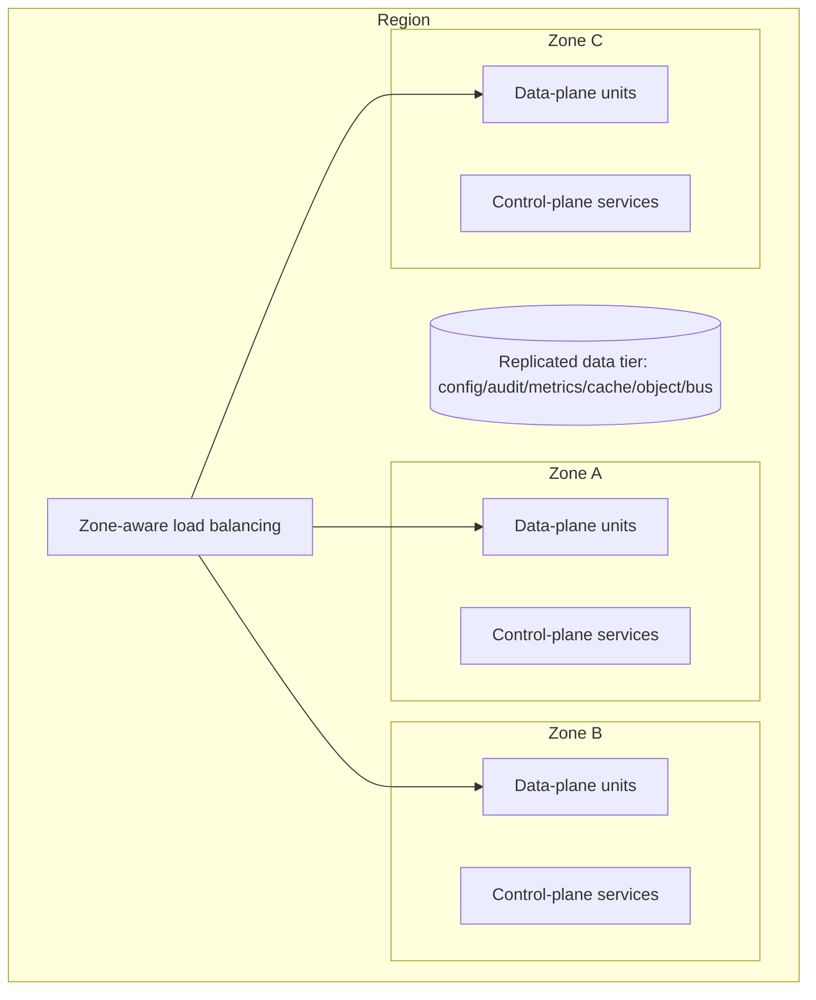

- **Data plane** deploys as many stateless, horizontally-scaled units behind zone-aware load balancing (shared-nothing hot path).
- **Control plane** deploys as independently-scaled, zone-redundant services.
- **Data tier** is replicated for durability and availability (Section 44).
- **N+1 zone redundancy** minimum at Enterprise/Regulated (`NFR-HA-001`, `NFR-CAP-001`); loss of a zone does not breach SLOs (verified by game days, `NFR-CHAOS-001`).
- **Deployment models:** managed multi-tenant, dedicated, and customer-environment deployments to meet constraints (`BR-031`); immutable images, progressive rollout, automated rollback (`NFR-UPG-001`, `NFR-DEP-001`).

---

## 35. Multi-Region Strategy

For continuity and residency (`NFR-MR-001`, `NFR-DR-001`, `BR-023`).

- **Regional independence:** each region operates self-sufficiently; one region's failure does not cascade (regional isolation).
- **Residency confinement:** residency-constrained data and traffic are confined to permitted regions — including during failover (Section 16, 20) — an invariant (`NFR-MR-001`, C-1).
- **Data replication:** audit/accounting replicated to meet RPO (audit RPO = 0); config replicated; sensitive data replicated only within permitted regions.
- **Routing:** requests are handled in the appropriate region per residency and latency; cross-region routing never violates residency.
- **Consistency:** governance/policy is consistent across regions (single logical control plane, regionally enforced).

**Trade-off:** active-active multi-region maximizes availability but complicates consistency and residency; we adopt regionally-isolated operation with globally-consistent policy and residency-bounded data, prioritizing correctness and compliance over maximal global consistency (EP-1).

---

## 36. Disaster Recovery Architecture

Meets tiered RTO/RPO with audit RPO = 0 (`NFR-DR-001`, `NFR-BAK-001`).

- **RPO:** audit/accounting = 0 (synchronous/quorum-durable replication); config ≤ 1 min; transient in-flight data may be lost but fails safe (no silent incorrect delivery).
- **RTO:** regional failover ≤ 5 min (Regulated), ≤ 15 min (Enterprise), ≤ 1 h (Business), ≤ 4 h (Developer).
- **Mechanisms:** replicated data tier, standby capacity, automated failover, and tested runbooks; **quarterly DR game days** verify actual RTO/RPO (`NFR-DR-001`, `NFR-CHAOS-001`).
- **Backups:** encrypted, integrity-verified, immutable for audit, quarterly test-restores (`NFR-BAK-001`).
- **Fail-safe principle:** in any disaster, the system fails safe — it does not deliver incorrect results, bypass governance, or leak data, even if it must reject requests (C-1, EP-4).

---

## 37. Scalability Strategy

Near-linear horizontal scale with no hot-path single point of failure (`NFR-SCALE-001`, `NFR-HA-001`, `NFR-ELAS-001`).

- **Stateless hot path** → add units to add throughput; shared-nothing (C-6).
- **Ephemeral shared state** (rate-limit counters, cache, health) lives in the fast in-memory tier, partitioned to avoid a coordination bottleneck (Section 46).
- **Elastic autoscaling** with warm headroom (20–30% at Enterprise) to absorb surges within reaction time (`NFR-ELAS-001`, `NFR-CAP-001`).
- **Per-tenant fairness** prevents noisy neighbors (`NFR-SCALE-002`).
- **Control plane scales independently** by its own load profile.
- **Backpressure & shedding** under overload preserve correctness and shed low-priority load gracefully (`NFR-ST-001`, EP-10).

**Bottleneck analysis:** the only shared hot-path dependencies are the in-memory tier (rate limits/cache) and cached config/identity/secret snapshots; both are partitioned and cached to avoid becoming caps (`NFR-SCALE-001`). Durable stores are off the hot path (event-driven writes), so persistence is not a request-path bottleneck (`NFR-DS-001`).

---

## 38. Security Architecture

Zero-trust, defense-in-depth, secure-by-default (`NFR-AUTH/AUTHZ/ENC-001`, `NFR-SEC-*`, EP-7).

- **Zero trust:** every request and every inter-component call is authenticated, authorized, and encrypted; no implicit trust between components or planes.
- **Defense in depth:** critical properties (isolation, data protection, output integrity) enforced by multiple independent mechanisms so a single failure does not breach them (EP-7).
- **Secure by default:** 100% of security-relevant settings default secure; insecure config requires explicit, recorded override (`NFR-SEC-004`, BRULE-3).
- **Data protection:** classification-driven redaction/handling, residency, encryption in transit (TLS 1.2+/1.3) and at rest (AES-256), customer-managed keys at higher tiers (`NFR-DP-001`, `NFR-ENC-001`, `NFR-PRIV-001`).
- **Content trust:** injection/untrusted-content controls at designated points, with transparent residual risk (`NFR-SEC-003`, BRULE-9).
- **Secrets:** central governance, rotation, revocation, zero exposure (`NFR-SEC-SM-001`).
- **Boundary hardening:** the gateway's own attack surface is minimized, continuously tested (pen-test, red-team, dependency scanning), and vulnerabilities remediated on strict SLAs (`NFR-SECT-001`, `NFR-SEC-001`).
- **Blast-radius control:** tenant isolation, least privilege, and regional isolation bound the impact of any compromise.

---

## 39. Observability Architecture

Complete, correlated, audit-grade records by construction (`NFR-OBS-001`).

- **By-construction telemetry:** every stage emits structured, correlated events; coverage is 100% because emission is part of the pipeline, not optional instrumentation.
- **Correlation:** a request identity threads through all stages, retries, failovers, and stream segments (`NFR-TRC-001`), enabling full reconstruction.
- **Three signals:** metrics (Section 41), logs (Section 40), traces (Section 42), plus audit (Section 43) — unified by correlation identifiers.
- **Export:** to the gateway's own backend and to the enterprise's SIEM/APM (Section 7), governed to prevent leakage (`NFR-LOG-001`).
- **Freshness:** operational signals available in seconds (`NFR-MET-001`).

---

## 40. Logging Architecture

- **Structured & correlated** logs with request/trace identifiers (`NFR-LOG-001`).
- **Governed:** zero secrets/sensitive-data leakage (redaction applied before emission; C-1).
- **Reliable delivery:** operational logs high-reliability; audit-relevant logs zero-loss (Section 43).
- **Retention:** configurable per policy/regulation (`NFR-LOG-001`).
- **Integrity:** audit-relevant logs are tamper-evident (Section 43).

---

## 41. Metrics Architecture

- **SLI-backed:** every SLO (`03` Section 61) has a live metric (`NFR-MET-001`).
- **Dimensioned:** per tier, region, provider, tenant (managed cardinality).
- **Time-series store:** optimized for high-ingest, high-cardinality query (Section 44).
- **Freshness ≤ 10 s** operational; drives burn-rate alerting (`NFR-ALRT-001`).
- **Accounting metrics** feed authoritative cost/usage (`NFR-COST-001`).

---

## 42. Tracing Architecture

- **End-to-end traces** across internal stages, retries, failover, stream segments (`NFR-TRC-001`).
- **Intelligent sampling:** 100% capture for errors and slow requests; representative sampling otherwise (overhead within budget).
- **Correlation-first:** identifiers propagate across planes and async events, so traces reconstruct the full lifecycle including asynchronous audit/accounting.

---

## 43. Audit Architecture

Audit-grade, complete, tamper-evident, zero-loss (`NFR-AUD-001`, `BR-011`).

- **Coverage:** 100% of requests and material policy/security decisions produce audit records (by construction, via the event bus).
- **Integrity:** records are tamper-evident; audit store is append-only/immutable (WORM-capable) (Section 44).
- **Zero loss:** audit stream uses durable, at-least-once delivery and quorum-durable storage → RPO = 0 (`NFR-DR-001`).
- **Fidelity:** records reflect what actually happened, including any corrections applied to output (BRULE-1) — repairs and rejections are recorded.
- **Retention & access:** configurable retention; access to audit data (which may contain sensitive information) is itself governed and audited (`NFR-PRIV-001`).
- **Reporting:** supports audit export within defined SLAs (`BR-024`).

---

## 44. Storage Strategy

Polyglot persistence — each data class gets the store matched to its access pattern and durability requirement (technology-neutral; representative classes named illustratively, not mandated).

| Data Class | Requirements | Store Class | NFR |
|---|---|---|---|
| Config / Tenant / Policy | Consistent, versioned, relational integrity | Relational / strongly-consistent store | NFR-CFG-001 |
| Audit records | Append-only, immutable, tamper-evident, zero-loss | WORM-capable append-only store | NFR-AUD-001 |
| Metrics / SLIs | High-ingest, high-cardinality, time-range query | Time-series store | NFR-MET-001 |
| Ephemeral state / cache | Ultra-low-latency, partitioned, TTL | In-memory data tier | NFR-PERF-001, NFR-CACHE-001 |
| Large payloads / exports / backups | Durable, cheap, large-object | Object storage | NFR-BAK-001 |
| Event streams | Durable, ordered, replayable | Streaming log backbone | NFR-Q-001 |

**Principle:** stores are reached only through persistence **ports** (hexagonal), so store technologies can evolve without touching the domain (`BR-006`, G-10). No durable store sits on the hot path synchronously (Section 37).

---

## 45. Database Strategy

- **Strong consistency where correctness demands it:** config, tenancy, policy, and accounting reconciliation use strongly-consistent, relational-style stores (integrity, versioning) (`NFR-CFG-001`, `NFR-COST-001`).
- **Eventual consistency where acceptable:** telemetry/analytics tolerate eventual consistency for throughput.
- **Isolation:** tenant scoping enforced at query/access, backed by isolation detectors (`NFR-REL-002`).
- **Durability:** audit/accounting quorum-durable for RPO = 0 (`NFR-DR-001`).
- **No hot-path dependency:** the request path never blocks on a durable database write; writes are event-driven and asynchronous (Section 27, 37).

---

## 46. In-Memory / Cache Tier Strategy

*(The distributed in-memory tier — e.g., a Redis-class system — used for ephemeral state and response caching. Named as a representative class; the architecture depends on the *role*, not a specific product, and reaches it via a port.)*

- **Roles:** rate-limit/quota counters, circuit-breaker/health state, response cache, and short-lived credential/config caches.
- **Latency:** ultra-low-latency to fit the hot-path budget (`NFR-PERF-001`, `NFR-LAT-001`).
- **Partitioning:** partitioned/sharded to avoid a coordination bottleneck and to scale (`NFR-SCALE-001`).
- **Correctness & isolation:** cache entries are tenant/policy-scoped; sensitive data not cached by default; no cross-tenant serve (`NFR-CACHE-001`, `NFR-REL-002`, BRULE-7).
- **Resilience:** the tier is redundant; loss of a node degrades gracefully (rate limits fail safe/conservative; cache misses fall through to origin) without breaching correctness (EP-10).
- **Ephemerality:** it holds no source-of-truth durable data; loss is tolerable (the durable stores are authoritative).

---

## 47. Queue / Streaming Backbone Strategy

*(The event bus / streaming log used for all off-hot-path events. Role-defined, technology-neutral, reached via a port.)*

- **Roles:** transport telemetry, audit, accounting, security signals, and analytics events (Section 27).
- **Delivery semantics by stream:** audit/accounting = durable, at-least-once, idempotent consumers → zero loss (`NFR-AUD-001`, `NFR-COST-001`); operational telemetry = high-reliability with graceful degradation; analytics = best-effort.
- **Ordering & correlation:** preserves ordering and correlation needed for reconstruction (`NFR-TRC-001`).
- **Backpressure:** bounded with backpressure — no unbounded growth (`NFR-Q-001`).
- **Replay:** durable streams support replay for recovery and reprocessing.

---

## 48. Object / File Storage Strategy

- **Roles:** large request/response payloads (where policy permits), audit/analytics exports, and backups.
- **Durability & encryption:** highly durable, encrypted at rest (AES-256), immutable for audit/backup (`NFR-BAK-001`, `NFR-ENC-001`).
- **Governance:** stored objects are classified, residency-confined, retention-governed, and access-audited (`NFR-DP-001`, `NFR-MR-001`).
- **Lifecycle:** automated lifecycle per retention policy; test-restores verify backups (`NFR-BAK-001`).

---

## 49. Configuration Management

- **Declarative & versioned:** all configuration is declarative, validated, versioned, and immutable per snapshot (Section 25, `NFR-CFG-001`).
- **Safe defaults:** secure/compliant defaults for 100% of security-relevant settings (BRULE-3).
- **Drift detection:** running config is continuously compared to intended snapshots.
- **Reversibility:** any change is reversible by re-pinning a prior snapshot (immutable-infra).
- **Propagation:** bounded-latency propagation to the data plane; high-priority path for security/invariant changes (Section 25).

---

## 50. Versioning Strategy

- **Explicit versioning** of the data-plane contract, control contract, SDKs, plugins, and config schemas (`NFR-VER-001`, API-First).
- **Semantic discipline:** no breaking change within a major version; breaking changes require a new major version plus deprecation window (≥ 12 months Enterprise, ≥ 6 months Business).
- **Concurrent versions:** multiple supported versions run concurrently with published support windows.
- **Provider evolution absorbed:** provider/model changes are absorbed in adapters and surfaced through versioned capability, insulating customers (`PRB-022`, `BR-007`).

---

## 51. Backward Compatibility

- **Compatibility within major versions** is a hard requirement, verified by compatibility test suites (`NFR-VER-001`, `NFR-TEST-001`).
- **Additive evolution:** capabilities are added additively; existing behavior is preserved.
- **Deprecation discipline:** advance notice, migration guidance, and honored windows (UPG-*, `NFR-VER-001`).
- **Contract tests** gate releases; any undeclared breaking change blocks release (`NFR-IF-001`).

---

## 52. Upgrade Strategy

- **Immutable, progressive, reversible:** replace-not-patch; progressive rollout with health-gated promotion and automated rollback within ≤ 5 min (`NFR-UPG-001`, immutable-infra).
- **Zero request-path downtime** at Enterprise/Regulated (rolling upgrades) (`NFR-UPG-001`, `NFR-MW-001`).
- **Plane independence:** data and control planes upgrade independently; data plane runs on last-known-good config during control-plane upgrades (Section 25).
- **Backward compatibility preserved** across upgrades (Section 51).
- **Customer-controllable timing** where applicable (UPG-5).

---

## 53. Plugin Extension Points

Defined, safe extension points where plugins may add behavior without weakening guarantees (Section 29, `BR-029`):

| Extension Point | Purpose | Constraint |
|---|---|---|
| Pre-routing signal | Contribute custom routing signals/weights | Cannot override residency/policy eligibility |
| Custom data-classification / redaction | Add classification or redaction logic | Additive to, cannot disable, core governance |
| Custom validation | Add domain-specific output validation | Additive to core correctness; cannot bypass it |
| Custom telemetry/export | Emit to additional sinks | Governed; cannot leak sensitive data |
| Custom auth attribute source | Contribute identity attributes | Cannot bypass authentication/authorization |
| Custom cost/attribution signal | Enrich accounting attribution | Cannot alter authoritative measurement |

**Invariant:** no extension point permits bypassing authentication, authorization, governance, correctness, accounting, isolation, or audit (C-3, BRULE-2). Extension points are additive-only with respect to safety.

---

## 54. Future Module Strategy

New modules (future capabilities from `02` Section 35 / `00`) attach to the architecture through the same mechanisms, never by special-casing the core:

- **As bounded contexts** with explicit ports and event participation (Sections 14–15, 27).
- **As adapters** behind existing ports (new providers, stores, identity, sinks) (Section 44).
- **As plugins** at extension points where appropriate (Section 53).
- **As control-plane services** for new management capabilities (Section 32).

Candidate future modules and their attachment:

| Future Module (from `02`/`00`) | Attachment |
|---|---|
| Advanced routing/optimization | Routing context + pre-routing extension |
| Deeper governance/compliance packs | Governance context + policy model |
| Governed agent/tool orchestration | New bounded context + correctness/authz + events (`BR-030`) |
| Broader modalities | New provider adapters + modality-aware correctness |
| Expanded analytics | Event-bus consumers + analytics store |
| Reliability assurance tooling | Observability/audit data + control-plane service |

**Rule:** every future module must conform to this document — statelessness on the hot path, ports/adapters for externals, invariants preserved, NFR conformance demonstrated (G-10, C-1).

---

## 55. Architecture Decision Summary

Major architectural decisions (ADRs are maintained separately in `adr/`; this is the summary):

| ADR | Decision | Rationale | Alternatives (Section 57) | NFR |
|---|---|---|---|---|
| AD-1 | Data-plane / control-plane split | Availability, latency, independent scale/upgrade | Monolith; single plane | NFR-AV/PERF/UPG/SCALE |
| AD-2 | Stateless hot path; state in tiers | Horizontal scale, HA, elasticity | Stateful hot path | NFR-SCALE/HA/ELAS |
| AD-3 | Hexagonal ports/adapters; provider-agnostic core | Provider independence, evolvability | Provider-coupled core | BR-006, NFR-VER |
| AD-4 | Pipeline as co-located stages (not per-stage microservices) | Latency budget; avoid network-hop tax | Fine-grained microservices | NFR-LAT/PERF |
| AD-5 | Event-driven off-hot-path | Observability/audit completeness w/o latency | Synchronous logging | NFR-OBS/AUD/LAT |
| AD-6 | Cached versioned config/identity/secret snapshots | Hot-path speed + control-plane decoupling | Per-request control-plane calls | NFR-PERF/AV |
| AD-7 | PEP/PDP split for authorization | Consistent enforcement at speed | Central per-request authz service | NFR-AUTHZ/PERF |
| AD-8 | Non-bypassable correctness/governance stages | Enforced correctness & governance | Optional/advisory checks | NFR-SO, BRULE-2 |
| AD-9 | Polyglot persistence by data class | Right store per access/durability need | Single database | NFR-DS/AUD/MET |
| AD-10 | Sandboxed additive-only plugins | Extensibility without weakening guarantees | Permissive plugins; no plugins | BR-029, BRULE-2 |
| AD-11 | Logical multi-tenancy + optional physical isolation | Efficiency with absolute isolation | Physical-only; weak logical | NFR-REL-002, BRULE-7 |
| AD-12 | Regionally-isolated, globally-consistent policy | Continuity + residency + consistency | Global active-active state | NFR-MR/DR |

---

## 56. Risks

- **AR-1 — Hot-path complexity vs latency budget.** Many enforced stages could exceed the budget. *Mitigation:* co-located pipeline (AD-4), per-stage budgets (`NFR-LAT-001`), optional heavy policy budgeted separately, continuous load calibration. *Risk:* Moderate.
- **AR-2 — In-memory tier as shared dependency.** Rate limits/cache could bottleneck or fail. *Mitigation:* partitioning, redundancy, fail-safe degradation (Section 46). *Risk:* Moderate.
- **AR-3 — Config-propagation delay.** Cached snapshots delay changes. *Mitigation:* bounded, disclosed delay; high-priority path for security/invariant changes (Section 25). *Risk:* Low.
- **AR-4 — Event-bus as audit backbone.** Audit depends on the bus. *Mitigation:* durable, at-least-once, quorum-durable storage, backpressure (Sections 27, 47). *Risk:* Moderate (mitigated to zero-loss).
- **AR-5 — Multi-region residency correctness.** Failover could violate residency. *Mitigation:* eligibility filtered by residency before routing/failover; invariant detectors (Sections 20, 35). *Risk:* High if mishandled → engineered to invariant.
- **AR-6 — Plugin risk.** Extensions could destabilize or weaken guarantees. *Mitigation:* sandboxing, additive-only, vetting, budgeting (Sections 29, 53). *Risk:* Moderate.
- **AR-7 — Provider semantic drift.** Providers change semantics under adapters. *Mitigation:* adapters absorb change; versioned capability; contract tests; fault injection (Sections 8, 50). *Risk:* Moderate.
- **AR-8 — Correctness targets partly model-bounded.** Post-enforcement success depends on models. *Mitigation:* separate owned detection/escape from attributed post-enforcement success; transparency (Section 18, OOS-6). *Risk:* Moderate.

---

## 57. Alternatives Considered

- **Alt-1 — Single-plane monolith.** *Rejected:* couples availability of hot path to management functions; harder to scale/upgrade independently (violates `NFR-AV/UPG`). Chosen: data/control split (AD-1).
- **Alt-2 — Fine-grained microservice hot path.** *Rejected:* per-stage network hops blow the latency budget (`NFR-LAT-001`) and add failure modes. Chosen: co-located pipeline (AD-4). Control plane *is* decomposed, where latency is not critical.
- **Alt-3 — Provider-coupled core with per-provider code paths.** *Rejected:* violates neutrality and evolvability (`BR-006`, BRULE-4). Chosen: hexagonal adapters (AD-3).
- **Alt-4 — Synchronous logging/audit on the hot path.** *Rejected:* adds latency and couples request success to logging availability. Chosen: event-driven async with durability (AD-5).
- **Alt-5 — Per-request central authorization service.** *Rejected:* adds a network hop and a shared dependency on the hot path. Chosen: PEP/PDP with cached versioned policy (AD-7).
- **Alt-6 — Single general-purpose database.** *Rejected:* no single store fits append-only audit + high-cardinality metrics + low-latency counters + relational config. Chosen: polyglot persistence (AD-9).
- **Alt-7 — Optional/advisory correctness & governance checks.** *Rejected:* violates no-bypass and enforced-correctness (BRULE-2, `NFR-SO`). Chosen: non-bypassable stages (AD-8).
- **Alt-8 — Global active-active shared state.** *Rejected:* complicates residency and consistency, risks residency violation. Chosen: regional isolation with globally-consistent policy (AD-12).

---

## 58. Open Questions

- **AOQ-1** — Final hot-path stage co-location boundary vs. selective isolation of the heaviest stages (pending latency calibration, `03` OQ-1).
- **AOQ-2** — Exact partitioning scheme for the in-memory tier to guarantee no coordination bottleneck at target scale.
- **AOQ-3** — Config-propagation latency target and the high-priority path SLA for security/invariant changes.
- **AOQ-4** — Degree of physical isolation offered at the Regulated tier vs. logical isolation + detectors (cost/assurance trade-off).
- **AOQ-5** — Plugin capability model granularity — how expressive can additive plugins be while provably preserving invariants.
- **AOQ-6** — Multi-region topology per residency regime (active-passive vs. regional-active) for specific government/health customers (`03` OQ-8).
- **AOQ-7** — Boundary of gateway-side vs. application-side responsibility for agent/tool orchestration (`BR-030`) as that context matures.
- **AOQ-8** — Reconciliation topology for authoritative accounting across regions/providers to hold `NFR-COST-001` at scale.

---

## 59. Architecture Principles Checklist

| Principle | Realized By | Status |
|---|---|---|
| Cloud Native | Sections 34, 37, immutable infra | ✔ |
| DDD | Bounded contexts (14–15) | ✔ |
| Hexagonal | Ports/adapters (12–13, 44) | ✔ |
| SOLID | Single-responsibility stages; DI at ports | ✔ |
| Stateless | Stateless hot path (C-6, 37) | ✔ |
| Event-Driven | Event architecture (27–28) | ✔ |
| API-First | Contract strategy (31, 50) | ✔ |
| Plugin Architecture | Plugin runtime & points (29, 53) | ✔ |
| Zero Trust | Security architecture (38) | ✔ |
| High Availability | HA/DR/multi-region (34–36, 41) | ✔ |
| Horizontal Scaling | Scalability strategy (37) | ✔ |
| Provider Agnostic | Hexagonal core (3, 13) | ✔ |
| Immutable Infrastructure | Deployment/upgrade (34, 52) | ✔ |
| Loose Coupling / High Cohesion | Contexts + events (13–15, 27) | ✔ |
| Backward Compatibility | Versioning (50–51) | ✔ |

---

## 60. Traceability Matrix

Mapping major components/decisions → business requirements (`02`), NFRs (`03`), and problems (`01`).

| Component / Concern | Section | BR (`02`) | NFR (`03`) | PRB (`01`) |
|---|---|---|---|---|
| Data/Control plane split | 9–10, 34 | BR-003, BR-005 | NFR-AV-001, NFR-UPG-001, NFR-SCALE-001 | PRB-008, PRB-020 |
| Ingress / Connection Mgr | 11, 16–17 | BR-002 | NFR-CONC-001, NFR-PERF-002 | PRB-004, PRB-020 |
| Authentication | 23 | BR-021 | NFR-AUTH-001 | PRB-029 |
| Authorization / PEP-PDP | 24 | BR-015, BR-021 | NFR-AUTHZ-001 | PRB-016, PRB-029 |
| Governance / Data-Handling | 16, 38 | BR-015, BR-018, BR-023 | NFR-DP-001, NFR-PRIV-001, NFR-MR-001 | PRB-014, PRB-016, PRB-017 |
| Router / Provider Selection | 20 | BR-006, BR-008 | NFR-FO-001, NFR-MR-001 | PRB-007, PRB-008 |
| Reliability Engine | 21, 37 | BR-003, BR-004 | NFR-FO-001, NFR-RTY-001, NFR-SCALE-002 | PRB-008, PRB-009, PRB-018 |
| Provider Adapter Layer | 8, 13 | BR-006, BR-007 | NFR-IF-001, NFR-VER-001 | PRB-007, PRB-021, PRB-022 |
| Correctness (structured output) | 18 | BR-001 | NFR-SO-001/002, NFR-REL-003 | PRB-001, PRB-002 |
| Correctness (streaming) | 17 | BR-002 | NFR-STRM-001, NFR-PERF-002 | PRB-004 |
| Correctness (tool-call) | 19 | BR-002, BR-030 | NFR-SO-003 | PRB-005 |
| Accounting & Cost | 16, 45 | BR-012, BR-013 | NFR-COST-001 | PRB-012, PRB-010 |
| Observability | 39–42 | BR-010 | NFR-OBS-001, NFR-MET-001, NFR-TRC-001 | PRB-011 |
| Audit | 43 | BR-011, BR-024 | NFR-AUD-001, NFR-DR-001 | PRB-011, PRB-014 |
| Secret & Credential | 26, 38 | BR-020 | NFR-SEC-SM-001, NFR-ENC-001 | PRB-015 |
| Configuration | 25, 49 | BR-027 | NFR-CFG-001 | PRB-030 |
| Cache / In-memory tier | 22, 46 | BR-013 | NFR-CACHE-001/002, NFR-PERF-001 | PRB-010, PRB-018 |
| Event bus | 27–28, 47 | BR-010, BR-011 | NFR-OBS/AUD-001, NFR-Q-001 | PRB-011, PRB-020 |
| Multi-tenancy | 33 | BR-021, BR-017 | NFR-REL-002, NFR-SCALE-002 | PRB-029, PRB-018/019 |
| Multi-region / DR | 35–36 | BR-023, BR-031 | NFR-MR-001, NFR-DR-001, NFR-BAK-001 | PRB-017 |
| Plugin runtime | 29, 53 | BR-029, BR-030 | NFR-PERF-003 | PRB-025, PRB-026 |
| SDK | 30 | BR-028 | NFR-SDK-001, NFR-VER-001 | PRB-021, PRB-023 |
| Admin portal | 32 | BR-015, BR-016 | NFR-A11Y-001, NFR-AUD-001 | PRB-016 |
| Upgrade / Versioning | 50–52 | BR-007, BR-036 | NFR-UPG-001, NFR-VER-001 | PRB-022 |

**Coverage note.** Every P0 NFR from `03` is realized by at least one architectural decision above; every foundational component maps to a business requirement and a problem. Any future component must be added here with its trace, or it is out of architecture scope pending amendment.

---

## Appendix

**A. Component Specification Index.** Full per-component specifications (Purpose, Responsibilities, Inputs, Outputs, Dependencies, Failure Modes, Scalability, Security, Monitoring, NFR Mapping, Extension Points, Future Evolution) are embedded in Sections 13–43 and summarized in Section 60; they are elaborated to module depth in the `docs/modules/` design documents that must conform to this architecture. Core components: Ingress · Authentication · Authorization/PEP-PDP · Governance/Data-Handling · Router · Reliability Engine · Provider Adapter Layer · Correctness Engines (structured-output / streaming / tool-call) · Accounting · Observability & Audit Emission · Secret & Credential Service · Configuration & Policy Service · Plugin Runtime · Admin/Control Plane.

**B. Data-plane vs Control-plane summary.** Data plane: stateless, hot, latency-budgeted, correctness/governance-enforcing, runs on cached config. Control plane: stateful, management, durable, authoritative for config/policy/identity/secrets/audit/cost. Failure of the control plane degrades gracefully (data plane on last-known-good); failure of the data plane is the availability-critical case (engineered to `NFR-AV-001`).

**C. Invariants realized structurally.** Isolation (Section 33), no-silent-delivery (Sections 16–19), audit integrity (43), secret non-exposure (26, 40), data protection (38), residency confinement (35), no-authz-bypass (24) — each is enforced by a dedicated, non-bypassable architectural element with defense-in-depth (EP-7). These are structural properties, not configurable features.

**D. Relationship to other documents.** This document derives *what to build well* from `03`, *what to build* from `02`, and *why* from `00`/`01`. It governs `docs/modules/` and `adr/`, which must conform. Where a module design conflicts with this document, this document governs architecture; conflicts are resolved by explicit amendment, not silent divergence.

**E. Maintenance.** Living document. Architectural changes are recorded as ADRs (`adr/`) and reflected in Sections 55 and 60. Calibration-dependent decisions (AD-4 co-location boundary, in-memory partitioning) are finalized post load/chaos testing. Invariants (Appendix C) and constraints (Section 4) are stable and may not be weakened without revisiting the frozen documents.

---

*End of document — 04-System-Architecture.md*
