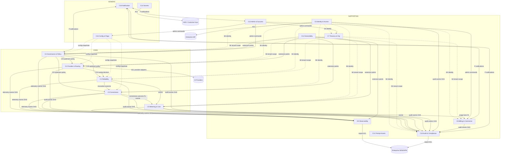
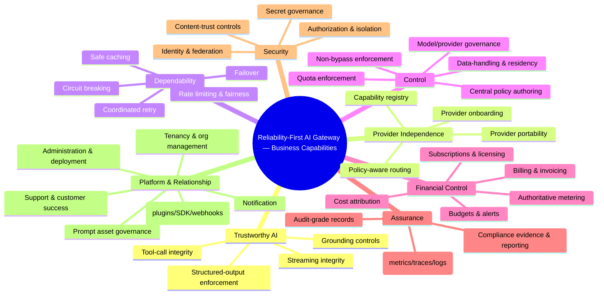
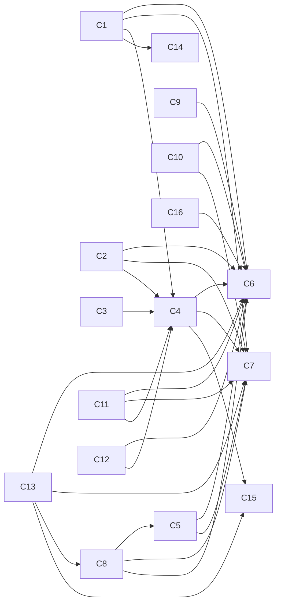
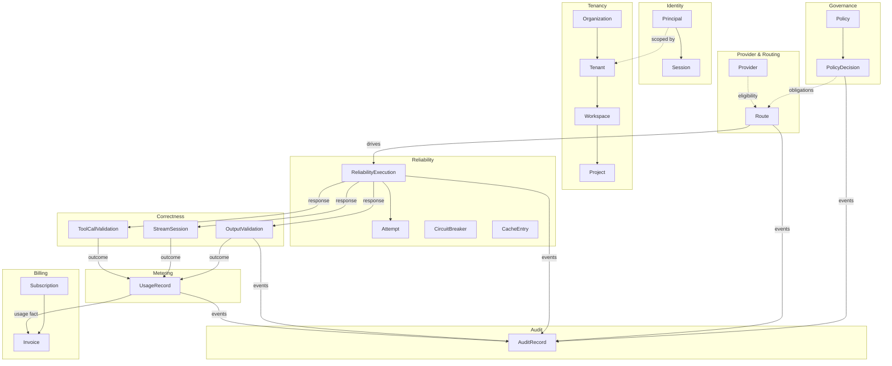

# 05 — Domain Model

**Document:** Canonical Business Domain Model (Domain-Driven Design)
**Project:** Reliability-First AI Gateway
**Status:** Living document (v1.0) — **canonical business model; source of truth for all downstream design**
**Audience:** Enterprise Architecture, Engineering Leadership, Domain Teams, Auditors, Future Engineers
**Classification:** Internal — Architecture Standard
**Builds on (approved, frozen):** `00`, `01`, `02`, `03`, `04`, and the ADR register in `adr/` (ADRs referenced by ID, e.g., AD-001; see `adr/000-ADR-Index.md`)

> **Authority & scope.** This is the canonical model of the *business* the platform runs. Microservices, contracts, SDKs, stores, events, admin, plugins, billing, observability, security, and governance all derive from it — nothing downstream may introduce a business concept absent here without amending this document. It stays at the **business domain level**: no code, no classes, no interfaces/APIs, no database schemas, no package layouts. Commands, queries, events, aggregates, entities, and value objects are named in **ubiquitous language**, not technology.
>
> **Method.** We apply strategic DDD (subdomain classification: Core / Supporting / Generic; bounded contexts; context mapping) before tactical DDD (aggregates, entities, value objects, domain services, invariants, events). Business rules live **inside aggregates** (no anemic models). We **challenge** the candidate domain list from the prompt and from `04`, and we justify every merge, split, and boundary.
>
> **Consistency with frozen documents.** Where this model elaborates or extends the bounded contexts of `04 §15`, it does so additively and in conformance with `04`'s future-module strategy (`04 §54`); it never contradicts a frozen decision or an Accepted ADR. Deviations from the prompt's candidate list are deliberate DDD decisions, justified in Section 4.

---

## Table of Contents

1. Executive Summary
2. Purpose, Scope & Relationship to Frozen Documents
3. Domain-Driven Design Approach
4. Strategic Domain Analysis (Challenging the Candidate List)
5. Bounded Context Catalogue & Classification
6. Context Map
7. Business Capability Map
8. Domain Dependency Graph
9. Ownership Matrix
10. Ubiquitous Language Dictionary & Business Glossary
11. Core Domains (detailed)
    - 11.1 Provider & Routing
    - 11.2 Reliability
    - 11.3 Correctness
    - 11.4 Governance & Policy
    - 11.5 Metering & Cost
12. Supporting Domains (detailed)
    - 12.1 Identity & Access
    - 12.2 Tenancy & Organization
    - 12.3 Billing & Commerce
    - 12.4 Observability
    - 12.5 Audit & Compliance
    - 12.6 Prompt & Interaction Asset Management
    - 12.7 Extensibility & Ecosystem
    - 12.8 Administration & Customer Success
13. Generic Subdomains (concise)
    - 13.1 Secrets & Credentials
    - 13.2 Configuration & Feature Management
    - 13.3 Notification
14. Consolidated Domain Event Catalogue
15. Aggregate Relationship Model
16. Command & Event Relationship Model
17. Traceability Matrix
18. Risks & Open Questions
19. Appendix

---

## 1. Executive Summary

This document defines the business domain of the Reliability-First AI Gateway using Domain-Driven Design. It is the single source of truth from which every microservice, contract, SDK, datastore, event, admin capability, plugin, billing behaviour, observability signal, security control, and governance rule derives.

The prompt and the architecture together enumerate roughly forty candidate "domains." A central finding of this analysis is that **a list of forty domains is a capability inventory, not a domain model.** Treating each as an independent bounded context would produce chatty coupling, duplicated identity and tenancy concepts, and a fragmented model that no team could own coherently. The strategic work here is therefore to **classify** each candidate as part of a Core, Supporting, or Generic subdomain, **merge** concepts that share a consistency boundary and a single owner, **split** concepts that share a name but have fundamentally different lifecycles and invariants, and consolidate the result into **sixteen bounded contexts** — five Core, eight Supporting, three Generic — each with a single business owner, a cohesive model, and explicit boundaries.

The **five Core domains** carry the company's differentiation and map directly to the reasons customers adopt the platform:

1. **Provider & Routing** — provider independence and intelligent, policy-aware selection.
2. **Reliability** — retry, failover, rate limiting, and circuit breaking as a coordinated whole.
3. **Correctness** — structured-output validation, streaming integrity, and tool-call integrity.
4. **Governance & Policy** — central policy definition and non-bypassable enforcement.
5. **Metering & Cost** — authoritative, attributable usage and cost measurement.

These are the domains where we must be excellent and which we must build ourselves. The **eight Supporting domains** (Identity & Access, Tenancy & Organization, Billing & Commerce, Observability, Audit & Compliance, Prompt & Interaction Asset Management, Extensibility & Ecosystem, Administration & Customer Success) are necessary and often enterprise-standard but are not the differentiator; we build them to a high but not category-defining bar. The **three Generic subdomains** (Secrets & Credentials, Configuration & Feature Management, Notification) are candidates for standard or bought solutions behind ports, though Secrets remains security-critical.

Several deliberate, justified departures from the candidate list appear in Section 4. The most important: **Metering is split from Billing** (measurement is on the hot path and authoritative — a Core concern; commerce is off-path and commercial — Supporting); **Audit is split from Observability** (audit is a tamper-evident compliance system of record with absolute invariants; observability is operational telemetry); **Organization, Tenant, Workspace, and Project are merged** into one Tenancy hierarchy (they are one aggregate tree, not four domains); and **Conversation is largely scoped out** as an application concern (per `00` OOS-2/OOS-3), while prompt/template management is retained narrowly as a *governed-asset* domain.

The document then models each domain fully — capabilities, rules, commands, queries, events, aggregates (with roots, invariants, state machines, and consistency boundaries), entities, value objects, domain services, and integration patterns — and provides the cross-cutting artefacts: context map, capability map, dependency graph, ownership matrix, ubiquitous-language dictionary, consolidated event catalogue, and a traceability matrix binding every domain, aggregate, and event back to the business requirements (`02`), problems (`01`), NFRs (`03`), and ADRs.

---

## 2. Purpose, Scope & Relationship to Frozen Documents

**Purpose.** Provide the authoritative business model so that all technical artefacts share one language and one set of concepts, eliminating the semantic drift that fragments large platforms.

**Scope.** The business concepts the platform *manages* — not the applications above it (OOS-3) nor the providers below it (`03` EP-3). The model covers what the gateway is responsible for as a business: mediating, enforcing, measuring, governing, and recording enterprise AI traffic, and administering the commercial and operational relationship with customers.

**Relationship to frozen documents.**

- `00` (Vision) sets identity, boundaries (what we never build), and neutrality — constrains which domains are legitimate.
- `01` (Problems) defines the problems each Core domain exists to solve.
- `02` (Business Requirements) defines the capabilities each domain must deliver; every domain traces to BRs.
- `03` (NFRs) defines the qualities each domain must meet; invariants here reflect NFR invariants.
- `04` (Architecture) defines the bounded contexts at architectural level (`04 §15`); this document elaborates them into full domain models and, per `04 §54`, adds contexts (Tenancy, Billing, Prompt Assets, Extensibility ecosystem, Admin/Success, Notification) as future-module-consistent extensions.
- ADRs record the decisions the model must honour (e.g., AD-018 non-bypass, AD-021 tenancy isolation, AD-016 reliability-first).

**Non-contradiction rule.** Where a candidate boundary would contradict a frozen decision (e.g., modelling a provider-favouring concept against BRULE-4, or an application framework against OOS-2), the model conforms to the frozen document and records the tension as a boundary decision.

---

## 3. Domain-Driven Design Approach

We use both halves of DDD:

**Strategic DDD** (Sections 4–9): identify subdomains and classify them by strategic value — **Core** (differentiating; build with excellence), **Supporting** (necessary; build competently), **Generic** (commodity; buy/standardise). Draw **bounded contexts** — explicit boundaries within which a model and its ubiquitous language are consistent. Map contexts with relationship patterns (Partnership, Customer-Supplier, Conformist, Anti-Corruption Layer, Shared Kernel, Open-Host Service, Published Language).

**Tactical DDD** (Sections 11–16): within each context, model **aggregates** (consistency boundaries with a single root enforcing invariants), **entities** (identity over time), **value objects** (immutable, defined by attributes), **domain services** (business operations not belonging to one aggregate), **factories** (complex creation), **repositories** (business-level persistence abstractions — named, not implemented), **domain events** (business facts), and **commands/queries** (intentions and questions in ubiquitous language).

**Modelling rules we enforce:**

- **Rich, not anemic** — business rules and invariants live inside aggregates; services coordinate, they do not hold the rules that belong to an aggregate.
- **Small aggregates** — an aggregate is the smallest boundary that must be transactionally consistent; cross-aggregate consistency is eventual, via events (aligns with `04` event-driven, AD-005).
- **One root per aggregate** — external references point only to roots.
- **Events as the integration currency** — contexts integrate primarily through domain events (loose coupling, `04 §27`).
- **Ubiquitous language** — every command, event, and concept is named as the business names it, and defined once in Section 10.

---

## 4. Strategic Domain Analysis (Challenging the Candidate List)

The prompt lists ~40 candidate domains. We evaluate each and assign it to a bounded context, recording every merge, split, scope decision, and the justification. This is the most important section: it is where forty features become a coherent model.

### 4.1 Classification summary

| Candidate (from prompt/`04`) | Decision | Bounded Context | Subdomain type | Justification |
|---|---|---|---|---|
| Identity & Access | Keep | Identity & Access | Supporting (critical) | Distinct model; shared kernel for identity across all contexts |
| Organization | **Merge** | Tenancy & Organization | Supporting | Part of one customer-structure hierarchy |
| Tenant | **Merge** | Tenancy & Organization | Supporting | Same hierarchy; the isolation unit |
| Workspace | **Merge** | Tenancy & Organization | Supporting | Sub-unit of the hierarchy |
| Project | **Merge** | Tenancy & Organization | Supporting | Leaf of the hierarchy; usage/attribution scope |
| Provider Management | **Merge** | Provider & Routing | Core | Providers and their selection are one cohesive concern |
| Provider Capability Registry | **Merge** | Provider & Routing | Core | Capability data feeds routing decisions |
| Routing | Keep (in Provider & Routing) | Provider & Routing | Core | Core differentiator (BR-006/008) |
| Retry | **Merge** | Reliability | Core | One of the coordinated reliability mechanisms |
| Reliability | Keep | Reliability | Core | Coordinated failover/retry/limit/break |
| Schema Validation | **Merge** | Correctness | Core | Structured-output correctness |
| Streaming | **Merge** | Correctness | Core | Streaming integrity |
| Tool Calling | **Merge** | Correctness | Core | Tool-call integrity |
| Conversation | **Scope out (mostly)** | (Prompt & Interaction, ref-only) | — | Application concern (OOS-2/3); we keep only correlation/reference, not app state |
| Prompt Management | Keep (narrowed) | Prompt & Interaction Asset Mgmt | Supporting | Governed prompt *assets* only, not app logic |
| Template Library | **Merge** | Prompt & Interaction Asset Mgmt | Supporting | Templates are prompt assets |
| Policy Engine | **Merge** | Governance & Policy | Core | The mechanism of governance |
| Governance | Keep | Governance & Policy | Core | Central enforcement (BR-015) |
| Compliance | **Split → part Governance, part Audit** | Governance & Policy + Audit & Compliance | Core/Supporting | Controls live in Governance; evidence in Audit |
| Rate Limiting | **Merge** | Reliability | Core | Reliability/fairness mechanism |
| Usage Accounting | **Merge** | Metering & Cost | Core | Authoritative measurement (PRB-012) |
| Billing | **Split from metering** | Billing & Commerce | Supporting | Commerce, off-path |
| Quota | **Split** | Governance (enforcement) + Billing (entitlement) | Core/Supporting | Enforcement is governance; entitlement is commercial |
| Subscription | **Merge** | Billing & Commerce | Supporting | Commercial construct |
| Cache | **Merge** | Reliability (as optimization) | Core | Optimization within reliability/cost, governed by correctness |
| Configuration | Keep | Configuration & Feature Mgmt | Generic | Commodity, standardised |
| Secrets | Keep | Secrets & Credentials | Generic (critical) | Commodity pattern, security-critical |
| Audit | **Split from observability** | Audit & Compliance | Supporting (compliance-critical) | Tamper-evident system of record; different invariants |
| Observability | Keep | Observability | Supporting | Operational telemetry |
| Metrics | **Merge** | Observability | Supporting | A telemetry signal |
| Tracing | **Merge** | Observability | Supporting | A telemetry signal |
| Plugin Marketplace | **Merge** | Extensibility & Ecosystem | Supporting | Ecosystem construct |
| SDK Management | **Merge** | Extensibility & Ecosystem | Supporting | Ecosystem construct |
| Webhook Management | **Merge** | Extensibility & Ecosystem | Supporting | Outbound integration ecosystem |
| Notification | Keep | Notification | Generic | Commodity delivery |
| Deployment | **Merge** | Administration & Customer Success | Supporting | Operational admin concern |
| Administration | Keep | Administration & Customer Success | Supporting | Enterprise admin |
| Support | **Merge** | Administration & Customer Success | Supporting | Post-sale relationship |
| Customer Success | **Merge** | Administration & Customer Success | Supporting | Post-sale relationship |
| Licensing | **Merge** | Billing & Commerce | Supporting | Commercial entitlement |
| Feature Flags | **Merge** | Configuration & Feature Mgmt | Generic | Configuration variant |

### 4.2 Key strategic decisions, justified

**D-1 — Split Metering (Core) from Billing (Supporting).** *Usage Accounting* measures tokens/cost authoritatively at the boundary — on the hot path, subject to `NFR-COST-001` accuracy invariants, and one of our differentiators (`PRB-012`). *Billing* turns measured usage into invoices, subscriptions, and entitlements — off-path, commercial, and standard. They share a name ("usage/cost") but have opposite lifecycles: metering is high-volume, real-time, correctness-critical; billing is periodic, low-volume, finance-critical. Merging them would put commercial logic on the hot path and correctness logic in finance workflows. **Split.** Metering *publishes* usage facts; Billing *consumes* them.

**D-2 — Split Audit (compliance system of record) from Observability (operational telemetry).** Both are "recording what happened," but audit records are **immutable, tamper-evident, zero-loss (RPO=0), retention-governed, access-controlled** compliance evidence (`NFR-AUD-001`, invariant), whereas observability is **sampled, mutable-retention, operational** signal (`NFR-OBS/MET/TRC`). Their invariants and lifecycles are incompatible in one model. **Split.** They may share correlation identifiers (shared kernel) but are distinct contexts.

**D-3 — Merge Organization/Tenant/Workspace/Project into one Tenancy hierarchy.** These are four levels of one tree describing the customer's structure and the scoping of identity, isolation, quota, policy, and attribution. They share one consistency boundary (a change at one level constrains children) and one owner. Four separate contexts would create constant cross-context chatter for what is one aggregate tree. **Merge**, with the **Tenant** as the isolation unit (AD-021) and **Project** as the finest attribution scope.

**D-4 — Merge Provider Management + Capability Registry + Routing.** Routing decisions depend on provider capability and health data; capability data has no purpose except to inform routing/governance. Keeping them together yields high cohesion; splitting them creates a synchronous dependency on the hot path. **Merge** into Provider & Routing. (Reliability stays separate per `04` because retry/failover/limit wrap invocation regardless of routing.)

**D-5 — Merge Retry + Rate Limiting + Failover + Circuit Breaking + Cache into Reliability.** These are the coordinated mechanisms that make invocation dependable (`01` shows they *interact* — uncoordinated they cause storms). They must share state (budgets, health, limits) and be reasoned about together (`NFR-RTY-001`, `NFR-FO-001`, `NFR-SCALE-002`). Cache joins here as an optimization governed by correctness/governance (AD-018), not a separate domain. **Merge.**

**D-6 — Split "Compliance" across Governance and Audit; split "Quota" across Governance and Billing.** *Compliance controls* (residency, data-handling rules) are enforcement → Governance; *compliance evidence* (audit trails, reports) → Audit. *Quota as enforcement* (rate/usage caps) → Governance/Reliability; *quota as entitlement* (what the plan allows) → Billing. This avoids a "compliance" or "quota" god-context and places each aspect where its invariants live.

**D-7 — Scope Conversation out; retain Prompt/Template as governed assets.** Owning conversation state would make us an application framework (violating OOS-2/OOS-3). We therefore **do not** own conversation/session state. We **do** offer, as a Supporting domain, governed **prompt assets** (templates, versions, approvals) because prompts are governed, versioned, auditable artefacts an enterprise wants controlled centrally — and we keep only a **correlation reference** to conversations for observability/audit, never their content-of-record. This is a deliberate boundary; the tension is recorded as a risk (Section 18).

**D-8 — Classify Identity as Supporting-but-critical and a Shared Kernel.** Identity is not a differentiator (many do it well) → Supporting. But it is used by every context → modelled as a **shared kernel** for the *Principal/Tenant* concepts, with each context owning its own authorization semantics. This prevents both duplication and a single identity god-context.

**D-9 — Generic subdomains are buy/standardise candidates.** Configuration, Feature Flags, and Notification are commodity; Secrets is commodity-pattern but security-critical. We model them for completeness but flag them for standard solutions behind ports (`04` hexagonal), concentrating build effort on Core.

### 4.3 Missing domains the architecture under-emphasised (added)

Challenging `04`'s ten contexts, we add, consistent with `04 §54`:

- **Tenancy & Organization** — `04` treated multi-tenancy as a cross-cutting property (AD-021) but did not model the *organizational hierarchy* as a domain; enterprises need Organization→Tenant→Workspace→Project as first-class governed structure.
- **Billing & Commerce** — required by `02` (COMM-*, LIC-*) but not a `04` context; the commercial relationship is a genuine business domain.
- **Prompt & Interaction Asset Management** — governed prompt assets are a real enterprise need (governance/audit of prompts) not covered by `04`.
- **Administration & Customer Success** — the post-sale relationship (support, success, deployment lifecycle) is a business domain enterprises expect.
- **Notification** — outbound alerting/communication as a generic capability.

Each is Supporting or Generic (none is Core) — correctly, since none is the differentiator.

---

## 5. Bounded Context Catalogue & Classification

| # | Bounded Context | Subdomain Type | Strategic Importance | Primary Business Owner | Consolidates |
|---|---|---|---|---|---|
| C1 | Provider & Routing | **Core** | Provider independence & selection | Routing/Provider Product | Provider Mgmt, Capability Registry, Routing |
| C2 | Reliability | **Core** | Dependable invocation | Reliability/SRE Product | Retry, Failover, Rate Limiting, Circuit Breaking, Cache |
| C3 | Correctness | **Core** | Trustworthy output | Correctness Product | Schema Validation, Streaming, Tool Calling |
| C4 | Governance & Policy | **Core** | Enforced control | Governance Product | Policy Engine, Governance, Compliance controls, Quota-enforcement |
| C5 | Metering & Cost | **Core** | Authoritative accounting | FinOps/Metering Product | Usage Accounting, Cost measurement |
| C6 | Identity & Access | Supporting (critical) | Security foundation | Security/Platform | AuthN, AuthZ |
| C7 | Tenancy & Organization | Supporting | Customer structure & isolation | Platform | Organization, Tenant, Workspace, Project |
| C8 | Billing & Commerce | Supporting | Monetisation | Commercial/Finance | Billing, Subscription, Licensing, Quota-entitlement |
| C9 | Observability | Supporting | Operability | SRE/Platform | Metrics, Tracing, Logging |
| C10 | Audit & Compliance | Supporting (compliance-critical) | Evidence & assurance | Compliance | Audit, Compliance evidence |
| C11 | Prompt & Interaction Asset Mgmt | Supporting | Governed prompt assets | Product | Prompt Mgmt, Template Library, Conversation-reference |
| C12 | Extensibility & Ecosystem | Supporting | Platform reach | Ecosystem/Platform | Plugin Marketplace, SDK Mgmt, Webhooks |
| C13 | Administration & Customer Success | Supporting | Relationship & operations | Customer Success/Ops | Administration, Deployment, Support, Customer Success |
| C14 | Secrets & Credentials | Generic (critical) | Credential safety | Security | Secrets |
| C15 | Configuration & Feature Mgmt | Generic | Safe configuration | Platform | Configuration, Feature Flags |
| C16 | Notification | Generic | Communication | Platform | Notification |

---

## 6. Context Map

Relationship patterns: **SK** = Shared Kernel, **C/S** = Customer/Supplier, **CF** = Conformist, **ACL** = Anti-Corruption Layer, **OHS** = Open-Host Service, **PL** = Published Language, **P** = Partnership.



**Reading the map.** Identity (C6) and Tenancy (C7) are **shared kernels** (their *Principal* and *Tenant/Scope* value objects are used everywhere). Governance (C4) is **upstream customer-supplier** to the hot-path Core contexts (its policy decisions constrain them). The hot path flows C1→C2→C3 with C5 metering and C10 auditing as **published-language event consumers**. Providers, IdP, KMS, and SIEM are external systems reached through **anti-corruption layers** (adapters), realising `04`'s hexagonal boundary and AD-007. Extensibility (C12) attaches at defined extension points (AD-004). This map is the business-level realisation of `04`'s architecture and must not contradict it.

---

## 7. Business Capability Map

Capabilities are what the business *can do*, independent of how. Grouped by the value they deliver.



Each leaf capability is owned by exactly one bounded context (Ownership Matrix, Section 9), satisfying "one capability, one owner."

---

## 8. Domain Dependency Graph

Directional business dependencies (A → B means A depends on B). Hot-path dependencies are minimised and mostly satisfied via cached data/events (per AD-022, AD-005) to avoid runtime coupling.



**Note.** No Core hot-path context depends *synchronously* on another Core context except the intrinsic request flow (C1→C2→C3); metering/audit are reached via events (loose coupling). Governance dependencies are satisfied via cached policy snapshots, not runtime calls (AD-019/022). This keeps the runtime dependency graph on the hot path minimal, honouring `NFR-LAT-001`.

---

## 9. Ownership Matrix

| Capability / Concept | Owning Context | Type |
|---|---|---|
| Provider onboarding, capability registry, routing | C1 | Core |
| Retry, failover, rate limit, circuit break, cache | C2 | Core |
| Structured output, streaming, tool-call integrity | C3 | Core |
| Policy authoring & enforcement, governance, residency rules, quota-enforcement | C4 | Core |
| Usage metering, cost measurement, attribution | C5 | Core |
| Authentication, authorization, sessions | C6 | Supporting |
| Organization, tenant, workspace, project, isolation scope | C7 | Supporting |
| Billing, invoicing, subscription, licensing, quota-entitlement | C8 | Supporting |
| Metrics, traces, operational logs, SLIs | C9 | Supporting |
| Audit records, compliance evidence, reporting | C10 | Supporting |
| Prompt templates, versions, approvals, conversation-reference | C11 | Supporting |
| Plugins, marketplace, SDK registry, webhooks | C12 | Supporting |
| Admin operations, deployment, support cases, success plans | C13 | Supporting |
| Secrets, credentials, keys | C14 | Generic |
| Configuration snapshots, feature flags | C15 | Generic |
| Notifications, alerts | C16 | Generic |

**Rule:** every concept has exactly one owning context. Concepts appearing to belong to two (e.g., quota) were split (Section 4) so each *aspect* has one owner.

---

## 10. Ubiquitous Language Dictionary & Business Glossary

Selected canonical terms (full glossary in Appendix A). Each term is used identically everywhere; ambiguous terms are disambiguated by context.

- **Principal** — an authenticated identity (user or service) making requests. *(C6 shared kernel.)*
- **Tenant** — the isolation unit; a customer boundary within which data and quota never cross. *(C7, AD-021.)*
- **Workspace / Project** — nested scopes under a Tenant for organisation and attribution; Project is the finest attribution scope. *(C7.)*
- **Provider** — an external model provider the gateway can invoke via an adapter. *(C1.)*
- **Provider Capability** — a described feature/limit/behaviour of a provider/model used for routing eligibility. *(C1.)*
- **Route** — a resolved decision of which provider/model (and failover order) serves a request under policy. *(C1.)*
- **Attempt** — one invocation try within a request's reliability handling. *(C2.)*
- **Reliability Budget** — the bounded allowance (e.g., retry budget) governing recovery. *(C2.)*
- **Conformance** — whether output matches the declared structure. *(C3.)*
- **Correction** — a bounded, recorded repair of non-conforming output within policy. *(C3.)*
- **Policy** — a governing rule set authored centrally and enforced at the boundary. *(C4.)*
- **Obligation** — an action a policy decision requires (e.g., redact) carried downstream. *(C4.)*
- **Usage Fact** — an authoritative measured record of tokens/cost/latency for a request. *(C5, published to C8.)*
- **Audit Record** — an immutable, tamper-evident record of a request and material decisions. *(C10, invariant.)*
- **Telemetry** — operational, sampled signal (metrics/traces/logs). *(C9.)*
- **Prompt Asset** — a governed, versioned prompt/template artefact. *(C11.)*
- **Plugin** — a vetted, sandboxed extension executed at a defined point. *(C12, AD-004.)*
- **Entitlement** — what a subscription/license permits. *(C8.)*
- **Secret** — a credential/key governed by the platform, never exposed. *(C14, invariant.)*

> **Disambiguation examples.** "Quota" means *enforcement cap* in C4 and *entitlement allowance* in C8 — always qualified. "Usage" means *measured fact* in C5 and *billable quantity* in C8. "Compliance" means *enforced control* in C4 and *evidence* in C10.

---

## 11. Core Domains (Detailed)

> **Domain template.** Each domain records: Purpose · Business Responsibilities · Business Owner · Subdomains · Bounded Context · Core/Supporting · Strategic Importance · Business Capabilities · Business Rules · Policies · Commands · Queries · Events · Aggregates · Entities · Value Objects · Domain Services · Factories · Repositories · Invariants · Lifecycle · State Machines · Errors · Dependencies (Upstream/Downstream/Shared Kernel/ACL/Integration Style) · Future Evolution · Risks · Related BR/PRB/NFR/ADR. Aggregates use the aggregate template; key events use the event template (full event catalogue in Section 14).

---

### 11.1 Provider & Routing (C1) — CORE

- **Purpose.** Absorb provider heterogeneity and select, per policy/health/cost/latency/residency, which provider and model serve each request — realising provider independence.
- **Business Responsibilities.** Onboard/retire providers; maintain the capability registry; assess provider health; make routing and failover-order decisions; enforce neutrality.
- **Business Owner.** Routing/Provider Product.
- **Subdomains.** Provider lifecycle (supporting-within-core), Capability registry (core), Routing decisioning (core), Health assessment (core).
- **Strategic Importance.** Highest — provider independence is a top differentiator (`02` BG-4).
- **Business Capabilities.** Provider onboarding; capability registration; routing; failover ordering; residency-eligible selection; neutrality enforcement.
- **Business Rules (inside aggregates).** A request may only be routed to a provider **eligible** under policy, residency, and capability (rule in *Route* aggregate). Neutrality: selection weighting is customer-policy-driven; no intrinsic provider preference (BRULE-4). Eligibility is filtered **before** scoring (so residency can never be overridden by cost). Unhealthy providers are excluded.
- **Policies.** Routing policy (cost/latency/capability weighting), failover policy, residency policy (from C4), neutrality policy.
- **Commands.** RegisterProvider, UpdateProviderCapability, RetireProvider, AssessProviderHealth, RouteRequest, ComputeFailoverOrder.
- **Queries.** GetEligibleProviders, GetProviderHealth, GetRouteDecision, ListProviderCapabilities.
- **Events.** ProviderRegistered, ProviderCapabilityUpdated, ProviderRetired, ProviderHealthChanged, RequestRouted, FailoverOrderComputed.
- **Aggregates.** *Provider*, *Route*. (Detailed below.)
- **Entities.** Provider, ModelProfile, CapabilityDescriptor, HealthState.
- **Value Objects.** ProviderId, ModelId, Capability, ResidencyConstraint, RoutingWeight, RouteDecision, FailoverOrder.
- **Domain Services.** RoutingDecisionService (applies policy to eligible set), HealthAssessmentService.
- **Factories.** RouteFactory (builds a Route from policy + eligibility + health).
- **Repositories (business).** ProviderRegistry, RouteDecisionLog (decisions are also audited via events).
- **Invariants.** No route to an ineligible/non-compliant/unhealthy provider; residency filter precedes scoring; neutrality preserved.
- **Lifecycle.** Provider: Onboarding → Active → Degraded → Retired. Route: Requested → Resolved → Executed/Failed.
- **State Machines.** Provider health: Healthy ⇄ Degraded → Unavailable → (recovered) Healthy.
- **Errors.** NoEligibleProvider, ResidencyUnsatisfiable, AllProvidersUnhealthy, CapabilityUnsupported.
- **Dependencies.** **Upstream:** Governance (C4) supplies routing/residency policy (C/S); Tenancy (C7) & Identity (C6) shared kernel; Secrets (C14) for provider credentials (ACL). **Downstream:** Reliability (C2) consumes route decisions. **ACL:** provider adapters (AD-007). **Integration style:** cached policy snapshots (AD-022) upstream; direct decision handoff to C2; events to C9/C10.
- **Future Evolution.** Smarter, learned routing; broader modalities (new adapters); capability auto-discovery. *(`04 §54`.)*
- **Risks.** Provider semantic drift under adapters (mitigate: contract tests, fault injection). Capability data staleness (mitigate: health assessment).
- **Related BR:** BR-006, BR-007, BR-008. **PRB:** PRB-007, PRB-008, PRB-021/022. **NFR:** NFR-FO-001, NFR-MR-001, NFR-IF-001. **ADR:** AD-007, AD-002, AD-014.

**Aggregate — Provider**
- *Business Purpose:* represent an onboarded provider and its governed capabilities/health.
- *Root:* Provider. *Entities:* ModelProfile, CapabilityDescriptor, HealthState. *Value Objects:* ProviderId, Capability, ResidencyConstraint.
- *Commands:* RegisterProvider, UpdateProviderCapability, AssessProviderHealth, RetireProvider.
- *Queries:* GetProviderHealth, ListProviderCapabilities.
- *Events:* ProviderRegistered, ProviderCapabilityUpdated, ProviderHealthChanged, ProviderRetired.
- *Business Rules:* capabilities must be valid and current; a retired provider cannot be routed to.
- *Consistency Boundary:* the provider and its capabilities/health are consistent together; cross-provider comparisons are eventual.
- *Invariants:* health reflects latest assessment; retired ⇒ ineligible.
- *State Machine:* Onboarding → Active → Degraded → Retired.
- *Lifecycle:* created on onboarding; retired (not deleted) to preserve history.
- *Ownership:* C1.

**Aggregate — Route**
- *Business Purpose:* the resolved decision for a single request.
- *Root:* Route. *Entities:* (none beyond root). *Value Objects:* RouteDecision, FailoverOrder, RoutingWeight, ResidencyConstraint.
- *Commands:* RouteRequest, ComputeFailoverOrder.
- *Queries:* GetRouteDecision.
- *Events:* RequestRouted, FailoverOrderComputed.
- *Business Rules:* eligibility (policy+residency+capability+health) filters candidates before scoring; neutrality in weighting.
- *Consistency Boundary:* a single routing decision is atomic per request.
- *Invariants:* never resolves to an ineligible provider; residency respected in primary and failover set.
- *State Machine:* Requested → Resolved → Executed | Failed.
- *Lifecycle:* ephemeral per request; recorded via events for audit.
- *Ownership:* C1.

---

### 11.2 Reliability (C2) — CORE

- **Purpose.** Make provider invocation dependable through *coordinated* retry, failover, rate limiting, circuit breaking, and safe caching — so recovery never causes harm.
- **Business Responsibilities.** Execute invocation with bounded retry/backoff; traverse failover order; enforce rate limits and fairness; open/close circuits on provider health; serve/store cache safely.
- **Business Owner.** Reliability/SRE Product.
- **Subdomains.** Retry (core), Failover execution (core), Rate limiting & fairness (core), Circuit breaking (core), Caching (optimization, governed).
- **Strategic Importance.** Highest — dependability is the product's name.
- **Business Capabilities.** Coordinated recovery; fair capacity allocation; provider health-based circuit control; safe cache.
- **Business Rules.** Retry budget ≤ 10% of volume (rule in *ReliabilityBudget*); no retry of non-idempotent/consequential operations without idempotency guarantee (rule in *Attempt*); backoff+jitter mandatory; cache never crosses tenant/policy boundary and never serves sensitive data by default; rate limits enforce per-tenant fairness.
- **Policies.** Retry policy, failover policy (order from C1), rate-limit/quota-enforcement policy (from C4), circuit-breaker policy, cache policy.
- **Commands.** InvokeWithReliability, RecordAttemptOutcome, OpenCircuit, CloseCircuit, ConsumeRateBudget, ServeFromCache, StoreToCache.
- **Queries.** GetReliabilityBudget, GetCircuitState, GetRateAllocation, LookupCache.
- **Events.** AttemptStarted, AttemptSucceeded, AttemptFailed, FailoverTriggered, RetryBudgetExhausted, CircuitOpened, CircuitClosed, RateLimitBreached, CacheServed, CacheStored.
- **Aggregates.** *ReliabilityExecution* (per request), *RateLimitBucket*, *CircuitBreaker*, *CacheEntry*.
- **Entities.** Attempt, Circuit, RateBucket.
- **Value Objects.** AttemptId, Backoff, Jitter, ReliabilityBudget, RateAllocation, CircuitState, CacheKey (tenant/policy-scoped), Freshness.
- **Domain Services.** RetryPolicyService, FailoverExecutionService, FairnessAllocationService, CacheSafetyService.
- **Factories.** ReliabilityExecutionFactory.
- **Repositories (business).** RateBucketStore, CircuitStore, CacheStore (ephemeral tier, AD-008).
- **Invariants.** Retry budget honoured; no unsafe retry duplication; circuit reflects health; cache scoped & non-sensitive-by-default; fairness maintained.
- **Lifecycle.** Execution: Started → (Attempt loop) → Succeeded | Exhausted | Failed.
- **State Machines.** Circuit: Closed → Open → Half-Open → Closed. RateBucket: Available → Throttled → Recovered.
- **Errors.** RetryBudgetExhausted, AllFailoversExhausted, CircuitOpen, RateLimited, UnsafeRetryBlocked.
- **Dependencies.** **Upstream:** C1 (route/failover order), C4 (limits/quota-enforcement policy), C6/C7 (identity/tenant). **Downstream:** C3 (correctness on the response), C5 (usage), C10 (audit). **Integration:** direct handoff from C1; events to C5/C9/C10; ephemeral state in cache tier.
- **Future Evolution.** Adaptive/predictive reliability; workload-aware fairness; smarter semantic caching (safe).
- **Risks.** Cache correctness; retry storms; fairness under bursty multi-tenant load (mitigate: budgets, detectors, `NFR-RTY/CACHE/SCALE`).
- **Related BR:** BR-003, BR-004, BR-013 (cache/cost), BR-017. **PRB:** PRB-008, PRB-009, PRB-010, PRB-018. **NFR:** NFR-FO-001, NFR-RTY-001, NFR-CACHE-001, NFR-SCALE-002. **ADR:** AD-008, AD-018, AD-016.

**Aggregate — ReliabilityExecution**
- *Purpose:* govern the reliability handling of one request. *Root:* ReliabilityExecution. *Entities:* Attempt. *VOs:* ReliabilityBudget, Backoff, Jitter, AttemptId.
- *Commands:* InvokeWithReliability, RecordAttemptOutcome. *Queries:* GetReliabilityBudget.
- *Events:* AttemptStarted/Succeeded/Failed, FailoverTriggered, RetryBudgetExhausted.
- *Rules:* budget ≤ 10%; no unsafe retry; backoff+jitter. *Consistency:* atomic per request. *Invariants:* budget never exceeded; no duplicate consequential action.
- *State Machine:* Started → Succeeded | Exhausted | Failed. *Lifecycle:* ephemeral per request. *Ownership:* C2.

**Aggregate — CircuitBreaker**
- *Purpose:* protect against unhealthy providers. *Root:* CircuitBreaker. *VOs:* CircuitState. *Commands:* OpenCircuit, CloseCircuit. *Queries:* GetCircuitState. *Events:* CircuitOpened/Closed.
- *Rules:* state driven by health/error thresholds. *Consistency:* per provider(+scope). *Invariants:* Open ⇒ no invocation. *State Machine:* Closed→Open→Half-Open→Closed. *Ownership:* C2.

**Aggregate — CacheEntry**
- *Purpose:* safe optimization. *Root:* CacheEntry. *VOs:* CacheKey (tenant/policy-scoped), Freshness. *Commands:* StoreToCache, ServeFromCache. *Queries:* LookupCache. *Events:* CacheStored/Served.
- *Rules:* never cross tenant/policy; sensitive not cached by default; freshness enforced. *Consistency:* per key. *Invariants:* no stale/cross-boundary serve. *Ownership:* C2.

---

### 11.3 Correctness (C3) — CORE

- **Purpose.** Guarantee that output structure, streaming, and tool calls entering the enterprise are correct or explicitly failed — never silently wrong.
- **Business Responsibilities.** Validate structured output against declared structure; detect/repair/reject per policy; reassemble streams with integrity and surface mid-stream failures; reconstruct and validate tool calls before execution; apply grounding controls where configured.
- **Business Owner.** Correctness Product.
- **Subdomains.** Structured-output validation (core), Streaming integrity (core), Tool-call integrity (core), Grounding controls (core, bounded assurance).
- **Strategic Importance.** Highest — trustworthy output is the raison d'être (`01` root cause B).
- **Business Capabilities.** Conformance enforcement; bounded repair; stream integrity; tool-call validation; grounding controls with transparent limits.
- **Business Rules.** Non-conformance is detected before downstream delivery (≥99.99%); repair only within recorded rules and never changes semantics; where repair disallowed, explicit failure (never silent); tool-call arguments 100% validated pre-execution; mid-stream failure always surfaced.
- **Policies.** Validation policy (schemas), repair policy, grounding policy, streaming policy.
- **Commands.** ValidateOutput, RepairOutput, RejectOutput, ReassembleStream, ValidateToolCall, ApplyGroundingControl.
- **Queries.** GetConformanceResult, GetStreamIntegrityStatus, GetToolCallValidation.
- **Events.** OutputValidated, OutputRepaired, OutputRejected, StreamSegmentValidated, StreamFailureSurfaced, ToolCallValidated, ToolCallRejected, GroundingControlApplied.
- **Aggregates.** *OutputValidation*, *StreamSession*, *ToolCallValidation*.
- **Entities.** ConformanceCheck, StreamSegment, ToolCall.
- **Value Objects.** SchemaRef, ConformanceResult, CorrectionRecord (fidelity-preserving), SegmentOrder, ToolCallArguments, GroundingOutcome.
- **Domain Services.** ConformanceService, RepairService (bounded), StreamAssemblyService, ToolCallReconstructionService, GroundingService.
- **Factories.** ValidationFactory (from declared schema + policy).
- **Repositories (business).** SchemaRegistry (declared structures), ValidationOutcomeLog (via events).
- **Invariants.** No silent incorrect delivery; escape ≤ 0.01%; repair preserves semantics; tool-call validated before execution; stream failures surfaced.
- **Lifecycle.** Validation: Received → Validated | Repaired | Rejected. Stream: Open → (segment loop) → Completed | FailedSurfaced.
- **State Machines.** Stream: Open → Streaming → Completed | Failed(surfaced).
- **Errors.** NonConformant, RepairFailed, SemanticFidelityViolation, ToolCallCorrupt, StreamTruncated(surfaced).
- **Dependencies.** **Upstream:** C4 (validation/repair/grounding policy), C2 (provides the response), C6/C7 (identity/tenant). **Downstream:** C5 (usage after correctness), C10 (audit of outcomes), application (delivered output). **Integration:** in-line gate on C2 output; events to C5/C9/C10. **ACL:** none external (provider specifics already neutralised by C1 adapters).
- **Future Evolution.** Stronger grounding/verification; modality-specific correctness; richer repair with provenance.
- **Risks.** Post-enforcement success partly model-bounded (transparent per OOS-6); repair fidelity (mitigate: recorded rules, `NFR-SO-002`).
- **Related BR:** BR-001, BR-002, BR-009, BR-030 (tool authz handoff). **PRB:** PRB-001, PRB-002, PRB-003, PRB-004, PRB-005. **NFR:** NFR-SO-001/002/003, NFR-STRM-001, NFR-REL-003. **ADR:** AD-018, AD-016.

**Aggregate — OutputValidation**
- *Purpose:* enforce structured-output conformance for one response. *Root:* OutputValidation. *Entities:* ConformanceCheck. *VOs:* SchemaRef, ConformanceResult, CorrectionRecord.
- *Commands:* ValidateOutput, RepairOutput, RejectOutput. *Queries:* GetConformanceResult. *Events:* OutputValidated/Repaired/Rejected.
- *Rules:* detect before delivery; repair within recorded rules; else explicit reject. *Consistency:* per response. *Invariants:* no silent incorrect delivery; escape ≤ target; fidelity preserved. *State Machine:* Received → Validated | Repaired | Rejected. *Ownership:* C3.

**Aggregate — StreamSession**
- *Purpose:* integrity of one streamed response. *Root:* StreamSession. *Entities:* StreamSegment. *VOs:* SegmentOrder.
- *Commands:* ReassembleStream. *Queries:* GetStreamIntegrityStatus. *Events:* StreamSegmentValidated, StreamFailureSurfaced.
- *Rules:* ordered, complete; mid-stream failure surfaced. *Consistency:* per stream. *Invariants:* no silent truncation. *State Machine:* Open → Streaming → Completed | Failed(surfaced). *Ownership:* C3.

**Aggregate — ToolCallValidation**
- *Purpose:* integrity of tool calls before execution. *Root:* ToolCallValidation. *Entities:* ToolCall. *VOs:* ToolCallArguments.
- *Commands:* ValidateToolCall. *Queries:* GetToolCallValidation. *Events:* ToolCallValidated/Rejected.
- *Rules:* 100% validated pre-execution; authz handoff to C4/C6. *Consistency:* per tool call. *Invariants:* corrupted call never delivered for execution. *Ownership:* C3.

---

### 11.4 Governance & Policy (C4) — CORE

- **Purpose.** Let enterprises define policy centrally and have it enforced consistently and non-bypassably across all traffic; own data-handling, residency, model/provider governance, and quota-enforcement rules.
- **Business Responsibilities.** Author, validate, version, and distribute policy; make policy decisions (authorization obligations, data-handling, residency, routing constraints, quota-enforcement); classify and redact data; enforce compliance controls.
- **Business Owner.** Governance Product.
- **Subdomains.** Policy authoring & lifecycle (core), Policy decisioning (core), Data-handling/classification/redaction (core), Residency governance (core), Model/provider governance (core), Quota-enforcement (core).
- **Strategic Importance.** Highest — control is a top adoption driver (`02` BR-015).
- **Business Capabilities.** Central policy; consistent non-bypass enforcement; data classification & redaction; residency enforcement; governance of models/providers; quota caps.
- **Business Rules.** No traffic bypasses policy (BRULE-2); default deny for authorization obligations; residency rules cannot be overridden by cost/latency; classified data carries mandatory handling obligations; policy changes are validated and versioned.
- **Policies.** (This domain *is* policy.) Authorization policy, data-handling policy, residency policy, routing constraints, model/provider allow-lists, quota-enforcement policy.
- **Commands.** AuthorPolicy, ValidatePolicy, PublishPolicySnapshot, EvaluatePolicy, ClassifyData, ApplyRedaction, EnforceResidency, EnforceQuota.
- **Queries.** GetActivePolicy, EvaluateDecision, GetDataClassification, GetResidencyConstraint.
- **Events.** PolicyAuthored, PolicyPublished, PolicyDecisionMade, DataClassified, RedactionApplied, ResidencyEnforced, QuotaEnforced, PolicyViolationDetected.
- **Aggregates.** *Policy*, *PolicyDecision*, *DataClassification*.
- **Entities.** PolicyRule, PolicyVersion, ClassificationLabel.
- **Value Objects.** PolicyId, PolicyVersionId, Decision (Permit/Deny+Obligations), DataClass, ResidencyConstraint, QuotaLimit, Obligation.
- **Domain Services.** PolicyEvaluationService (PDP logic), ClassificationService, RedactionService, ResidencyService.
- **Factories.** PolicySnapshotFactory (validated, versioned).
- **Repositories (business).** PolicyRegistry, DecisionLog (via events/audit).
- **Invariants.** No bypass; deny-by-default; residency inviolable; classified data always carries obligations; only validated policy is published.
- **Lifecycle.** Policy: Draft → Validated → Published → Superseded. Decision: Requested → Made (Permit/Deny+Obligations).
- **State Machines.** Policy version: Draft → Validated → Active → Superseded.
- **Errors.** PolicyInvalid, DecisionDenied, ResidencyUnsatisfiable, QuotaExceeded, ClassificationFailed.
- **Dependencies.** **Upstream:** Admin (C13) authors; Identity (C6)/Tenancy (C7) shared kernel; Config (C15) distributes snapshots. **Downstream (customer-supplier):** C1, C2, C3, C5 consume policy decisions (via cached snapshots, AD-019/022). Audit (C10) records decisions. **Integration:** published-language policy snapshots; events. **ACL:** external compliance frameworks mapped in, not leaked.
- **Future Evolution.** Richer policy expressiveness; industry compliance packs; delegated governance; policy simulation.
- **Risks.** Policy complexity vs usability; propagation delay (mitigate: high-priority path, AD-022). Over-rigid policy impeding developers (mitigate: tiered/flexible policy).
- **Related BR:** BR-015, BR-016, BR-017 (enforcement), BR-018, BR-023. **PRB:** PRB-013/014/016/017. **NFR:** NFR-AUTHZ-001, NFR-DP-001, NFR-MR-001, NFR-CFG-001. **ADR:** AD-018, AD-019, AD-012, AD-022.

**Aggregate — Policy**
- *Purpose:* a governed, versioned policy set. *Root:* Policy. *Entities:* PolicyRule, PolicyVersion. *VOs:* PolicyId, PolicyVersionId, QuotaLimit, ResidencyConstraint.
- *Commands:* AuthorPolicy, ValidatePolicy, PublishPolicySnapshot. *Queries:* GetActivePolicy. *Events:* PolicyAuthored, PolicyPublished.
- *Rules:* only validated policy published; versions immutable once active. *Consistency:* per policy. *Invariants:* one active version at a time (per scope); validated before publish. *State Machine:* Draft → Validated → Active → Superseded. *Ownership:* C4.

**Aggregate — PolicyDecision**
- *Purpose:* a decision for one request. *Root:* PolicyDecision. *VOs:* Decision, Obligation, DataClass, ResidencyConstraint.
- *Commands:* EvaluatePolicy, EnforceResidency, EnforceQuota. *Queries:* EvaluateDecision. *Events:* PolicyDecisionMade, ResidencyEnforced, QuotaEnforced, PolicyViolationDetected.
- *Rules:* deny-by-default; obligations mandatory downstream; residency inviolable. *Consistency:* per request. *Invariants:* no bypass; obligations carried. *Ownership:* C4.

---

### 11.5 Metering & Cost (C5) — CORE

- **Purpose.** Measure usage and cost authoritatively and attributably at the boundary — the system of record for AI consumption.
- **Business Responsibilities.** Measure tokens/cost/latency per request; attribute to tenant/workspace/project/principal; reconcile against provider ground truth; publish usage facts.
- **Business Owner.** FinOps/Metering Product.
- **Subdomains.** Measurement (core), Attribution (core), Reconciliation (core).
- **Strategic Importance.** High — authoritative accounting is a differentiator (`01` PRB-012).
- **Business Capabilities.** Authoritative metering; multi-dimensional attribution; near-real-time usage facts; reconciliation.
- **Business Rules.** Measurement occurs at the boundary and is authoritative; accounting error ≤ target vs ground truth; attribution is 100% (every usage fact attributed); reconciliation within tolerance.
- **Policies.** Measurement policy, attribution policy, reconciliation policy.
- **Commands.** MeasureUsage, AttributeUsage, ReconcileUsage, PublishUsageFact.
- **Queries.** GetUsageFact, GetAttributedUsage, GetReconciliationStatus.
- **Events.** UsageMeasured, UsageAttributed, **UsageFactPublished**, ReconciliationCompleted, ReconciliationDiscrepancyDetected.
- **Aggregates.** *UsageRecord*, *ReconciliationRun*.
- **Entities.** UsageMeasurement, AttributionScope.
- **Value Objects.** TokenCount, CostAmount, LatencyMeasure, AttributionKey (tenant/workspace/project/principal), ReconciliationDelta.
- **Domain Services.** MeasurementService, AttributionService, ReconciliationService.
- **Factories.** UsageRecordFactory.
- **Repositories (business).** UsageLedger (authoritative), ReconciliationStore.
- **Invariants.** Every request produces exactly one authoritative usage fact; full attribution; measurement authoritative over estimates.
- **Lifecycle.** Usage: Measured → Attributed → Published → Reconciled.
- **State Machines.** ReconciliationRun: Started → Completed | DiscrepancyRaised.
- **Errors.** MeasurementFailed, AttributionMissing, ReconciliationOutOfTolerance.
- **Dependencies.** **Upstream:** C2/C3 (invocation & correctness outcomes via events), C6/C7 (attribution scope). **Downstream (published language):** Billing (C8) consumes usage facts; Governance (C4) uses usage for quota-enforcement; Observability (C9) and Audit (C10) record. **Integration:** event-driven (AD-005); usage facts are a published language shared with C8.
- **Future Evolution.** Cross-provider/region reconciliation at scale; predictive cost; granular unit economics.
- **Risks.** Provider figure variance; cross-region reconciliation topology (`04` AOQ-8) (mitigate: authoritative boundary measurement, tolerance).
- **Related BR:** BR-012, BR-013. **PRB:** PRB-012, PRB-010. **NFR:** NFR-COST-001. **ADR:** AD-005, AD-010.

**Aggregate — UsageRecord**
- *Purpose:* the authoritative usage fact for one request. *Root:* UsageRecord. *Entities:* UsageMeasurement, AttributionScope. *VOs:* TokenCount, CostAmount, LatencyMeasure, AttributionKey.
- *Commands:* MeasureUsage, AttributeUsage, PublishUsageFact. *Queries:* GetUsageFact. *Events:* UsageMeasured, UsageAttributed, UsageFactPublished.
- *Rules:* one authoritative fact per request; full attribution. *Consistency:* per request. *Invariants:* authoritative & attributed; immutable once published. *State Machine:* Measured → Attributed → Published → Reconciled. *Ownership:* C5.

---

## 12. Supporting Domains (Detailed)

> Supporting domains use the same template, presented more compactly. They are necessary and built competently, but are not the differentiator.

### 12.1 Identity & Access (C6) — SUPPORTING (critical, shared kernel)

- **Purpose.** Authenticate principals (federated) and provide the identity/authorization primitives used by every context; enforce tenant-scoped access.
- **Business Owner.** Security/Platform. **Strategic Importance:** High (security foundation), non-differentiating.
- **Capabilities.** Federation/authentication; session/token lifecycle; authorization primitives; principal↔tenant binding.
- **Business Rules.** Every request authenticated & attributed (100%); deny-by-default authorization; tenant scope inseparable from identity; strong/MFA for admin.
- **Commands.** AuthenticatePrincipal, IssueSession, RevokeSession, GrantRole, RevokeRole, AuthorizeAction.
- **Queries.** GetPrincipal, GetTenantScope, GetAuthorizationDecision.
- **Events.** PrincipalAuthenticated, SessionIssued, SessionRevoked, RoleGranted, RoleRevoked, AuthorizationDenied.
- **Aggregates.** *Principal*, *Session*, *AccessGrant*. **Entities.** Principal, Session, Role. **VOs.** PrincipalId, TenantScope, Scope, Credentialref (never the secret itself — that's C14).
- **Domain Services.** AuthenticationService (ACL to IdP), AuthorizationService (primitives; per-context authz semantics stay in each context).
- **Invariants.** No anonymous protected access; identity always tenant-scoped; sessions bounded/revocable.
- **State Machine.** Session: Issued → Active → Expired | Revoked.
- **Dependencies.** **Shared kernel:** Principal/TenantScope used by all. **ACL:** enterprise IdP. **Downstream:** all. **Integration:** shared kernel + events.
- **Future Evolution.** Finer-grained delegated admin; workload identity federation.
- **Risks.** Federation edge cases; token compromise (mitigate: short lifetimes, revocation).
- **BR:** BR-021. **PRB:** PRB-029. **NFR:** NFR-AUTH-001, NFR-AUTHZ-001. **ADR:** AD-012, AD-019.

*Aggregate — Principal:* root Principal; VOs PrincipalId, TenantScope; commands AuthenticatePrincipal, Grant/RevokeRole; events PrincipalAuthenticated, RoleGranted/Revoked; invariant: always tenant-scoped; ownership C6.

### 12.2 Tenancy & Organization (C7) — SUPPORTING (shared kernel)

- **Purpose.** Model the customer structure (Organization → Tenant → Workspace → Project) and the isolation/attribution scopes derived from it.
- **Owner.** Platform. **Importance:** High (isolation foundation), non-differentiating.
- **Capabilities.** Org/tenant/workspace/project management; isolation-scope definition; attribution-scope provisioning.
- **Business Rules.** Tenant is the absolute isolation unit (AD-021, BRULE-7); child scopes inherit and cannot exceed parent constraints; Project is the finest attribution scope.
- **Commands.** CreateOrganization, ProvisionTenant, CreateWorkspace, CreateProject, SuspendTenant, ArchiveProject.
- **Queries.** GetTenant, GetHierarchy, GetAttributionScope, GetIsolationScope.
- **Events.** OrganizationCreated, TenantProvisioned, WorkspaceCreated, ProjectCreated, TenantSuspended, ProjectArchived.
- **Aggregates.** *Organization* (root of hierarchy), *Tenant* (isolation unit). **Entities.** Organization, Tenant, Workspace, Project. **VOs.** OrganizationId, TenantId, WorkspaceId, ProjectId, IsolationScope, AttributionScope.
- **Invariants.** Tenant isolation absolute; hierarchy integrity (no orphan scopes); child ⊆ parent constraints.
- **State Machine.** Tenant: Provisioning → Active → Suspended → Terminated.
- **Shared kernel:** Tenant/Scope used by C1/C2/C4/C5/C8/C10.
- **Future Evolution.** Complex org structures (multi-org, resellers); scope-level policy inheritance.
- **Risks.** Hierarchy complexity vs isolation guarantees.
- **BR:** BR-021, BR-017. **PRB:** PRB-029, PRB-018. **NFR:** NFR-REL-002, NFR-SCALE-002. **ADR:** AD-021.

*Aggregate — Tenant:* root Tenant; entities Workspace, Project; VOs TenantId, IsolationScope; commands ProvisionTenant, SuspendTenant, CreateWorkspace/Project; events TenantProvisioned/Suspended; invariant isolation absolute; state machine Provisioning→Active→Suspended→Terminated; ownership C7.

### 12.3 Billing & Commerce (C8) — SUPPORTING

- **Purpose.** Monetise the platform: subscriptions, entitlements/licensing, usage-based charges (from C5 usage facts), invoicing.
- **Owner.** Commercial/Finance. **Importance:** High (revenue), non-differentiating technically.
- **Capabilities.** Subscription management; entitlement/licensing; usage rating; invoicing; budget-entitlement.
- **Business Rules.** Charges derive only from authoritative usage facts (C5); entitlements bound what a plan permits; no lock-in pricing (BRULE-10, COMM-5).
- **Commands.** CreateSubscription, ChangePlan, GrantEntitlement, RateUsage, GenerateInvoice, ApplyLicense.
- **Queries.** GetSubscription, GetEntitlements, GetInvoice, GetBillableUsage.
- **Events.** SubscriptionCreated, PlanChanged, EntitlementGranted, UsageRated, InvoiceGenerated, LicenseApplied.
- **Aggregates.** *Subscription*, *Invoice*, *Entitlement*. **Entities.** Subscription, Plan, Invoice, License. **VOs.** Money, BillingPeriod, EntitlementLimit, Rate.
- **Invariants.** Invoice = f(authoritative usage + plan); entitlement never silently exceeded (enforcement is in C4, entitlement definition here).
- **State Machine.** Subscription: Trial → Active → PastDue → Cancelled. Invoice: Draft → Issued → Paid | Void.
- **Dependencies.** **Upstream (published language):** consumes UsageFactPublished from C5; C7 (tenant), C6 (identity). **Downstream:** Notification (C16), Admin (C13).
- **Future Evolution.** Complex pricing, marketplace revenue-share (with C12), unit-economics analytics.
- **Risks.** Rating accuracy depends on C5; commercial complexity.
- **BR:** BR-012, BR-013, COMM-*, LIC-*. **PRB:** PRB-012. **NFR:** NFR-COST-001. **ADR:** AD-010, AD-005.

*Aggregate — Subscription:* root Subscription; entities Plan, License; VOs Money, BillingPeriod, EntitlementLimit; commands CreateSubscription, ChangePlan, ApplyLicense; events SubscriptionCreated, PlanChanged; invariant entitlement consistency; state machine Trial→Active→PastDue→Cancelled; ownership C8.

### 12.4 Observability (C9) — SUPPORTING

- **Purpose.** Operational visibility — metrics, traces, logs, SLIs — for running the platform (distinct from audit).
- **Owner.** SRE/Platform. **Importance:** High (operability), standardised (OpenTelemetry, AD-011).
- **Capabilities.** Metric collection; distributed tracing; operational logging; SLI computation; export to enterprise APM/SIEM.
- **Business Rules.** 100% telemetry coverage of requests; correlation across retries/failover/stream; no sensitive-data leakage in telemetry (governed).
- **Commands.** RecordMetric, RecordTraceSpan, RecordLog, ComputeSLI, ExportTelemetry.
- **Queries.** QueryMetrics, QueryTraces, GetSLI.
- **Events.** SLIThresholdBreached, TelemetryExported.
- **Aggregates.** *SLI* (as a computed, monitored concept), *TelemetryStream* (conceptual). **VOs.** MetricPoint, TraceContext, LogEntry, SLIValue.
- **Invariants.** Coverage 100%; correlation preserved; no leakage.
- **Dependencies.** Consumes telemetry events (OHS) from all; ACL export to SIEM/APM.
- **Future Evolution.** Advanced analytics, anomaly detection.
- **Risks.** Cardinality; leakage in telemetry (mitigate: governed emission, `NFR-LOG-001`).
- **BR:** BR-010. **PRB:** PRB-011. **NFR:** NFR-OBS-001, NFR-MET-001, NFR-TRC-001. **ADR:** AD-011, AD-005.

### 12.5 Audit & Compliance (C10) — SUPPORTING (compliance-critical)

- **Purpose.** Maintain the immutable, tamper-evident, zero-loss system of record for compliance, and produce compliance evidence/reports (distinct from operational observability, D-2).
- **Owner.** Compliance. **Importance:** High (regulated adoption), invariant-bearing.
- **Capabilities.** Audit-record capture (100%); tamper-evidence; retention governance; compliance reporting; evidence production.
- **Business Rules.** Audit coverage 100%; record loss 0 (RPO=0); records tamper-evident and faithful (including corrections, BRULE-1); retention/access governed.
- **Commands.** CaptureAuditRecord, SealAuditRecord, ProduceComplianceReport, ApplyRetention.
- **Queries.** GetAuditRecord, QueryAuditTrail, GetComplianceReport.
- **Events.** AuditRecordCaptured, AuditRecordSealed, ComplianceReportProduced, RetentionApplied.
- **Aggregates.** *AuditRecord*, *ComplianceReport*. **Entities.** AuditRecord, ReportRun. **VOs.** RecordIntegrityProof, RetentionPolicy, CorrelationId (shared kernel with C9).
- **Invariants.** Immutable once sealed; zero loss; tamper-evident; complete.
- **State Machine.** AuditRecord: Captured → Sealed (immutable). 
- **Dependencies.** Consumes audit events (OHS) from all contexts (esp. C4 decisions, C3 corrections, C6 access); ACL export to enterprise systems.
- **Future Evolution.** Industry compliance packs; automated evidence for specific frameworks.
- **Risks.** Completeness depends on event capture (mitigate: durable at-least-once, AD-009). Access to sensitive audit data (governed by C4/C6).
- **BR:** BR-011, BR-024, BR-022 (evidence). **PRB:** PRB-011, PRB-014. **NFR:** NFR-AUD-001, NFR-COMP-001. **ADR:** AD-009, AD-005.

*Aggregate — AuditRecord:* root AuditRecord; VOs RecordIntegrityProof, RetentionPolicy; commands CaptureAuditRecord, SealAuditRecord; events AuditRecordCaptured/Sealed; invariant immutable+zero-loss+tamper-evident; state machine Captured→Sealed; ownership C10.

### 12.6 Prompt & Interaction Asset Management (C11) — SUPPORTING (narrowly scoped)

- **Purpose.** Govern prompt **assets** (templates, versions, approvals) as controlled, auditable artefacts — **without** owning conversation/application state (D-7, OOS-2/3).
- **Owner.** Product. **Importance:** Medium.
- **Capabilities.** Prompt template authoring; versioning; approval workflow; governed reuse; conversation *reference* (correlation only).
- **Business Rules.** Prompt assets are versioned and governable; approved assets are immutable versions; **we do not persist conversation content as a system of record** (only correlation references for audit/observability).
- **Commands.** CreatePromptAsset, RevisePromptAsset, ApprovePromptAsset, DeprecatePromptAsset, ReferenceConversation.
- **Queries.** GetPromptAsset, ListPromptVersions, GetApprovalStatus.
- **Events.** PromptAssetCreated, PromptAssetRevised, PromptAssetApproved, PromptAssetDeprecated.
- **Aggregates.** *PromptAsset* (root; versions), *ConversationReference* (thin, correlation-only). **VOs.** PromptAssetId, PromptVersion, ApprovalState, ConversationRef.
- **Invariants.** Approved versions immutable; no conversation-content-of-record.
- **State Machine.** PromptAsset version: Draft → Approved → Deprecated.
- **Dependencies.** C4 (governance/approval policy), C6/C7, C10 (audit).
- **Future Evolution.** Prompt evaluation/testing, template marketplace (with C12) — while holding the OOS-2 boundary.
- **Risks.** Scope creep toward app framework (mitigate: explicit boundary, Section 18).
- **BR:** BR-015 (governed assets), BR-016. **PRB:** PRB-016. **NFR:** NFR-AUD-001. **ADR:** AD-004 (if delivered via extensions).

### 12.7 Extensibility & Ecosystem (C12) — SUPPORTING

- **Purpose.** Enable safe extension and ecosystem: plugins/marketplace, SDK registry, outbound webhooks — within guarantees (AD-004).
- **Owner.** Ecosystem/Platform. **Importance:** Medium-High (platform reach).
- **Capabilities.** Plugin vetting/registry/marketplace; SDK version registry; webhook subscription/delivery.
- **Business Rules.** Plugins are additive-only and cannot weaken guarantees (AD-004, BRULE-2); only vetted plugins are published; webhooks are governed (no sensitive-data leakage); SDK versions honour compatibility (AD-015).
- **Commands.** SubmitPlugin, VetPlugin, PublishPlugin, DeprecatePlugin, RegisterSDKVersion, SubscribeWebhook, DeliverWebhook.
- **Queries.** GetPlugin, ListMarketplace, GetSDKVersion, GetWebhookSubscription.
- **Events.** PluginSubmitted, PluginVetted, PluginPublished, PluginDeprecated, SDKVersionRegistered, WebhookSubscribed, WebhookDelivered, WebhookDeliveryFailed.
- **Aggregates.** *Plugin*, *WebhookSubscription*, *SDKVersion*. **VOs.** PluginId, Capability(extension-point), VettingResult, WebhookEndpoint, DeliveryGuarantee.
- **Invariants.** Additive-only; vetted-before-publish; governed webhooks.
- **State Machine.** Plugin: Submitted → Vetted → Published → Deprecated.
- **Dependencies.** C4 (governance of extensions), C6, C16 (webhooks are notifications-adjacent).
- **Future Evolution.** Revenue-share marketplace (with C8); certified partner ecosystem.
- **Risks.** Plugin risk (mitigate: sandbox/vetting, AD-004).
- **BR:** BR-029, BR-030. **PRB:** PRB-025, PRB-026. **NFR:** NFR-PERF-003. **ADR:** AD-004.

### 12.8 Administration & Customer Success (C13) — SUPPORTING

- **Purpose.** The management and post-sale relationship: administration, deployment lifecycle, support cases, customer success.
- **Owner.** Customer Success/Ops. **Importance:** Medium-High (relationship, adoption).
- **Capabilities.** Admin operations (via C4/C7/C15 commands); deployment lifecycle management; support case management; success planning.
- **Business Rules.** All admin actions authenticated (strong/MFA), authorized, and audited (C6/C10); support access to customer data is governed/minimised (SUP-6).
- **Commands.** PerformAdminAction, ManageDeployment, OpenSupportCase, ResolveSupportCase, CreateSuccessPlan.
- **Queries.** GetDeploymentStatus, GetSupportCase, GetSuccessPlan, GetAdminActivity.
- **Events.** AdminActionPerformed, DeploymentChanged, SupportCaseOpened, SupportCaseResolved, SuccessMilestoneReached.
- **Aggregates.** *Deployment*, *SupportCase*, *SuccessPlan*. **VOs.** DeploymentId, CaseId, Severity, Milestone.
- **Invariants.** Admin actions audited; support data access governed.
- **State Machine.** SupportCase: Open → InProgress → Resolved → Closed.
- **Dependencies.** C4/C7/C8/C15 (acts upon them), C6/C10.
- **Future Evolution.** Self-service admin, proactive success automation.
- **Risks.** Privileged access risk (mitigate: audit, least privilege).
- **BR:** BR-015 (admin), Section 26/28 (`02`). **PRB:** PRB-016, PRB-023. **NFR:** NFR-A11Y-001, NFR-SUP-001, NFR-AUD-001. **ADR:** AD-012.

---

## 13. Generic Subdomains (Concise)

> Generic subdomains are commodity capabilities. We model them for completeness and flag them as candidates for standard/bought solutions behind ports (`04` hexagonal). Secrets is generic-pattern but security-critical (built/operated to high standard).

### 13.1 Secrets & Credentials (C14) — GENERIC (critical)
- **Purpose.** Store, rotate, revoke, and provide credentials/keys without exposure.
- **Rules/Invariants.** Zero exposure in logs/records/telemetry; encrypted at rest; rotation without downtime; revocation ≤ 5 min; access attributable.
- **Commands.** StoreSecret, RotateSecret, RevokeSecret, IssueCredential. **Queries.** GetCredentialRef (never the secret). **Events.** SecretRotated, SecretRevoked, SecretAccessAttributed.
- **Aggregate.** *Secret* (root; VOs SecretId, RotationPolicy). **Invariant:** never exposed.
- **Dependencies.** ACL to KMS/customer-managed keys; used by C1 (provider creds) and others.
- **BR:** BR-020. **PRB:** PRB-015. **NFR:** NFR-SEC-SM-001, NFR-ENC-001. **ADR:** AD-012. **Buy/build:** standard secret-management pattern behind a port; security-critical so held to high bar.

### 13.2 Configuration & Feature Management (C15) — GENERIC
- **Purpose.** Declarative, validated, versioned configuration snapshots and feature flags (AD-013/022).
- **Rules/Invariants.** Only validated config published; secure defaults (BRULE-3); immutable versioned snapshots; drift detected; reversible.
- **Commands.** AuthorConfig, ValidateConfig, PublishConfigSnapshot, SetFeatureFlag. **Queries.** GetActiveConfig, GetFeatureFlag. **Events.** ConfigPublished, FeatureFlagChanged, ConfigDriftDetected.
- **Aggregate.** *ConfigSnapshot* (root; VOs ConfigVersionId, FlagState). **Invariant:** validated + immutable per version.
- **Dependencies.** Distributes snapshots to C1–C4 (AD-022).
- **BR:** BR-027. **PRB:** PRB-030. **NFR:** NFR-CFG-001. **ADR:** AD-013, AD-022. **Buy/build:** standardisable.

### 13.3 Notification (C16) — GENERIC
- **Purpose.** Deliver alerts/communications (budget alerts, security signals, admin notices) to configured channels.
- **Rules/Invariants.** Governed content (no leakage); delivery per configured reliability; idempotent where required.
- **Commands.** SendNotification, ConfigureChannel. **Queries.** GetNotificationStatus. **Events.** NotificationSent, NotificationFailed.
- **Aggregate.** *Notification* (root; VOs Channel, DeliveryStatus). 
- **Dependencies.** Consumes events from C4/C8/C10/C13.
- **BR:** BR-013 (alerts), BR-024. **PRB:** PRB-011. **NFR:** NFR-ALRT-001. **Buy/build:** commodity.

---

## 14. Consolidated Domain Event Catalogue

> **Event template.** Each event: Name · Meaning · Producer · Consumers · Business Payload (business terms, not schema) · Ordering · Idempotency · Business Constraints · Failure Consequences. Detailed for the highest-value cross-context events; the remainder are tabulated. Events are the primary integration currency (AD-005).

**RequestRouted** — *Meaning:* a request has a resolved provider/model + failover order. *Producer:* C1. *Consumers:* C2, C9, C10. *Payload:* request ref, tenant scope, chosen provider/model, failover order, residency constraint. *Ordering:* per request; precedes AttemptStarted. *Idempotency:* keyed by request ref (one routing decision per request). *Constraints:* only eligible/compliant targets. *Failure Consequences:* if lost, reliability can't proceed → request fails safe & is re-evaluated; audit gap flagged.

**AttemptFailed / FailoverTriggered** — *Meaning:* an invocation attempt failed and/or failover engaged. *Producer:* C2. *Consumers:* C1 (health), C5, C9, C10. *Payload:* request ref, provider, failure class, attempt no., budget state. *Ordering:* per request, ordered by attempt. *Idempotency:* keyed by request+attempt. *Constraints:* respects retry budget. *Failure Consequences:* if lost, health/usage signals degrade; mitigated by durable stream.

**OutputRejected / OutputRepaired** — *Meaning:* correctness outcome for a response. *Producer:* C3. *Consumers:* C5, C10, application. *Payload:* request ref, conformance result, correction record (if repaired), reason (if rejected). *Ordering:* per request, after invocation. *Idempotency:* keyed by request ref. *Constraints:* repair fidelity-preserving; rejection explicit. *Failure Consequences:* if lost, audit of correctness incomplete → invariant alert (BRULE-1 requires recording); durable delivery ensures capture.

**PolicyDecisionMade** — *Meaning:* a governance decision (permit/deny + obligations) for a request. *Producer:* C4. *Consumers:* C1/C2/C3 (obligations), C10. *Payload:* request ref, decision, obligations, residency, quota outcome. *Ordering:* precedes routing/invocation. *Idempotency:* keyed by request ref. *Constraints:* deny-by-default; no bypass. *Failure Consequences:* absence blocks the request (fail safe) — never proceed unauthorized.

**UsageFactPublished** — *Meaning:* authoritative usage/cost fact for a request. *Producer:* C5. *Consumers:* C8 (billing), C4 (quota-enforcement), C9, C10. *Payload:* request ref, attribution key, tokens, cost, latency. *Ordering:* after correctness. *Idempotency:* exactly-one fact per request (keyed by request ref); consumers idempotent. *Constraints:* authoritative & attributed. *Failure Consequences:* if lost, billing/quota drift → reconciliation (C5) and durable at-least-once prevent loss (RPO for accounting = 0).

**AuditRecordCaptured / Sealed** — *Meaning:* immutable audit evidence for a request/decision. *Producer:* C10 (from events). *Consumers:* compliance reporting, enterprise SIEM. *Payload:* full correlated record. *Ordering:* per request. *Idempotency:* keyed by correlation id; duplicates collapsed. *Constraints:* immutable once sealed; zero loss. *Failure Consequences:* any loss is an invariant violation → durable, quorum storage guarantees RPO=0.

**Event catalogue (remainder).**

| Event | Producer | Key Consumers | Ordering | Idempotency key |
|---|---|---|---|---|
| ProviderRegistered/Retired/HealthChanged | C1 | C2, C9, C10 | per provider | provider id + version |
| CircuitOpened/Closed, RateLimitBreached | C2 | C1, C9, C10 | per provider/scope | provider/scope + state |
| CacheServed/Stored | C2 | C5, C9 | per request/key | request/key |
| StreamFailureSurfaced | C3 | application, C10 | per stream | stream ref |
| ToolCallValidated/Rejected | C3 | application, C10 | per tool call | tool-call ref |
| DataClassified/RedactionApplied/ResidencyEnforced/QuotaEnforced | C4 | C1/C2/C3, C10 | per request | request ref + control |
| PolicyPublished | C4 | C1–C5 (snapshots), C15 | per policy | policy version id |
| PrincipalAuthenticated/AuthorizationDenied | C6 | C10, all | per request | session/request |
| TenantProvisioned/Suspended | C7 | all scoped contexts, C10 | per tenant | tenant id + state |
| SubscriptionCreated/PlanChanged/InvoiceGenerated | C8 | C13, C16, C10 | per subscription/invoice | subscription/invoice id |
| SLIThresholdBreached | C9 | C13, C16 | per SLI window | SLI + window |
| ComplianceReportProduced | C10 | C13, customer | per report | report id |
| PromptAssetApproved/Deprecated | C11 | C10, users | per asset version | asset version id |
| PluginPublished/Deprecated, WebhookDelivered/Failed | C12 | marketplace, subscribers, C10 | per plugin/delivery | plugin/delivery id |
| SecretRotated/Revoked | C14 | C1 (creds), C10 | per secret | secret id + version |
| ConfigPublished/FeatureFlagChanged | C15 | C1–C4, C13 | per snapshot/flag | version/flag id |
| NotificationSent/Failed | C16 | recipients | per notification | notification id |

**Global event rules.** Audit/accounting/policy-decision events are durable, at-least-once, idempotent → zero loss (AD-005/009, `NFR-AUD/COST`). Telemetry events are high-reliability with graceful degradation. All events carry the correlation id (shared kernel) enabling end-to-end reconstruction (`NFR-TRC-001`). Ordering is per-entity (per request/provider/tenant), not global.

---

## 15. Aggregate Relationship Model



**Relationship rules.** Aggregates reference each other **only by root identity** (e.g., a Route references a ProviderId, not a Provider object). Cross-aggregate consistency is **eventual via events**; only within-aggregate state is transactionally consistent (small-aggregate rule). The Tenancy hierarchy and Identity are referenced (by scope/id) but not embedded, preserving context independence.

---

## 16. Command & Event Relationship Model

The canonical request as a command→event chain (business level; realises `04 §16` lifecycle):

```
AuthenticatePrincipal → PrincipalAuthenticated
  → EvaluatePolicy → PolicyDecisionMade (+ obligations, residency, quota)
    → ClassifyData/ApplyRedaction → DataClassified/RedactionApplied
      → RouteRequest → RequestRouted
        → InvokeWithReliability → AttemptStarted → (AttemptSucceeded | AttemptFailed → FailoverTriggered ...)
          → ValidateOutput/ReassembleStream/ValidateToolCall → OutputValidated|Repaired|Rejected / StreamSegmentValidated / ToolCallValidated
            → MeasureUsage/AttributeUsage → UsageFactPublished
              → CaptureAuditRecord → AuditRecordCaptured → (Sealed)
                → [async] RateUsage → UsageRated → GenerateInvoice (periodic)
```

**Command→event discipline.** Every state-changing command emits at least one domain event (the business fact). Queries never emit events or change state. Obligations from PolicyDecisionMade are **carried, not re-derived**, downstream (single source of governance truth). UsageFactPublished is the single published-language bridge from Core metering to commercial billing.

---

## 17. Traceability Matrix

Every domain, and its principal aggregates/events, traced to `02` BR, `01` PRB, `03` NFR, and ADRs.

| Context | Key Aggregates | Key Events | BR | PRB | NFR | ADR |
|---|---|---|---|---|---|---|
| C1 Provider & Routing | Provider, Route | ProviderHealthChanged, RequestRouted | BR-006/007/008 | PRB-007/008/021/022 | NFR-FO/MR/IF-001 | AD-007/002/014 |
| C2 Reliability | ReliabilityExecution, CircuitBreaker, CacheEntry | AttemptFailed, FailoverTriggered, CircuitOpened, CacheServed | BR-003/004/013/017 | PRB-008/009/010/018 | NFR-FO/RTY/CACHE/SCALE | AD-008/018/016 |
| C3 Correctness | OutputValidation, StreamSession, ToolCallValidation | OutputRejected/Repaired, StreamFailureSurfaced, ToolCallRejected | BR-001/002/009/030 | PRB-001/002/003/004/005 | NFR-SO/STRM/REL-003 | AD-018/016 |
| C4 Governance & Policy | Policy, PolicyDecision, DataClassification | PolicyDecisionMade, ResidencyEnforced, QuotaEnforced | BR-015/016/017/018/023 | PRB-013/014/016/017 | NFR-AUTHZ/DP/MR/CFG | AD-018/019/012/022 |
| C5 Metering & Cost | UsageRecord, ReconciliationRun | UsageFactPublished, ReconciliationDiscrepancyDetected | BR-012/013 | PRB-012/010 | NFR-COST-001 | AD-005/010 |
| C6 Identity & Access | Principal, Session, AccessGrant | PrincipalAuthenticated, AuthorizationDenied | BR-021 | PRB-029 | NFR-AUTH/AUTHZ-001 | AD-012/019 |
| C7 Tenancy & Org | Organization, Tenant | TenantProvisioned/Suspended | BR-021/017 | PRB-029/018 | NFR-REL-002, NFR-SCALE-002 | AD-021 |
| C8 Billing & Commerce | Subscription, Invoice, Entitlement | UsageRated, InvoiceGenerated | BR-012/013, COMM/LIC | PRB-012 | NFR-COST-001 | AD-010/005 |
| C9 Observability | SLI, TelemetryStream | SLIThresholdBreached | BR-010 | PRB-011 | NFR-OBS/MET/TRC-001 | AD-011/005 |
| C10 Audit & Compliance | AuditRecord, ComplianceReport | AuditRecordCaptured/Sealed, ComplianceReportProduced | BR-011/024/022 | PRB-011/014 | NFR-AUD/COMP-001 | AD-009/005 |
| C11 Prompt Assets | PromptAsset, ConversationReference | PromptAssetApproved/Deprecated | BR-015/016 | PRB-016 | NFR-AUD-001 | AD-004 |
| C12 Extensibility | Plugin, WebhookSubscription, SDKVersion | PluginPublished, WebhookDelivered | BR-029/030 | PRB-025/026 | NFR-PERF-003 | AD-004 |
| C13 Admin & Success | Deployment, SupportCase, SuccessPlan | AdminActionPerformed, SupportCaseResolved | BR-015, `02`§26/28 | PRB-016/023 | NFR-A11Y/SUP/AUD | AD-012 |
| C14 Secrets | Secret | SecretRotated/Revoked | BR-020 | PRB-015 | NFR-SEC-SM/ENC-001 | AD-012 |
| C15 Config & Flags | ConfigSnapshot | ConfigPublished, FeatureFlagChanged | BR-027 | PRB-030 | NFR-CFG-001 | AD-013/022 |
| C16 Notification | Notification | NotificationSent/Failed | BR-013/024 | PRB-011 | NFR-ALRT-001 | AD-005 |

**Coverage note.** Every Core domain traces to a P0 problem and P0 NFR. Every candidate concept from Section 4 is owned by exactly one context. Any new domain/aggregate/event must be added here with its full trace, or it is out of model scope pending amendment.

---

## 18. Risks & Open Questions

**Domain risks.**
- **DR-1 — Prompt/Interaction scope creep (C11).** Owning conversation state would make us an application framework (OOS-2/3). *Mitigation:* strict governed-asset-only boundary; conversation reference-only; revisit if customers demand more (recorded decision D-7).
- **DR-2 — Metering/Billing coupling (C5/C8).** Business pressure to move rating onto the hot path. *Mitigation:* published-language usage facts; billing stays off-path (D-1).
- **DR-3 — Governance as a god-context (C4).** Risk of absorbing too much. *Mitigation:* compliance evidence lives in C10, quota-entitlement in C8, config distribution in C15 (splits D-6).
- **DR-4 — Tenancy hierarchy complexity (C7).** Complex org structures vs isolation guarantees. *Mitigation:* isolation invariant is absolute regardless of hierarchy depth (AD-021).
- **DR-5 — Event completeness for audit (C10).** Audit correctness depends on event capture. *Mitigation:* durable at-least-once + idempotent (AD-009), RPO=0.
- **DR-6 — Generic-subdomain build temptation (C14/15/16).** Over-investing in commodity. *Mitigation:* buy/standardise behind ports; concentrate on Core.

**Open questions.**
- **DOQ-1** — Should Grounding (C3) become its own Supporting context as verification matures? (Currently a C3 subdomain.)
- **DOQ-2** — Exact boundary of Prompt Asset governance vs future evaluation/testing tooling (C11) without breaching OOS-2.
- **DOQ-3** — Whether agent/tool orchestration (`BR-030`) becomes a new Core context as that surface matures (`04` AOQ-7) — currently split across C3 (integrity) and C4 (authz).
- **DOQ-4** — Reconciliation topology for cross-region/provider metering at scale (C5) (`04` AOQ-8).
- **DOQ-5** — Degree to which Marketplace commerce (C12×C8) becomes its own context if revenue-share grows.
- **DOQ-6** — Whether Tenancy and Identity should remain separate shared kernels or partially merge as delegated-admin needs grow.

---

## 19. Appendix

**A. Full Business Glossary.** *(Selected; extends Section 10.)* Attempt · AttributionScope · AuditRecord · Backoff · Capability · CacheEntry · CircuitBreaker · ComplianceReport · ConfigSnapshot · ConformanceResult · Correction · Credentialref · DataClass · Decision · Deployment · Entitlement · FailoverOrder · FeatureFlag · GroundingOutcome · Invoice · IsolationScope · License · Obligation · Organization · Plan · Plugin · Policy · PolicyDecision · Principal · Project · PromptAsset · Provider · RateAllocation · ReconciliationDelta · ReliabilityBudget · ResidencyConstraint · Route · RouteDecision · Secret · Session · SLI · StreamSegment · Subscription · SupportCase · Telemetry · Tenant · ToolCall · UsageFact · Workspace. *(Each defined in context; disambiguations per Section 10.)*

**B. Subdomain classification summary.**

| Type | Contexts | Build posture |
|---|---|---|
| Core (5) | C1 Provider & Routing, C2 Reliability, C3 Correctness, C4 Governance & Policy, C5 Metering & Cost | Build with excellence; strongest teams |
| Supporting (8) | C6 Identity, C7 Tenancy, C8 Billing, C9 Observability, C10 Audit, C11 Prompt Assets, C12 Extensibility, C13 Admin & Success | Build competently; standard where possible |
| Generic (3) | C14 Secrets, C15 Config & Flags, C16 Notification | Buy/standardise behind ports (Secrets to high bar) |

**C. Context integration patterns summary.**

| From → To | Pattern | Reason |
|---|---|---|
| C6/C7 → all | Shared Kernel | Identity/Tenant used everywhere |
| C4 → C1/C2/C3/C5 | Customer/Supplier (via snapshots) | Governance constrains the hot path |
| C1 → C2 → C3 | Partnership (hot path) | Intrinsic request flow |
| C3/C2 → C5 → C8 | Published Language (events) | Usage facts bridge to commerce |
| all → C9/C10 | Open-Host Service (events) | Telemetry/audit consumers |
| C1/C6/C14/C9/C10 → external | Anti-Corruption Layer | Providers, IdP, KMS, SIEM |
| C12 → C1/C3/C4/C5/C9 | Extension points | Additive-only plugins (AD-004) |

**D. Relationship to other documents.** This model derives capabilities from `02`, exists to solve `01`, meets `03`, and honours the ADRs. It elaborates `04`'s bounded contexts and, per `04 §54`, adds Supporting/Generic contexts consistent with the architecture. Downstream artefacts (services, contracts, SDKs, stores, events, admin, plugins, billing, observability, security, governance) must originate here; a downstream concept absent from this model requires amendment here first.

**E. Maintenance.** Living document. New domains/aggregates/events carry the full template and a traceability entry (Section 17). Subdomain classification (Core/Supporting/Generic) is reviewed as strategy evolves — promotion to Core is a significant decision. Invariant-bearing concepts (tenant isolation, audit immutability, no-bypass governance, secret non-exposure, no-silent-delivery) are stable and may not be weakened without revisiting the frozen foundational documents and ADRs.

---

*End of document — 05-Domain-Model.md*
