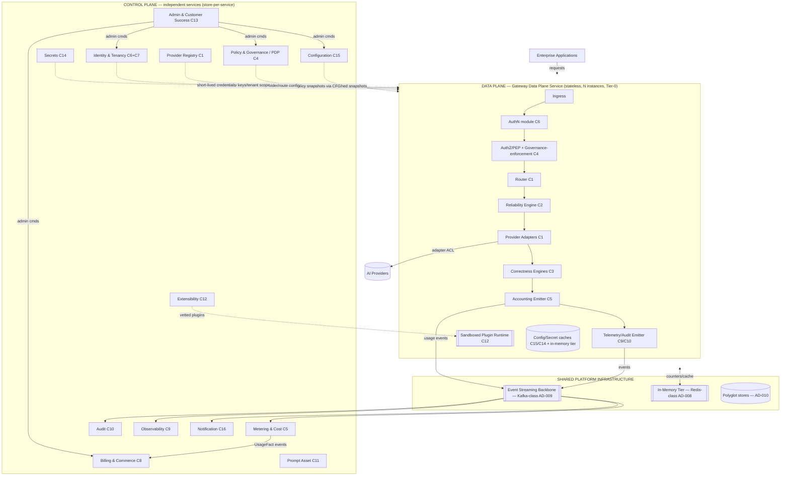
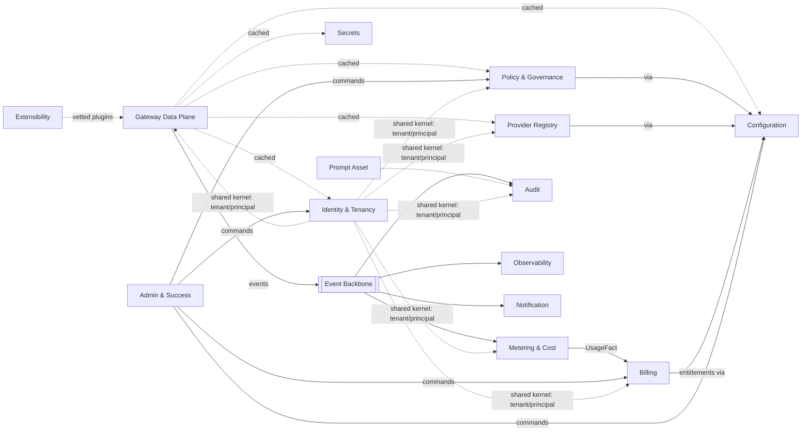

# 06 — Service Boundaries

**Document:** Service Boundaries & Decomposition Specification
**Project:** Reliability-First AI Gateway
**Status:** **Approved & Frozen (v1.3, 2026-07-20)** — **binding service-decomposition standard**
**v1.3 changes (additive, surfaced by the `08` review — finding C1):** added §23.11 `RequestFinalized` terminal event (per-request audit-completeness manifest). Purely additive; no existing event changed.
**v1.1 changes:** SB-D1 strengthened (four separations); SB-D2 (Billing/Prompt/Notification promoted to first-class); added §23 Event Ownership Matrix and §24 Data Ownership Matrix (canonical references for `07`/`08`).
**v1.2 changes (consistency fix surfaced by the `07` review):** added §23.10 Administration (C13) events — previously referenced by §24 (`rfaig.admin.*`) and `05 §12.8` but omitted from the event matrix. No other content changed.
**Audience:** Architecture, Engineering Leadership, Platform & Stream-aligned Teams, SRE, Auditors
**Classification:** Internal — Architecture Standard
**Builds on (approved, frozen):** `00`, `01`, `02`, `03`, `04`, `05`, and the ADR register in `adr/` (referenced by ID, e.g., AD-020; see `adr/000-ADR-Index.md`)

> **Authority & scope.** This document turns the 16 bounded contexts of `05-Domain-Model.md` into concrete, ownable **services and module boundaries**. It defines what is a network service, what is an in-process module, who owns each store, how services communicate, how failure is contained, and how teams are aligned. It stays at the **service-architecture level**: no code, no interface/API signatures, no schemas, no package layouts. It elaborates — and never contradicts — `04-System-Architecture.md` and the ADRs; where it refines a `04` container it maps the refinement explicitly (Section 7).
>
> **The one idea to hold on to.** Because the hot path is **co-located** (AD-020), a bounded context is **not** the same thing as a network service. Each request-path context is **partitioned**: an in-process **module** in the Data Plane (enforcement/emission, on the hot path) plus a **control-plane service** (management, off the hot path). "Service boundaries" therefore means two distinct kinds of boundary — network-service boundaries *and* internal module boundaries — and this document defines both.

---

## Table of Contents

1. Executive Summary
2. Purpose & Scope
3. Constraints from the Frozen Documents
4. Service Decomposition Principles
5. Central Principle — Bounded Context ≠ Service
6. Context → Plane Partition Map
7. Reconciliation with the `04` Container Diagram
8. Service Topology
9. Service Catalogue
10. The Data Plane as a Modular Monolith
11. Service Communication Patterns
12. Data Ownership & Store-per-Service
13. Failure Domains & Blast Radius
14. Scaling & Deployment Matrix
15. Service Boundary Rules & Anti-Patterns
16. Team & Ownership Topology
17. Cross-Cutting Business-Requirement Ownership
18. Service Dependency Graph
19. Criticality Classes & SLO Tiering
20. Risks & Open Questions
21. Traceability Matrix
22. Appendix

---

## 1. Executive Summary

`05-Domain-Model.md` established 16 bounded contexts. A naïve reading would create 16 microservices. That reading is wrong here, and the reason is `04`/AD-020: the request path is a **co-located pipeline in one horizontally-scaled unit**, because the latency budget (`NFR-LAT-001`, P99 ≤ 50 ms added) cannot absorb a network hop per stage. Consequently, the hot-path portions of several contexts run as **in-process modules inside a single Data Plane service**, while the management portions of every context run as **independent control-plane services**.

This produces a deliberate, two-tier decomposition:

- **One Data Plane service** — the co-located request pipeline — hosting in-process modules drawn from the request-path contexts (Ingress, Identity/AuthN, Authorization/PEP, Governance-enforcement, Router, Reliability Engine, Provider Adapters, Correctness Engines, Accounting Emitter, Telemetry/Audit Emitter) plus a sandboxed Plugin Runtime. It is stateless (AD-006), horizontally scaled, and **request-critical** (its outage is the *only* failure that stops request serving).
- **Thirteen Control Plane services** — Provider Registry, Policy & Governance, Configuration, Identity & Tenancy, Secrets, Metering & Cost, Billing & Commerce, Audit, Observability, Prompt Asset, Extensibility, Administration & Customer Success, Notification — each owning the management of one or more contexts and its own store (store-per-service).

The headline reliability property, inherited from AD-017/AD-022, is that **no control-plane service failure can cause a data-plane request outage**: the Data Plane runs on cached, last-known-good snapshots and keeps serving. This makes the failure-domain map simple and strong — there is exactly one request-outage failure domain (the Data Plane itself), everything else degrades gracefully.

A second, organizational consequence follows directly from AD-020: **the Data Plane is a modular monolith** — one deployable artifact owned by a platform team for its runtime and SLOs, composed of in-process modules owned by stream-aligned teams as internal libraries with enforced contracts. This is the single most important thing for engineering leadership to internalize before staffing: on the hot path, teams own **modules, not services**.

The document specifies the context→plane partition, reconciles every service to a `04` container (including the one split `04` implies), defines communication patterns (in-process on the hot path; cached-snapshot pull and async events across the plane boundary; never a synchronous control-plane call on the hot path), store ownership, failure domains, scaling, team topology, and pins the seven cross-cutting business requirements to concrete owners. It closes with a full traceability matrix.

---

## 2. Purpose & Scope

**Purpose.** Give every team an unambiguous answer to: *What service or module do I own? What may it touch? How does it talk to others? What happens when it fails? Who is accountable?* — derived from the domain model and constrained by the architecture.

**In scope.** Network-service boundaries; in-process module boundaries within the Data Plane; store ownership; synchronous vs asynchronous interaction rules; failure isolation; scaling and deployment granularity; team ownership; cross-cutting requirement ownership.

**Out of scope (deferred).** Event schemas and topics (→ `07-Event-Architecture.md`); data models and store technology detail (→ `08-Data-Architecture.md`); technology selections beyond the ADRs (→ `09-Technology-Decisions.md`); interface/API definitions and code (→ standards + module docs 17–28). This document names *what* services exist and *why they are bounded as they are* — not their internal implementation.

---

## 3. Constraints from the Frozen Documents

These are inputs, not decisions:

- **AD-020** — hot-path stages are co-located in one unit; the control plane is decomposed. *(The defining constraint of this document.)*
- **AD-017** — Data Plane / Control Plane separation; control-plane outage must not stop the data plane.
- **AD-006** — Data Plane is stateless; ephemeral state in the in-memory tier; durable state in control-plane stores.
- **AD-022** — Data Plane runs on cached, versioned, last-known-good snapshots; no synchronous control-plane call on the hot path.
- **AD-005** — off-hot-path integration is event-driven.
- **AD-002 / AD-007** — externals (providers, IdP, KMS, sinks) are adapters behind ports; provider complexity lives in the adapter layer.
- **AD-019** — authorization is PEP (data plane) / PDP (control plane) split.
- **AD-021** — tenant isolation is absolute and threads through every service/module.
- **AD-004** — plugins are sandboxed, additive-only, at defined extension points.
- **AD-016** — reliability-first is the tie-breaker; invariants are absolute.
- **NFR-LAT-001 / NFR-PERF-001** — the latency budget that forbids per-stage network hops on the hot path.
- **`05` bounded contexts C1–C16** — the domain boundaries these services realize.

---

## 4. Service Decomposition Principles

1. **Latency governs hot-path granularity.** On the request path, boundaries are drawn to avoid network hops (AD-020). Fine-grained decomposition is applied only where latency is not critical (the control plane).
2. **A service owns its data.** Store-per-service; no service reads another's store directly (Section 12).
3. **Contexts partition across planes.** A context's *enforcement/emission* runs as a Data-Plane module; its *management* runs as a control-plane service (Section 5–6).
4. **Async by default across the plane boundary.** The Data Plane pulls cached snapshots and emits events; it never makes a synchronous control-plane call on the hot path (AD-022, AD-005).
5. **One owner per service and per module.** Every service and every in-process module has exactly one accountable team (Section 16).
6. **Failure isolation is designed, not hoped for.** Every boundary is drawn so that a failure on one side degrades gracefully on the other (Section 13).
7. **Invariants cross no boundary weakened.** Isolation, no-silent-delivery, audit integrity, non-exposure, residency, no-bypass hold within and across every boundary (AD-016/018/021).
8. **Elaborate, don't contradict.** Every service maps to a `04` container or is a `04 §54` future-module extension (Section 7).

---

## 5. Central Principle — Bounded Context ≠ Service

In a conventional microservice architecture, one bounded context ≈ one service. Here, AD-020 breaks that equivalence for request-path contexts. There are **two kinds of boundary**:

- **Network-service boundary** — a separately deployable, independently scalable process with its own store. All control-plane services, and the Data Plane *as a whole*, are network services.
- **In-process module boundary** — a cohesive unit *inside* the Data Plane deployable, separated by DDD/hexagonal discipline and contract tests rather than by a network. The hot-path stages are modules, not services.

A request-path context therefore lives in **two places at once**:

```
Bounded Context (e.g., C4 Governance & Policy)
        │
        ├── Data-Plane MODULE ── "Governance-enforcement + PEP"
        │      (applies cached policy, classification, redaction, residency, per request)
        │
        └── Control-Plane SERVICE ── "Policy & Governance Service (PDP)"
               (authors, validates, versions, and distributes policy snapshots)
```

The module and the service communicate only through **cached snapshots** (control→data) and **events** (data→control) — never a synchronous hot-path call. This partition is the structural realization of AD-019 (PEP/PDP), AD-022 (snapshots), and AD-005 (events), and it is what lets the Data Plane keep serving when the control plane is down.

**Why this is correct, not a compromise.** The alternative — making each stage a network service — was considered and rejected in AD-020: it blows the latency budget and multiplies hot-path failure modes. Co-location with strong internal module boundaries gives the *design* benefits of separation (clear ownership, testability, evolvability) without the *runtime* cost of network hops.

---

## 6. Context → Plane Partition Map

For each of the 16 contexts: the Data-Plane module (hot-path runtime, if any) and the Control-Plane service (management). "—" means the context has no hot-path runtime (management-only).

| Context (`05`) | Data-Plane Module (in the Gateway Data Plane Service) | Control-Plane Service | Notes |
|---|---|---|---|
| **C1** Provider & Routing | **Router** + **Provider Adapters** (execute routing & invocation using cached provider/route config) | **Provider Registry Service** | Adapters = ACL to providers (AD-007) |
| **C2** Reliability | **Reliability Engine** (retry/failover/rate-limit/circuit/cache execution using in-memory tier) | — (policy authored in Governance/Config) | Almost entirely DP; no dedicated CP service |
| **C3** Correctness | **Correctness Engines** (structured-output, streaming, tool-call) | — (schemas/policies distributed via Configuration) | DP-only at runtime |
| **C4** Governance & Policy | **Governance-enforcement + Authorization/PEP** (cached policy, classification, redaction, residency, quota-enforcement) | **Policy & Governance Service (PDP)** | AD-019 PEP/PDP split |
| **C5** Metering & Cost | **Accounting Emitter** (measures usage, emits usage events) | **Metering & Cost Service** | Measurement DP; aggregation/reconciliation/publish CP |
| **C6** Identity & Access | **Authentication** (validates credentials vs cached keys; attributes principal) | **Identity & Tenancy Service** | Shared kernel; federation to IdP (ACL) |
| **C7** Tenancy & Organization | **Tenant-scope resolution** (derives isolation/attribution scope from authenticated context) | **Identity & Tenancy Service** | Co-located with Identity (see §7) |
| **C8** Billing & Commerce | — (entitlement *limits* cached & enforced by C2/C4 modules) | **Billing & Commerce Service** | CP-only; consumes usage facts |
| **C9** Observability | **Telemetry Emitter** (emits metrics/traces/logs) | **Observability Service** | Emission DP; storage/query CP |
| **C10** Audit & Compliance | **Audit Emitter** (emits audit events) | **Audit Service** | Emission DP; capture/seal/report CP |
| **C11** Prompt Asset Mgmt | — (DP may reference an asset id for correlation) | **Prompt Asset Service** | CP-only |
| **C12** Extensibility | **Plugin Runtime** (sandboxed execution at extension points) | **Extensibility Service** | Runtime DP (sandboxed); registry/marketplace/SDK/webhook CP |
| **C13** Administration & Success | — | **Administration & Customer Success Service** | CP-only |
| **C14** Secrets & Credentials | **Secret cache** (short-lived credential material) | **Secrets Service** | Cache DP; lifecycle CP |
| **C15** Configuration & Feature Mgmt | **Config cache** (last-known-good snapshots, feature flags) | **Configuration Service** | Cache DP; authoring/distribution CP |
| **C16** Notification | — | **Notification Service** | CP-only; consumes events |

**Reading the map.** The Gateway Data Plane Service hosts **modules** from C1, C2, C3, C4, C5, C6, C7, C9, C10, C12(plugin), C14(cache), C15(cache). Every context's **management** is a control-plane service. Three contexts (C8, C11, C13, C16) are management-only. This table is the authoritative partition; every subsequent section is consistent with it.

---

## 7. Reconciliation with the `04` Container Diagram

`04 §10` defined containers at a higher level. This document refines them into services. The mapping (no contradictions; one deliberate split, plus `04 §54` additions):

| `04 §10` Container | This document's service(s) | Relationship |
|---|---|---|
| Ingress / Connection Manager (DP) | Gateway Data Plane Service — *Ingress module* | Refinement (module of the DP unit) |
| Request Processing Pipeline (DP) | Gateway Data Plane Service — *pipeline modules* | Refinement |
| Provider Adapter Layer (DP) | Gateway Data Plane Service — *Provider Adapters module* + **Provider Registry Service** | Split: runtime adapters (DP) vs mgmt (CP) |
| Plugin Runtime (DP) | Gateway Data Plane Service — *sandboxed Plugin Runtime* + **Extensibility Service** | Split: runtime (DP) vs registry (CP) |
| Configuration & Policy Service (CP) | **Policy & Governance Service** (C4) + **Configuration Service** (C15) | **Deliberate split** (justified below) |
| Identity & Tenant Service (CP) | **Identity & Tenancy Service** (C6 + C7) | Kept combined |
| Secret & Credential Service (CP) | **Secrets Service** (C14) | 1:1 |
| Observability Backend (CP) | **Observability Service** (C9) | 1:1 |
| Audit Service & Store (CP) | **Audit Service** (C10) | 1:1 |
| Accounting & Cost Service (CP) | **Metering & Cost Service** (C5-mgmt) | 1:1 |
| Admin Portal & Control APIs (CP) | **Administration & Customer Success Service** (C13) | 1:1 |
| Plugin Registry (CP) | **Extensibility Service** (C12) | Broadened (adds SDK/webhook/marketplace) |
| **First-class platform services** (realized per `04 §54`) | **Billing & Commerce** (C8), **Prompt Asset** (C11), **Notification** (C16) | Promoted to official platform services (SB-D2) |

**The one deliberate split — "Configuration & Policy Service" → two services.** `04` grouped configuration and policy because configuration is the *distribution mechanism* for policy snapshots. At service-boundary granularity they resolve into two services because they differ on the dimensions that determine service boundaries:

- **Subdomain type & build posture** — Governance (C4) is **Core** (built with excellence); Configuration (C15) is **Generic** (standardise/buy). Bundling a Core domain with a Generic mechanism couples different investment levels and lifecycles.
- **Criticality** — both are Tier-1, but the Configuration Service is the *generic snapshot-distribution substrate* used by *many* services (policy, provider config, identity keys, feature flags), whereas Policy & Governance is the *authority for policy content*. The distributor and the authority are cleanly separable.
- **Ownership** — Governance is owned by a Core stream-aligned team; Configuration by the Platform team.

They remain tightly coupled only in that Policy & Governance *publishes* policy snapshots *through* the Configuration distribution substrate.

> **Confirmed decision SB-D1 (2026-07-20).** Policy & Governance and Configuration remain **separate logical services**. For the **MVP they may be co-deployed** in the same runtime for operational simplicity. Regardless of co-deployment, the following are **kept fully separate** so that independent deployment is possible in the future **without redesign**:
> - **Separate ownership** — different accountable teams (Governance = Core stream-aligned; Configuration = Platform).
> - **Separate interfaces (APIs)** — each exposes its own contract; neither calls into the other's internals.
> - **Separate domain models** — C4 (policy/governance) and C15 (configuration/feature-flags) models never merge.
> - **Separate repositories (stores)** — store-per-service is preserved; **no shared database, no shared internal state, no cross-reaching**.
>
> Co-deployment is therefore a **packaging choice only**; operational separation later is a topology change, not an architectural one.

This refinement does not contradict `04`; it elaborates one container into its two natural services.

**Identity & Tenant kept combined.** C6 (Identity) and C7 (Tenancy) are shared kernels with tightly-coupled lifecycles (a principal is always tenant-scoped). `04` combined them; we keep one **Identity & Tenancy Service** with two internal context-modules, matching `04` and avoiding chatty coupling. (Open question DOQ for future split if delegated-admin scale demands it — Section 20.)

> **Confirmed decision SB-D2 (2026-07-20) — Billing & Commerce, Prompt Asset, and Notification are promoted to first-class platform services.** They are **official, permanent** services of the platform architecture — not tentative future modules — each with its own bounded context, accountable owner, store, interfaces, domain model, and lifecycle. Their realization is consistent with `04 §54` (future-module attachment) and with their first-class status as bounded contexts C8/C11/C16 in `05`. **First-class denotes official/permanent standing and is independent of criticality class**: all three remain **Tier-2** by request-criticality (Section 19) while being first-class members of the platform. The Service Catalogue (Section 9), Topology (Section 8), Dependency Graph (Section 18), Ownership/Team topology (Section 16), and Traceability (Section 21) reflect this status.

---

## 8. Service Topology



---

## 9. Service Catalogue

> **Service template.** Plane · Owned context(s)/partition · Criticality class · Purpose · Responsibilities · State & data ownership · Synchronous interactions · Asynchronous interactions · Dependencies (upstream/downstream) · Failure isolation & degradation · Scaling profile · Deployment · Security boundary · Extension points · Owning team · Related ADR/NFR/BR/PRB. (Interactions described at business level — no API detail.)

### 9.1 Gateway Data Plane Service (DATA PLANE)

- **Plane:** Data · **Owned partition:** hot-path modules of C1, C2, C3, C4, C5, C6, C7, C9, C10 + Plugin Runtime (C12) + caches (C14, C15) · **Criticality:** **Tier-0 (request-critical).**
- **Purpose.** Process every enterprise AI request on the hot path — authenticate, authorize/govern, route, invoke reliably, enforce correctness, meter, and emit — within the latency budget.
- **Responsibilities.** Run the co-located pipeline (Section 8) as in-process modules; execute provider invocation via adapters; enforce non-bypassable correctness/governance (AD-018); serve from and update the in-memory tier; read cached config/policy/identity/secret snapshots; emit usage/telemetry/audit events.
- **State & data ownership.** **Stateless** (AD-006). Owns **no durable store**. Uses the shared in-memory tier (ephemeral, tenant-scoped) and local caches of snapshots (owned upstream by CP services).
- **Synchronous interactions.** Inbound: application requests (stable contract). Outbound: provider calls (via adapters). **No synchronous control-plane calls** (AD-022).
- **Asynchronous interactions.** **Produces:** usage-measured, telemetry, audit, security-signal events → event backbone. **Consumes:** cached snapshot updates (config/policy/provider/identity/secret) via pull; vetted-plugin updates.
- **Dependencies.** Upstream (async/cached): all snapshot-producing CP services + Secrets + Configuration. Downstream: providers (adapters); event backbone; in-memory tier.
- **Failure isolation & degradation.** Its outage = request outage (the **only** such failure domain). On control-plane outage it **keeps serving on last-known-good** (AD-022). On in-memory tier degradation it **fails safe** (rate limits conservative, cache misses fall through). On event-backbone backpressure it applies bounded buffering; audit/usage never silently dropped (durability upstream).
- **Scaling profile.** Horizontal, near-linear, stateless (AD-006, NFR-SCALE-001); elastic with warm headroom (NFR-ELAS/CAP).
- **Deployment.** One immutable, zero-downtime, progressively-rolled deployable (AD-020, NFR-UPG-001), many instances, zone-redundant, multi-region per tier.
- **Security boundary.** Zero-trust ingress (mTLS, authN); tenant isolation enforced per request (AD-021); plugins sandboxed (AD-004); secrets never logged.
- **Extension points.** Additive-only plugin points (pre-routing, classification, validation, telemetry, attribution) via the sandboxed runtime (AD-004; `04 §53`).
- **Owning team.** **Platform team** owns the runtime/assembly and Tier-0 SLOs; **stream-aligned teams** own individual modules (Section 10, 16).
- **Related.** ADR AD-020/017/006/022/018/019/004; NFR-LAT/PERF/AV/SCALE/REL; BR-001/002/003/004/005/015/021; PRB-001/004/005/008/009/016.

---

### 9.2 Provider Registry Service (CONTROL PLANE — C1 mgmt)
- **Criticality:** Tier-1. **Purpose:** onboard/retire providers, maintain the capability registry, aggregate health; publish provider/route configuration to the Data Plane.
- **State/data:** owns the provider/capability/health store. **Sync:** admin authoring; health ingestion. **Async:** produces provider-registered/retired/health-changed events; publishes provider/route snapshots (via Configuration). **Failure/degradation:** if down, DP routes on last-known-good provider config; no new providers/health updates propagate (no request outage). **Scaling:** modest, read-heavy. **Team:** Provider & Routing (stream-aligned). **Related:** AD-007/014; NFR-FO/MR; BR-006/007/008; PRB-007/008.

### 9.3 Policy & Governance Service (CONTROL PLANE — C4 PDP)
- **Criticality:** Tier-1. **Purpose:** author, validate, version, and distribute policy (authorization, data-handling, residency, model/provider governance, quota-enforcement); the PDP of the PEP/PDP split (AD-019).
- **State/data:** owns the policy store. **Sync:** admin authoring/validation. **Async:** produces policy-published events; distributes policy snapshots through the Configuration substrate. **Failure/degradation:** if down, DP enforces last-known-good policy (AD-022); no policy changes propagate; **security-critical changes use the high-priority path** (AD-022). No request outage; deny-by-default preserved. **Scaling:** modest. **Team:** Governance (stream-aligned, Core). **Related:** AD-019/018/012/022; NFR-AUTHZ/DP/MR/CFG; BR-015/016/017/018/023; PRB-013/014/016/017.

### 9.4 Configuration Service (CONTROL PLANE — C15)
- **Criticality:** Tier-1 (substrate). **Purpose:** the generic, validated, immutable, versioned **snapshot-distribution substrate** and feature-flag authority used by all snapshot consumers.
- **State/data:** owns the config/snapshot store. **Sync:** authoring/validation; snapshot pull by DP and services. **Async:** config-published/feature-flag-changed/drift-detected events. **Failure/degradation:** if down, all consumers run on last-known-good; **no propagation of any config/policy/provider snapshot** until restored (highest-leverage Tier-1 service — but still no request outage). **Scaling:** read-heavy, cache-fronted. **Team:** Platform. **Related:** AD-013/022; NFR-CFG; BR-027; PRB-030.

### 9.5 Identity & Tenancy Service (CONTROL PLANE — C6 + C7)
- **Criticality:** Tier-1. **Purpose:** manage principals, federation configuration, sessions (C6) and the organization→tenant→workspace→project hierarchy and isolation/attribution scopes (C7).
- **State/data:** owns the identity + tenancy store. **Sync:** federation to enterprise IdP (ACL); admin/tenant provisioning; DP pulls cached verification keys/tenant scope. **Async:** principal/tenant lifecycle events. **Failure/degradation:** if down, DP authenticates against cached keys and resolves cached tenant scope; **no new principals/tenants onboard** until restored; existing traffic unaffected (no request outage). **Isolation:** the source of the tenant scope that AD-021 enforces everywhere. **Scaling:** read-heavy. **Team:** Platform (with Security). **Related:** AD-012/021/019; NFR-AUTH/AUTHZ/REL-002; BR-021/017; PRB-029.

### 9.6 Secrets Service (CONTROL PLANE — C14)
- **Criticality:** Tier-1 (security-critical). **Purpose:** store, rotate, revoke, and issue provider credentials/keys without exposure; integrate customer-managed keys (ACL to KMS).
- **State/data:** owns the (encrypted) secret store. **Sync:** rotation/revocation admin flows; KMS integration (ACL to customer-managed keys). **Cached (not hot-path sync):** the Data Plane holds **short-TTL credential material as a cached snapshot**, refreshed out-of-band ahead of expiry — this preserves the no-synchronous-control-plane-call-on-hot-path rule (AD-022, R-1); a cache miss is a rare degraded case that fails safe. **Async:** secret-rotated/revoked events. **Failure/degradation:** if down, DP uses short-TTL cached credentials until expiry, then affected provider calls fail safe (explicit error, no bypass); revocation ≤ 5 min honored via TTL. **Security boundary:** the most sensitive service; strongest hardening. **Scaling:** modest. **Team:** Security (Platform). **Related:** AD-012; NFR-SEC-SM/ENC; BR-020; PRB-015.

### 9.7 Metering & Cost Service (CONTROL PLANE — C5 mgmt)
- **Criticality:** Tier-1 (data-integrity). **Purpose:** consume usage events, aggregate and attribute, reconcile against provider ground truth, and publish authoritative **UsageFact** (published language) to Billing.
- **State/data:** owns the usage ledger + reconciliation store. **Sync:** usage/cost queries. **Async:** consumes usage-measured events (from DP); produces UsageFact/reconciliation events. **Failure/degradation:** if down, usage events **buffer durably** on the backbone (RPO=0 for accounting); processing lags but nothing is lost. **Scaling:** high-ingest consumer; scales with traffic. **Team:** Metering (stream-aligned, Core). **Related:** AD-005/010; NFR-COST; BR-012/013; PRB-012/010.

### 9.8 Billing & Commerce Service (CONTROL PLANE — C8)
- **Criticality:** Tier-2. **Purpose:** subscriptions, entitlements/licensing, usage rating (from UsageFact), invoicing.
- **State/data:** owns the billing store. **Sync:** admin/commercial flows. **Async:** consumes UsageFact; produces subscription/invoice/entitlement events; entitlement *limits* published to Configuration for DP enforcement. **Failure/degradation:** if down, no billing/invoicing runs; request serving and metering unaffected. **Scaling:** low-volume, periodic. **Team:** Commercial (stream-aligned). **Related:** AD-010/005; NFR-COST; BR-012/013, COMM/LIC; PRB-012.

### 9.9 Audit Service (CONTROL PLANE — C10)
- **Criticality:** Tier-1 (compliance-critical). **Purpose:** capture audit events, seal immutable tamper-evident records, apply retention, produce compliance reports.
- **State/data:** owns the append-only/WORM audit store. **Sync:** audit queries/exports. **Async:** consumes audit events (from DP + services); produces audit-sealed/report events. **Failure/degradation:** if down, audit events **buffer durably** (RPO=0); capture lags but zero loss — an invariant (AD-005/009). **Security boundary:** access to audit data is itself governed. **Scaling:** high-ingest consumer + query. **Team:** Compliance (stream-aligned). **Related:** AD-009/005; NFR-AUD/COMP; BR-011/024/022; PRB-011/014.

### 9.10 Observability Service (CONTROL PLANE — C9)
- **Criticality:** Tier-2. **Purpose:** store and query metrics/traces/logs; compute SLIs; export to enterprise SIEM/APM.
- **State/data:** owns the time-series/telemetry store. **Sync:** dashboards/queries. **Async:** consumes telemetry events; produces SLI-breach events. **Failure/degradation:** if down, operators lose visibility (serious operationally) but request serving is unaffected; telemetry buffers with graceful degradation. **Scaling:** high-cardinality, high-ingest. **Team:** SRE/Platform. **Related:** AD-011/005; NFR-OBS/MET/TRC; BR-010; PRB-011.

### 9.11 Prompt Asset Service (CONTROL PLANE — C11)
- **Criticality:** Tier-2. **Purpose:** govern prompt templates/versions/approvals as auditable assets (no conversation state — OOS-2/3).
- **State/data:** owns the prompt-asset store. **Sync:** authoring/approval flows; asset retrieval. **Async:** asset lifecycle events. **Failure/degradation:** if down, asset authoring/retrieval unavailable; request serving unaffected. **Scaling:** low. **Team:** Product. **Related:** AD-004; NFR-AUD; BR-015/016; PRB-016.

### 9.12 Extensibility Service (CONTROL PLANE — C12)
- **Criticality:** Tier-2. **Purpose:** plugin vetting/registry/marketplace, SDK version registry, webhook subscription & outbound delivery; distributes vetted plugins to the DP runtime.
- **State/data:** owns the plugin/SDK/webhook store. **Sync:** submission/vetting/subscription flows. **Async:** plugin-published/deprecated events; consumes events to trigger webhook delivery; produces webhook-delivered/failed events. **Failure/degradation:** if down, no new plugins/webhook deliveries; existing sandboxed plugins in the DP keep running on last-known-good. **Scaling:** modest + webhook-delivery workers. **Team:** Ecosystem (enabling). **Related:** AD-004; NFR-PERF-003; BR-028/029/030; PRB-025/026.

### 9.13 Administration & Customer Success Service (CONTROL PLANE — C13)
- **Criticality:** Tier-2. **Purpose:** admin control operations, deployment lifecycle management, support cases, customer-success plans; the control surface acting on other services.
- **State/data:** owns the admin/support/success store. **Sync:** admin/control flows (strong/MFA auth); issues commands to Governance/Identity/Billing/Config. **Async:** admin-action/support/deployment events. **Failure/degradation:** if down, no admin operations; request serving and all Tier-0/1 functions unaffected. **Security boundary:** privileged; every action audited. **Scaling:** low. **Team:** Customer Success/Ops. **Related:** AD-012; NFR-A11Y/SUP/AUD; BR-015, `02`§26/28; PRB-016/023.

### 9.14 Notification Service (CONTROL PLANE — C16)
- **Criticality:** Tier-2 (generic). **Purpose:** deliver alerts/communications (budget, security, admin) to configured channels.
- **State/data:** owns notification config/state. **Sync:** channel configuration. **Async:** consumes events (budget/security/admin) → delivers; produces notification-sent/failed events. **Failure/degradation:** if down, notifications delay/queue; no impact on serving. **Scaling:** modest. **Team:** Platform. **Related:** AD-005; NFR-ALRT; BR-013/024; PRB-011.

---

## 10. The Data Plane as a Modular Monolith

The most important organizational consequence of AD-020: **the Data Plane is one deployable artifact composed of in-process modules owned by different teams.** This is a *modular monolith*, deliberately, on the hot path.

- **The Platform team owns the deployable** — the runtime, the assembly/composition of modules into the pipeline, the Tier-0 SLOs, the release train, and the internal contracts between modules.
- **Stream-aligned teams own modules as internal libraries** — Provider & Routing owns the Router + Adapters modules; Reliability owns the Reliability Engine; Correctness owns the Correctness Engines; Governance owns the PEP/Governance-enforcement module; Metering owns the Accounting Emitter; Security/Platform owns AuthN + tenant-scope.
- **Boundaries are enforced by contract, not by network** — DDD/hexagonal module boundaries (AD-002/003), consumer-driven contract tests, and CI gates substitute for the network boundaries a microservice would provide. A module may only interact with another through its published internal contract; no reaching into another module's internals.
- **Release model** — modules are versioned libraries; the Platform team composes a validated set into each immutable Data Plane release (zero-downtime, progressive, auto-rollback — NFR-UPG-001). A module change ships via the Data Plane release train, not independently.

**Why accept a monolith here.** A monolith's usual downsides (coupled deploys, blast radius) are bounded by: statelessness (any instance is disposable), strong internal contracts, and the fact that the *alternative* (network-per-stage) is explicitly worse for latency and failure modes (AD-020). The upside — meeting the latency budget and a simple Tier-0 failure domain — is decisive. This is the correct trade for a reliability-first hot path.

**Guardrail (anti-erosion).** If a single module's isolation or scaling needs ever justify extraction to its own service, that is a deliberate decision recorded as an ADR (per `04` AOQ-1) — not an ad-hoc drift.

---

## 11. Service Communication Patterns

| From → To | Pattern | Sync/Async | Rule |
|---|---|---|---|
| Application → Data Plane | Stable request contract (mTLS) | Sync | Only inbound sync on the hot path |
| Module → Module (in DP) | In-process contract | In-process | No network hop (AD-020) |
| Data Plane → Provider | Adapter (ACL) | Sync (outbound) | Only outbound sync on the hot path |
| Control Plane → Data Plane | Cached versioned snapshots (pull) | Async pull | **Never** a per-request sync call (AD-022) |
| Data Plane → Control Plane | Domain events → backbone | Async | Usage/telemetry/audit/security events (AD-005) |
| CP service → CP service | Domain events (default); sync only for admin/authoring | Mostly async | Prefer events; sync only where a human/admin flow needs a response |
| Metering → Billing | UsageFact (published language) | Async | The single Core→commercial bridge |
| Admin → {Governance, Identity, Billing, Config} | Command (request/response) | Sync | Authoring/control flows, off hot path |

**Absolute rule (restated):** **No synchronous control-plane call on the request hot path — ever.** Everything the hot path needs from the control plane arrives as a cached snapshot; everything it tells the control plane leaves as an async event. This rule is what makes AD-017's "control-plane outage does not stop the data plane" true in practice, and what keeps the latency budget intact.

---

## 12. Data Ownership & Store-per-Service

- **Store-per-service.** Each control-plane service owns its store exclusively. **No service reads or writes another service's store directly.** Cross-service data flows only via events (async) or explicit sync contracts.
- **The Data Plane owns no durable store** (AD-006); it owns only ephemeral, tenant-scoped state in the shared in-memory tier and local snapshot caches (whose source of truth is upstream CP services).
- **Shared platform infrastructure (not shared databases):**
  - *Event Streaming Backbone* (AD-009) — shared **transport**, not a shared database; each stream/topic has a producer-owner and consumer-owners (defined in `07`).
  - *In-Memory Tier* (AD-008) — shared substrate, but access is **namespaced per module/service and tenant-scoped**; not a system of record.
  - *Polyglot stores* (AD-010) — physically may be shared clusters, but each is partitioned into **service-owned datasets**; ownership, not co-location, is the boundary.
- **Published language.** The only cross-context *shared* data contracts are the published-language artifacts (e.g., **UsageFact** from Metering to Billing; correlation identifiers shared by Observability and Audit). These are versioned contracts (`07`/`08`), not shared tables.
- **Rationale.** Store-per-service preserves context autonomy, prevents hidden coupling, and enables independent evolution and scaling (AD-003, NFR-VER/SCALE). It also localizes the blast radius of a data incident to one service.

---

## 13. Failure Domains & Blast Radius

The decomposition is drawn so failure domains are few and well-contained:

| Failure | Blast radius | Behavior |
|---|---|---|
| **Gateway Data Plane Service down** | **Request outage** (the only request-outage domain) | HA/DR: zone/region redundancy, failover (NFR-HA/DR); stateless instances disposable |
| Any single **Control Plane service** down | **No request outage** | Data Plane runs on last-known-good snapshots (AD-022); that service's *management* function pauses |
| **Configuration Service** down | No request outage; **no snapshot propagation** (highest-leverage CP) | Consumers hold last-known-good; high-priority path queued for restore |
| **Secrets Service** down | No request outage until cached credentials expire | Short-TTL cache; then affected provider calls fail safe (no bypass) |
| **Event backbone** down/backpressured | **No loss** for audit/accounting (durable, RPO=0); telemetry degrades gracefully | DP buffers within bounds; consumers lag then catch up |
| **In-memory tier** degraded | No request outage | Fail-safe: rate limits conservative, cache misses fall through to origin |
| **A single DP module** faulty | Contained by contracts; but **shares the DP deployable** | Caught by contract tests/CI pre-release; runtime faults isolated by module boundaries; rollback via release train |

**Headline property (from AD-017/AD-022):** there is exactly **one** request-outage failure domain (the Data Plane). Every control-plane and infrastructure failure degrades gracefully without stopping request serving. This is the core reliability dividend of the data/control split and the reason the decomposition is shaped this way.

---

## 14. Scaling & Deployment Matrix

| Service | Scaling driver | Profile | Deployment |
|---|---|---|---|
| Gateway Data Plane | Request volume | Horizontal, near-linear, elastic, warm headroom | Immutable, zero-downtime, multi-instance, zone/region-redundant |
| Provider Registry | Provider count + health ingest | Modest, read-heavy | Standard CP, zone-redundant |
| Policy & Governance | Policy authoring + distribution | Modest | Standard CP; **MVP co-deploy with Configuration permitted (SB-D1)**, separable later without re-architecture |
| Configuration | Snapshot reads (all consumers) | Read-heavy, cache-fronted | Standard CP, highly available |
| Identity & Tenancy | AuthN verification + provisioning | Read-heavy | Standard CP, HA |
| Secrets | Credential issuance/rotation | Modest, security-hardened | Isolated, hardened CP |
| Metering & Cost | Usage-event ingest | High-ingest consumer, scales w/ traffic | Consumer fleet |
| Billing & Commerce | Periodic rating/invoicing | Low-volume | Standard CP |
| Audit | Audit-event ingest + query | High-ingest consumer + query | Consumer fleet + WORM store |
| Observability | Telemetry ingest + query | High-cardinality/high-ingest | Consumer fleet + TSD |
| Prompt Asset | Authoring/retrieval | Low | Standard CP |
| Extensibility | Registry + webhook delivery | Modest + delivery workers | CP + worker fleet |
| Admin & Success | Admin/support ops | Low | Standard CP |
| Notification | Event-driven delivery | Modest | CP + delivery workers |

Data Plane and high-ingest consumers (Metering, Audit, Observability) scale with traffic; the rest scale with management/tenant activity. Deployment models per customer tier follow `04 §34–36` and NFR-MR/DR.

---

## 15. Service Boundary Rules & Anti-Patterns

**Rules (MUST):**
- R-1: No synchronous control-plane call on the request hot path (AD-022).
- R-2: No service accesses another service's store directly (store-per-service).
- R-3: Hot-path stages are in-process modules, not network services (AD-020).
- R-4: Cross-service integration is event-first; sync only for admin/authoring flows.
- R-5: Every service and module has exactly one owning team.
- R-6: Tenant scope propagates through every service/module; isolation is never crossed (AD-021).
- R-7: Extensions are additive-only and sandboxed; they never become a bypass (AD-004/018).
- R-8: Any hot-path module extraction to a service requires an ADR (`04` AOQ-1).

**Anti-patterns (MUST NOT), and why avoided:**
- *Microservice-per-stage on the hot path* — blows latency budget (AD-020). Avoided by co-location.
- *Shared database across services* — hidden coupling, blast-radius spread. Avoided by store-per-service.
- *Synchronous policy/config lookup per request* — couples availability, adds latency. Avoided by cached snapshots (AD-022).
- *God service* (e.g., a mega "core" service) — erodes cohesion/ownership. Avoided by context-aligned services + partition map.
- *Chatty cross-context sync calls* — latency and fragility. Avoided by event-first integration.
- *Distributed monolith* (services that must deploy together) — worst of both. Avoided: CP services are independently deployable; only the DP is intentionally one deployable, and that is a *modular* monolith by design, not by accident.

---

## 16. Team & Ownership Topology

Using Team Topologies:

| Team type | Team | Owns |
|---|---|---|
| **Platform** | Core Platform | Gateway Data Plane *deployable/runtime* + Tier-0 SLOs; Configuration; Identity & Tenancy; Notification; shared infra (event backbone, in-memory tier, stores, deployment) |
| **Platform (security)** | Security Platform | Secrets Service; security posture; zero-trust substrate |
| **Stream-aligned** | Provider & Routing | Router + Provider Adapters modules (DP) + Provider Registry Service |
| **Stream-aligned** | Reliability | Reliability Engine module (DP) — reliability policy with Governance |
| **Stream-aligned** | Correctness | Correctness Engines module (DP) |
| **Stream-aligned** | Governance | PEP/Governance-enforcement module (DP) + Policy & Governance Service |
| **Stream-aligned** | Metering & FinOps | Accounting Emitter module (DP) + Metering & Cost Service |
| **Stream-aligned** | Compliance | Audit emitter (DP) + Audit Service |
| **Stream-aligned** | Commercial | Billing & Commerce Service |
| **Stream-aligned** | Customer Success/Ops | Administration & Customer Success Service |
| **Complicated-subsystem** | Provider Adapters | Deep per-provider adapter expertise (supplies the Adapters module to Provider & Routing) |
| **Enabling** | Developer Experience / Ecosystem | SDKs, Extensibility Service, standards adoption |
| **Supporting** | SRE | Observability Service; reliability operations; game days |

**Key tension made explicit:** the Data Plane is one deployable owned by Core Platform, but several stream-aligned teams own modules within it. This is managed as a **modular monolith with an internal platform-as-product model**: Core Platform provides the assembly, contracts, and release train; stream-aligned teams deliver modules against those contracts. Interaction mode: *X-as-a-Service* (Platform provides the runtime) + *collaboration* during contract evolution.

---

## 17. Cross-Cutting Business-Requirement Ownership

Resolving the seven cross-cutting BRs the health report flagged — each now pinned to an owner:

| BR | Requirement | Primary Owner(s) | Realized as |
|---|---|---|---|
| **BR-005** | Predictable behavior under load/time | Gateway Data Plane (Core Platform) + in-memory tier + autoscaling | Stateless scaling, headroom, backpressure, isolation detectors |
| **BR-019** | Content trust / injection defense | Governance module (DP) + Policy & Governance Service | Content-trust controls as policy at designated points |
| **BR-025** | Operational manageability | Administration & Success Service + Core Platform | Admin/deployment operations, health visibility |
| **BR-026** | Enterprise networking | Core Platform (infra) + Data Plane egress | Private connectivity, egress control, residency-aware routing |
| **BR-028** | Developer integration experience | Ecosystem (Enabling) — Extensibility Service + Data Plane request contract | SDKs, stable contract, docs |
| **BR-031** | Flexible deployment models | Core Platform (infra) + Administration & Success | Deployment topologies per tier |
| **BR-036** | Version & upgrade management | Core Platform + Configuration + every service | Versioning governance, release trains, deprecation |

These BRs are quality/operational requirements owned by platform/infrastructure and cross-service governance — correctly not domain concepts. They are now traceable to concrete owners (updating the transparency note from the health report to **resolved**).

---

## 18. Service Dependency Graph

Directional runtime + management dependencies (async/cached unless noted). Hot-path dependencies are cached, not synchronous.



**Note:** the Data Plane has **no synchronous runtime dependency** on any control-plane service (all cached). The only synchronous hot-path dependency is outbound to providers. This keeps the hot-path dependency graph minimal, satisfying NFR-LAT-001.

---

## 19. Criticality Classes & SLO Tiering

*(Internal service criticality — distinct from the customer service tiers in `03 §64`.)*

| Class | Meaning | Services | SLO posture |
|---|---|---|---|
| **Tier-0** | Request-critical; outage = request outage | Gateway Data Plane | Highest availability (≥99.99% per customer tier), full HA/DR, zero-downtime deploys |
| **Tier-1** | Control/data-integrity critical; DP degrades gracefully if down | Configuration, Policy & Governance, Identity & Tenancy, Secrets, Provider Registry, Metering & Cost, Audit | High availability; strong durability (Metering/Audit RPO=0); high-priority propagation for security changes |
| **Tier-2** | Management/business; outage does not affect serving | Billing, Observability, Extensibility, Prompt Asset, Administration & Success, Notification | Standard availability; business-hours-to-24×7 by function |

**Rule:** invariants (isolation, no-silent-delivery, audit integrity, non-exposure, residency, no-bypass) hold at **all** classes; only availability/latency *guarantees* differ. Shared platform infrastructure (event backbone, in-memory tier, stores) inherits Tier-0/Tier-1 posture because Tier-0/1 services depend on it (durability and availability engineered accordingly — `08`).

---

## 20. Risks & Open Questions

**Risks.**
- **SR-1 — Modular-monolith erosion.** Module boundaries in the Data Plane could decay without network enforcement. *Mitigation:* contract tests, CI gates, DDD/hexagonal discipline, ADR-gated extraction (R-8).
- **SR-2 — Configuration Service as high-leverage dependency.** Many consumers depend on snapshot distribution. *Mitigation:* HA, cache-fronting, last-known-good, high-priority path (AD-022).
- **SR-3 — Shared deployable, multiple owners.** Coordination cost across module-owning teams on one release train. *Mitigation:* platform-as-product model, clear contracts, independent module testing.
- **SR-4 — Secrets Service blast radius.** Central credential authority. *Mitigation:* hardening, short-TTL caches, fail-safe, isolation.
- **SR-5 — Event backbone centrality.** Audit/metering depend on it. *Mitigation:* durability, replication, RPO=0, backpressure (AD-009).

**Open questions (for later documents).**
- **SOQ-1 — RESOLVED (SB-D1, 2026-07-20).** Policy & Governance and Configuration remain **separate logical services** with independent ownership and interfaces; **MVP co-deployment is permitted**, with operational separation possible later **without re-architecture** (store-per-service, ownership, and contracts preserved regardless). See Section 7.
- **SOQ-2** — Should Identity and Tenancy split as delegated-admin scale grows? (`05` DOQ-6.)
- **SOQ-3** — Webhook delivery: within Extensibility or shared with Notification? (`07`.)
- **SOQ-4** — Which high-ingest consumers (Metering/Audit/Observability) share vs isolate consumer fleets? (`08`.)
- **SOQ-5** — Exact snapshot topics/streams and their delivery semantics. (→ `07`.)
- **SOQ-6** — Provider Adapters: one complicated-subsystem team or per-provider sub-teams at scale?

---

## 21. Traceability Matrix

| Service | Context(s) | `04` Container | Criticality | BR | NFR | ADR | PRB |
|---|---|---|---|---|---|---|---|
| Gateway Data Plane | C1/2/3/4/5/6/7/9/10/12/14/15 (hot-path modules) | Ingress+Pipeline+Adapters+Plugin | Tier-0 | BR-001/002/003/004/005/015/021 | NFR-LAT/PERF/AV/SCALE/REL/SO/STRM | AD-020/017/006/022/018/019/004 | PRB-001/004/005/008/009/016 |
| Provider Registry | C1 mgmt | Provider Adapter Layer (mgmt) | Tier-1 | BR-006/007/008 | NFR-FO/MR | AD-007/014 | PRB-007/008 |
| Policy & Governance | C4 mgmt | Configuration & Policy (policy) | Tier-1 | BR-015/016/017/018/019/023 | NFR-AUTHZ/DP/MR | AD-019/018/012 | PRB-013/014/016/017 |
| Configuration | C15 | Configuration & Policy (config) | Tier-1 | BR-027/036 | NFR-CFG/UPG | AD-013/022 | PRB-030 |
| Identity & Tenancy | C6+C7 | Identity & Tenant | Tier-1 | BR-021/017 | NFR-AUTH/AUTHZ/REL-002 | AD-012/021/019 | PRB-029 |
| Secrets | C14 | Secret & Credential | Tier-1 | BR-020 | NFR-SEC-SM/ENC | AD-012 | PRB-015 |
| Metering & Cost | C5 mgmt | Accounting & Cost | Tier-1 | BR-012/013 | NFR-COST | AD-005/010 | PRB-012/010 |
| Billing & Commerce | C8 | First-class (`04 §54`) | Tier-2 | BR-012/013 | NFR-COST | AD-010/005 | PRB-012 |
| Audit | C10 | Audit Service | Tier-1 | BR-011/024/022 | NFR-AUD/COMP | AD-009/005 | PRB-011/014 |
| Observability | C9 | Observability Backend | Tier-2 | BR-010 | NFR-OBS/MET/TRC | AD-011/005 | PRB-011 |
| Prompt Asset | C11 | First-class (`04 §54`) | Tier-2 | BR-015/016 | NFR-AUD | AD-004 | PRB-016 |
| Extensibility | C12 | Plugin Registry (broadened) | Tier-2 | BR-028/029/030 | NFR-PERF-003/SDK | AD-004/015 | PRB-025/026 |
| Administration & Success | C13 | Admin Portal & Control APIs | Tier-2 | BR-025/031 + `02`§26/28 | NFR-A11Y/SUP/AUD | AD-012 | PRB-016/023 |
| Notification | C16 | First-class (`04 §54`) | Tier-2 | BR-013/024 | NFR-ALRT | AD-005 | PRB-011 |
| *Cross-cutting infra* | platform | Data Tier / shared infra | Tier-0/1 | BR-005/026/036 | NFR-HA/DR/SCALE/Q | AD-008/009/010 | PRB-018/020 |

**Coverage note.** Every service maps to ≥1 context, a `04` container (or a `04 §54` addition), a criticality class, and BR/NFR/ADR/PRB traces. The 7 cross-cutting BRs (005/019/025/026/028/031/036) are now owned (Section 17). No orphan services.

---

## 22. Appendix

**A. Service count.** 14 services: **1 Data-Plane** (Gateway Data Plane Service, modular monolith) + **13 Control-Plane** services. Plus shared platform infrastructure (event backbone, in-memory tier, polyglot stores) as platform-owned components, not domain services.

**B. Context → service quick reference.** C1→Data Plane (Router/Adapters) + Provider Registry · C2→Data Plane (Reliability Engine) · C3→Data Plane (Correctness) · C4→Data Plane (PEP) + Policy & Governance · C5→Data Plane (Accounting) + Metering & Cost · C6→Data Plane (AuthN) + Identity & Tenancy · C7→Data Plane (tenant-scope) + Identity & Tenancy · C8→Billing & Commerce · C9→Data Plane (Telemetry) + Observability · C10→Data Plane (Audit emit) + Audit · C11→Prompt Asset · C12→Data Plane (Plugin Runtime) + Extensibility · C13→Administration & Success · C14→Data Plane (secret cache) + Secrets · C15→Data Plane (config cache) + Configuration · C16→Notification.

**C. Relationship to other documents.** Derives service boundaries from `05` contexts, constrained by `04` architecture and the ADRs, meeting `03` NFRs and delivering `02` BRs. Feeds: `07-Event-Architecture.md` (the events and streams these services produce/consume), `08-Data-Architecture.md` (each service's store), `16-Deployment-Standards.md` (how they deploy), and module docs 17–28 (which implement specific services/modules). Where this document refines a `04` container, Section 7 records the mapping; there are no contradictions.

**D. Maintenance.** Living document. New services carry the full catalogue template + a traceability row + a `04`/`04 §54` mapping. Extraction of a Data-Plane module into its own service requires an ADR (R-8). Store-per-service, no-sync-on-hot-path, and one-owner rules are stable and may not be weakened without revisiting the frozen documents.

---

## 23. Event Ownership Matrix (Canonical)

> **Purpose.** The canonical ownership reference for every planned domain event (drawn from `05 §14`). It feeds `07-Event-Architecture.md`, which elaborates taxonomy, contracts, routing, delivery, DLQ, replay, security, and flows. Where `07` and this matrix differ on ownership, **this matrix governs ownership**; `07` governs event *mechanics*.
>
> **Global conventions (apply to every row unless a cell states otherwise):**
> - **Communication Type** = **Asynchronous event (pub/sub)** over the Kafka-class backbone (AD-005/AD-009). There are no synchronous domain events.
> - **Versioning Strategy** = **schema-registry-managed; backward-compatible (additive) evolution within a major version; a breaking change creates a new topic version (`.vN`) with dual-publish during migration** (AD-015). Shown per-row as **"Std"**; exceptions noted.
> - **Topic naming** = `rfaig.<context>.<family>.v<major>`. Topics are **family-grained** (related events share a topic; the event type is carried in the envelope) — a deliberate choice to bound topic sprawl.
> - **Producer note:** for **hot-path** events the **runtime producer is the Gateway Data Plane** (the emitting module), but **topic ownership belongs to the owning context team** (e.g., `correctness.*` is emitted by the Data Plane and owned by the Correctness team). "Producer (runtime)" and "Owner" are distinguished where they differ.
> - **Delivery classes:** **ZL** = at-least-once, durable, idempotent consumers, **zero-loss (RPO=0)**; **RL** = at-least-once, high-reliability, graceful degradation; **BE** = best-effort (high-volume/sampled).

### 23.1 Provider & Routing (C1)
| Event | Producer (runtime) / Owner | Consumers | Ordering key | Idempotency key | Delivery | Topic | Ver |
|---|---|---|---|---|---|---|---|
| ProviderRegistered | Provider Registry | Data Plane (route eligibility), Observability, Audit | providerId | eventId+providerId+version | ZL | `rfaig.routing.provider.v1` | Std |
| ProviderCapabilityUpdated | Provider Registry | Data Plane, Observability, Audit | providerId | eventId+providerId+version | ZL | `rfaig.routing.provider.v1` | Std |
| ProviderRetired | Provider Registry | Data Plane, Observability, Audit | providerId | eventId+providerId | ZL | `rfaig.routing.provider.v1` | Std |
| ProviderHealthChanged | Provider Registry | Data Plane (Reliability), Observability | providerId | eventId+providerId+state | RL | `rfaig.routing.provider.v1` | Std |
| RequestRouted | Data Plane (Router) / Provider&Routing | Reliability (in-proc), Audit, Observability, Metering | requestId | requestId | ZL | `rfaig.routing.request.v1` | Std |
| FailoverOrderComputed | Data Plane (Router) / Provider&Routing | Reliability (in-proc), Audit | requestId | requestId | RL | `rfaig.routing.request.v1` | Std |

### 23.2 Reliability (C2)
| Event | Producer / Owner | Consumers | Ordering key | Idempotency key | Delivery | Topic | Ver |
|---|---|---|---|---|---|---|---|
| AttemptStarted | Data Plane (Reliability) / Reliability | Observability, Audit | requestId | requestId+attemptNo | RL | `rfaig.reliability.attempt.v1` | Std |
| AttemptSucceeded | Data Plane / Reliability | Observability, Audit, Metering | requestId | requestId+attemptNo | RL | `rfaig.reliability.attempt.v1` | Std |
| AttemptFailed | Data Plane / Reliability | Provider Registry (health), Observability, Audit | requestId | requestId+attemptNo | RL | `rfaig.reliability.attempt.v1` | Std |
| FailoverTriggered | Data Plane / Reliability | Observability, Audit | requestId | requestId+attemptNo | RL | `rfaig.reliability.attempt.v1` | Std |
| RetryBudgetExhausted | Data Plane / Reliability | Observability, Audit, Notification | requestId | requestId | RL | `rfaig.reliability.attempt.v1` | Std |
| CircuitOpened | Data Plane / Reliability | Provider Registry, Observability, Notification | provider+scope | eventId+provider+scope+state | RL | `rfaig.reliability.circuit.v1` | Std |
| CircuitClosed | Data Plane / Reliability | Provider Registry, Observability | provider+scope | eventId+provider+scope+state | RL | `rfaig.reliability.circuit.v1` | Std |
| RateLimitBreached | Data Plane / Reliability | Observability, Notification, Metering | tenant+scope | eventId+tenant+scope+window | RL | `rfaig.reliability.circuit.v1` | Std |
| CacheServed | Data Plane / Reliability | Metering, Observability | requestId | requestId | RL | `rfaig.reliability.cache.v1` | Std |
| CacheStored | Data Plane / Reliability | Observability | cacheKey | eventId+cacheKey | BE | `rfaig.reliability.cache.v1` | Std |

### 23.3 Correctness (C3)
| Event | Producer / Owner | Consumers | Ordering key | Idempotency key | Delivery | Topic | Ver |
|---|---|---|---|---|---|---|---|
| OutputValidated | Data Plane (Correctness) / Correctness | Metering, Audit, Observability | requestId | requestId | ZL | `rfaig.correctness.output.v1` | Std |
| OutputRepaired | Data Plane / Correctness | Audit, Observability | requestId | requestId | ZL | `rfaig.correctness.output.v1` | Std |
| OutputRejected | Data Plane / Correctness | Audit, Observability, application | requestId | requestId | ZL | `rfaig.correctness.output.v1` | Std |
| StreamSegmentValidated | Data Plane / Correctness | Observability | streamId | streamId+segmentNo | RL | `rfaig.correctness.stream.v1` | Std |
| StreamFailureSurfaced | Data Plane / Correctness | Audit, Observability, application | streamId | streamId | ZL | `rfaig.correctness.stream.v1` | Std |
| ToolCallValidated | Data Plane / Correctness | Audit, Observability, application | toolCallId | toolCallId | ZL | `rfaig.correctness.toolcall.v1` | Std |
| ToolCallRejected | Data Plane / Correctness | Audit, Observability, application | toolCallId | toolCallId | ZL | `rfaig.correctness.toolcall.v1` | Std |
| GroundingControlApplied | Data Plane / Correctness | Audit, Observability | requestId | requestId | RL | `rfaig.correctness.toolcall.v1` | Std |

### 23.4 Governance & Policy (C4)
| Event | Producer / Owner | Consumers | Ordering key | Idempotency key | Delivery | Topic | Ver |
|---|---|---|---|---|---|---|---|
| PolicyAuthored | Policy & Governance | Audit, Observability | policyId | eventId+policyId+version | ZL | `rfaig.governance.policy.v1` | Std |
| PolicyPublished | Policy & Governance | Configuration (distribute), Data Plane (cache), Audit | policyId | eventId+policyId+version | ZL | `rfaig.governance.policy.v1` | Std |
| PolicyDecisionMade | Data Plane (PEP) / Governance | Audit, Observability | requestId | requestId | ZL | `rfaig.governance.decision.v1` | Std |
| DataClassified | Data Plane (PEP) / Governance | Audit | requestId | requestId | ZL | `rfaig.governance.decision.v1` | Std |
| RedactionApplied | Data Plane (PEP) / Governance | Audit | requestId | requestId | ZL | `rfaig.governance.decision.v1` | Std |
| ResidencyEnforced | Data Plane (PEP) / Governance | Audit | requestId | requestId | ZL | `rfaig.governance.decision.v1` | Std |
| QuotaEnforced | Data Plane (PEP) / Governance | Audit, Metering | requestId | requestId | ZL | `rfaig.governance.decision.v1` | Std |
| PolicyViolationDetected | Data Plane (PEP) / Governance | Audit, Notification, Observability | requestId | requestId | ZL | `rfaig.governance.decision.v1` | Std |

### 23.5 Metering & Cost (C5)
| Event | Producer / Owner | Consumers | Ordering key | Idempotency key | Delivery | Topic | Ver |
|---|---|---|---|---|---|---|---|
| UsageMeasured | Data Plane (Accounting) / Metering | Metering & Cost Service, Audit | requestId | requestId | ZL | `rfaig.metering.usage.v1` | Std |
| UsageAttributed | Metering & Cost | Billing, Audit, Observability | requestId | requestId | ZL | `rfaig.metering.usage.v1` | Std |
| UsageFactPublished | Metering & Cost | **Billing (published language)**, Governance (quota), Audit | attributionKey | requestId | ZL | `rfaig.metering.usage.v1` | Std |
| ReconciliationCompleted | Metering & Cost | Billing, Observability | reconRunId | reconRunId | ZL | `rfaig.metering.reconciliation.v1` | Std |
| ReconciliationDiscrepancyDetected | Metering & Cost | Notification, Observability, Audit | reconRunId | reconRunId | ZL | `rfaig.metering.reconciliation.v1` | Std |

### 23.6 Identity & Tenancy (C6, C7)
| Event | Producer / Owner | Consumers | Ordering key | Idempotency key | Delivery | Topic | Ver |
|---|---|---|---|---|---|---|---|
| PrincipalAuthenticated | Data Plane (AuthN) / Identity | Audit, Observability | principalId | requestId | ZL | `rfaig.identity.principal.v1` | Std |
| AuthorizationDenied | Data Plane (PEP) / Identity | Audit, Notification (security), Observability | principalId | requestId | ZL | `rfaig.identity.principal.v1` | Std |
| SessionIssued | Identity & Tenancy | Audit | sessionId | eventId+sessionId | ZL | `rfaig.identity.principal.v1` | Std |
| SessionRevoked | Identity & Tenancy | Data Plane (cache invalidate), Audit | sessionId | eventId+sessionId | ZL | `rfaig.identity.principal.v1` | Std |
| RoleGranted | Identity & Tenancy | Audit | principalId | eventId+principalId+role | ZL | `rfaig.identity.principal.v1` | Std |
| RoleRevoked | Identity & Tenancy | Audit | principalId | eventId+principalId+role | ZL | `rfaig.identity.principal.v1` | Std |
| OrganizationCreated | Identity & Tenancy | Admin, Audit | orgId | eventId+orgId | ZL | `rfaig.tenancy.lifecycle.v1` | Std |
| TenantProvisioned | Identity & Tenancy | all scoped services, Audit | tenantId | eventId+tenantId | ZL | `rfaig.tenancy.lifecycle.v1` | Std |
| WorkspaceCreated | Identity & Tenancy | Admin, Audit | tenantId | eventId+workspaceId | ZL | `rfaig.tenancy.lifecycle.v1` | Std |
| ProjectCreated | Identity & Tenancy | Metering, Admin, Audit | tenantId | eventId+projectId | ZL | `rfaig.tenancy.lifecycle.v1` | Std |
| TenantSuspended | Identity & Tenancy | Data Plane, Billing, Audit | tenantId | eventId+tenantId+state | ZL | `rfaig.tenancy.lifecycle.v1` | Std |
| ProjectArchived | Identity & Tenancy | Metering, Audit | tenantId | eventId+projectId+state | ZL | `rfaig.tenancy.lifecycle.v1` | Std |

### 23.7 Billing & Commerce (C8) — first-class
| Event | Producer / Owner | Consumers | Ordering key | Idempotency key | Delivery | Topic | Ver |
|---|---|---|---|---|---|---|---|
| SubscriptionCreated | Billing & Commerce | Admin, Notification, Audit | subscriptionId | eventId+subscriptionId | ZL | `rfaig.billing.commerce.v1` | Std |
| PlanChanged | Billing & Commerce | Configuration (entitlements), Admin, Audit | subscriptionId | eventId+subscriptionId+version | ZL | `rfaig.billing.commerce.v1` | Std |
| EntitlementGranted | Billing & Commerce | Configuration (distribute limits), Audit | subscriptionId | eventId+entitlementId | ZL | `rfaig.billing.commerce.v1` | Std |
| UsageRated | Billing & Commerce | Invoicing (internal), Audit | subscriptionId | requestId/usageFactId | ZL | `rfaig.billing.commerce.v1` | Std |
| InvoiceGenerated | Billing & Commerce | Notification, Admin, Audit | invoiceId | eventId+invoiceId | ZL | `rfaig.billing.commerce.v1` | Std |
| LicenseApplied | Billing & Commerce | Configuration, Audit | subscriptionId | eventId+licenseId | ZL | `rfaig.billing.commerce.v1` | Std |

### 23.8 Observability (C9), Audit (C10)
| Event | Producer / Owner | Consumers | Ordering key | Idempotency key | Delivery | Topic | Ver |
|---|---|---|---|---|---|---|---|
| SLIThresholdBreached | Observability | Notification, Admin | sli+window | eventId+sli+window | RL | `rfaig.observability.sli.v1` | Std |
| TelemetryExported | Observability | (enterprise SIEM/APM) | exportBatchId | exportBatchId | BE | `rfaig.observability.sli.v1` | Std |
| AuditRecordCaptured | Audit | (internal seal), Compliance | correlationId | correlationId | ZL | `rfaig.audit.record.v1` | Std |
| AuditRecordSealed | Audit | Compliance reporting, SIEM export | correlationId | correlationId | ZL | `rfaig.audit.record.v1` | Std |
| RetentionApplied | Audit | Observability | recordId | eventId+recordId | ZL | `rfaig.audit.record.v1` | Std |
| ComplianceReportProduced | Audit | Admin, customer | reportId | eventId+reportId | ZL | `rfaig.audit.report.v1` | Std |

### 23.9 Prompt (C11) — first-class, Extensibility (C12), Secrets (C14), Config (C15), Notification (C16) — first-class
| Event | Producer / Owner | Consumers | Ordering key | Idempotency key | Delivery | Topic | Ver |
|---|---|---|---|---|---|---|---|
| PromptAssetCreated | Prompt Asset | Audit | assetId | eventId+assetId+version | RL | `rfaig.prompt.asset.v1` | Std |
| PromptAssetRevised | Prompt Asset | Audit | assetId | eventId+assetId+version | RL | `rfaig.prompt.asset.v1` | Std |
| PromptAssetApproved | Prompt Asset | Audit, users | assetId | eventId+assetId+version | ZL | `rfaig.prompt.asset.v1` | Std |
| PromptAssetDeprecated | Prompt Asset | Audit, users | assetId | eventId+assetId+version | ZL | `rfaig.prompt.asset.v1` | Std |
| PluginSubmitted | Extensibility | (vetting), Audit | pluginId | eventId+pluginId+version | RL | `rfaig.extensibility.plugin.v1` | Std |
| PluginVetted | Extensibility | Audit | pluginId | eventId+pluginId+version | ZL | `rfaig.extensibility.plugin.v1` | Std |
| PluginPublished | Extensibility | Data Plane (plugin runtime), marketplace, Audit | pluginId | eventId+pluginId+version | ZL | `rfaig.extensibility.plugin.v1` | Std |
| PluginDeprecated | Extensibility | Data Plane, Audit | pluginId | eventId+pluginId+version | ZL | `rfaig.extensibility.plugin.v1` | Std |
| SDKVersionRegistered | Extensibility | (developers), Audit | sdkId | eventId+sdkId+version | RL | `rfaig.extensibility.plugin.v1` | Std |
| WebhookSubscribed | Extensibility | Audit | subscriptionId | eventId+subscriptionId | ZL | `rfaig.extensibility.webhook.v1` | Std |
| WebhookDelivered | Extensibility | Observability, Audit | subscriptionId | deliveryId | RL | `rfaig.extensibility.webhook.v1` | Std |
| WebhookDeliveryFailed | Extensibility | Notification, DLQ, Observability | subscriptionId | deliveryId | RL | `rfaig.extensibility.webhook.v1` | Std |
| SecretRotated | Secrets | Data Plane (cache refresh), Audit | secretId | eventId+secretId+version | ZL | `rfaig.secrets.lifecycle.v1` | Std |
| SecretRevoked | Secrets | Data Plane (cache invalidate), Audit | secretId | eventId+secretId+version | ZL | `rfaig.secrets.lifecycle.v1` | Std |
| SecretAccessAttributed | Secrets | Audit | secretId | eventId+secretId+accessId | ZL | `rfaig.secrets.lifecycle.v1` | Std |
| ConfigPublished | Configuration | Data Plane (cache), all consumers, Audit | snapshotId | eventId+snapshotId+version | ZL | `rfaig.config.snapshot.v1` | Std |
| ConfigDriftDetected | Configuration | Notification, Admin, Audit | scope | eventId+scope | RL | `rfaig.config.snapshot.v1` | Std |
| FeatureFlagChanged | Configuration | Data Plane, Audit | flagId | eventId+flagId+version | ZL | `rfaig.config.flag.v1` | Std |
| NotificationSent | Notification | Observability, Audit | notificationId | notificationId | RL | `rfaig.notification.delivery.v1` | Std |
| NotificationFailed | Notification | DLQ, Observability | notificationId | notificationId | RL | `rfaig.notification.delivery.v1` | Std |

### 23.10 Administration & Customer Success (C13)
| Event | Producer / Owner | Consumers | Ordering key | Idempotency key | Delivery | Topic | Ver |
|---|---|---|---|---|---|---|---|
| AdminActionPerformed | Administration & Success | Audit, Observability | actorId | eventId+actionId | ZL | `rfaig.admin.action.v1` | Std |
| DeploymentChanged | Administration & Success | Observability, Audit | deploymentId | eventId+deploymentId+version | ZL | `rfaig.admin.action.v1` | Std |
| SupportCaseOpened | Administration & Success | Notification, Audit | caseId | eventId+caseId | RL | `rfaig.admin.support.v1` | Std |
| SupportCaseResolved | Administration & Success | Notification, Audit | caseId | eventId+caseId | RL | `rfaig.admin.support.v1` | Std |
| SuccessMilestoneReached | Administration & Success | Notification | accountId | eventId+accountId+milestone | RL | `rfaig.admin.support.v1` | Std |

### 23.11 Request Lifecycle (Data Plane terminal — added v1.3 for audit completeness, `08` finding C1)
| Event | Producer (runtime) / Owner | Consumers | Ordering key | Idempotency key | Delivery | Topic | Ver |
|---|---|---|---|---|---|---|---|
| RequestFinalized | Data Plane (final emitter) / Observability&Audit-emission | Audit (completeness), Observability | requestId | requestId | ZL | `rfaig.request.lifecycle.v1` | Std |

`RequestFinalized` is emitted **once** by the Data Plane's terminal pipeline stage after a request's processing (success or explicit failure) completes. It carries the **audit manifest** for the request: the set of audit-relevant event types (and their count) that were emitted for the `correlationId`. It is the **terminal completeness signal** the Audit Service uses to assert that a per-request audit record is complete (all expected events received) versus still-assembling or missing — see `08 §10`. As a ZL event it is durable, ordered per `requestId`, and never lost.

**Matrix notes.** (1) Every ZL topic (audit, metering, governance-decision, correctness output, identity, tenancy, billing, secrets, config, policy, admin-action, **request-lifecycle**) is durable with idempotent consumers and RPO=0 — the invariant streams (`NFR-AUD/COST`, AD-005/009). (2) Ordering is **per-key** (partition by the ordering key), never global. (3) Consumers listed are logical; `07` defines consumer groups and DLQ routing. (4) `07` may split a family topic if a specific event needs different retention/partitioning — such a split is an event-architecture decision recorded in `07`, consistent with this ownership.

---

## 24. Data Ownership Matrix (Canonical)

> **Purpose.** The canonical store-ownership reference for `08-Data-Architecture.md`. Columns map to the technology classes selected in the ADRs: PostgreSQL (AD-010 relational), MongoDB (AD-010 document), Redis (AD-008 in-memory), Kafka topics (AD-009), Object storage (AD-010), and Cache (ephemeral snapshot/derived caches). **Rule:** a service **owns** a dataset if it is the sole writer/system-of-record; it may **use** (namespace/consume) shared infrastructure without owning others' data. "—" = not owned/used. Shared platform infrastructure is operated by Platform but **data ownership is per-service** (no shared database ownership).

| Service | PostgreSQL (owns) | MongoDB (owns) | Redis (uses; namespace) | Kafka topics (owns/produces) | Object storage (owns) | Cache (owns) |
|---|---|---|---|---|---|---|
| **Gateway Data Plane** | — (stateless) | — | **Uses** shared tier: rate-limit counters, circuit/health state, response cache, config-cache, secret-cache (tenant-scoped namespaces) | **Runtime-produces** (owned by context teams): `routing.request`, `reliability.*`, `correctness.*`, `governance.decision`, `metering.usage`(UsageMeasured), `identity.principal`(authN/authz), telemetry stream | — | Ephemeral read-caches of upstream snapshots (config/policy/provider/identity/secret) — source-of-truth owned upstream |
| **Provider Registry** | provider, capability, health (system of record) | — | provider-health cache namespace | `rfaig.routing.provider.v1` | — | provider/route config snapshot (published via Config) |
| **Policy & Governance** | policy, policy-version, rules (versioned SoR) | — | — | `rfaig.governance.policy.v1` (+ owns schema of `governance.decision.*` runtime-emitted by DP) | — | policy snapshots (distributed via Config) |
| **Configuration** | config-snapshot metadata, feature-flags (versioned SoR) | — | — | `rfaig.config.snapshot.v1`, `rfaig.config.flag.v1` | large config/snapshot artifacts | **is the source** of snapshots the Data Plane caches |
| **Identity & Tenancy** | principals, sessions, roles, org/tenant/workspace/project hierarchy (SoR) | — | session cache, auth-key cache namespace | `rfaig.identity.principal.v1`, `rfaig.tenancy.lifecycle.v1` | — | identity verification keys, tenant-scope snapshots (to DP) |
| **Secrets** | secret metadata, rotation state (SoR) | — | short-TTL credential-material cache (DP-side namespace) | `rfaig.secrets.lifecycle.v1` | **encrypted key material / secret backups (KMS-backed / WORM)** | short-TTL secret snapshot (to DP) |
| **Metering & Cost** | usage ledger, attribution rollups, reconciliation (SoR for accounting) | **raw usage records** (high-volume, flexible) | — | `rfaig.metering.usage.v1`, `rfaig.metering.reconciliation.v1` | usage exports / cost archives | — |
| **Billing & Commerce** | subscriptions, invoices, entitlements, licenses (financial SoR) | — | — | `rfaig.billing.commerce.v1` | invoice documents / exports | entitlement limits (published to Config) |
| **Audit** | audit index / report metadata | **queryable audit records** | — | `rfaig.audit.record.v1`, `rfaig.audit.report.v1` | **immutable sealed audit records (WORM), long-term retention** | — |
| **Observability** | dashboards/alerting config | logs (flexible) | query/result cache namespace | `rfaig.observability.sli.v1` | trace/log archives | metric query cache · **also owns a dedicated time-series store (TSD)** — a 7th class beyond these columns (`08`) |
| **Prompt Asset** | asset metadata, versions, approvals (SoR) | **prompt content documents** | — | `rfaig.prompt.asset.v1` | large prompt artifacts | — |
| **Extensibility** | plugin/SDK/webhook registry (SoR) | plugin manifests (flexible) | webhook delivery/retry state namespace | `rfaig.extensibility.plugin.v1`, `rfaig.extensibility.webhook.v1` | plugin packages / artifacts | vetted-plugin snapshot (to DP runtime) |
| **Administration & Success** | admin, deployment, support cases, success plans (SoR) | support-case documents/attachments meta | — | `rfaig.admin.*` (admin-action/support/deployment events) | support attachments | — |
| **Notification** | notification config, templates, channels (SoR) | — | dedup / delivery-state namespace | `rfaig.notification.delivery.v1` | — | — |
| **Shared Platform Infrastructure** | *operates* PG clusters | *operates* Mongo clusters | *operates* Redis clusters (in-memory tier, AD-008) | *operates* Kafka cluster (backbone, AD-009) | *operates* object storage | *operates* the caching substrate |

**Ownership rules (restating §12 with technology names):**
- **No shared database ownership.** Each PostgreSQL/MongoDB/Object dataset has exactly **one owning service** (its sole writer/SoR). Physical clusters may be shared, but datasets are service-owned partitions; no service reads another's dataset directly (integration via events/published-language only).
- **Redis is shared substrate, not owned data.** Services **use** namespaced, tenant-scoped Redis keyspaces; Redis holds no system-of-record data (AD-006/008). The Data Plane is the primary user; each namespace has a using-owner but the tier itself is Platform-operated.
- **Kafka topics have one producing owner** (the context/service owning the schema); hot-path topics are runtime-emitted by the Data Plane but **owned by the context team** whose events they carry.
- **Object storage** WORM buckets (audit, secret backups) are single-owner and immutable.
- **The Data Plane owns no durable store** (stateless, AD-006); it owns only ephemeral read-caches whose source-of-truth is upstream.
- **Cross-cutting `08` note:** Observability additionally owns a **time-series store** not represented in these six columns; `08-Data-Architecture.md` will formalize it as a seventh store class.

---

*End of document — 06-Service-Boundaries.md (v1.1, frozen)*
