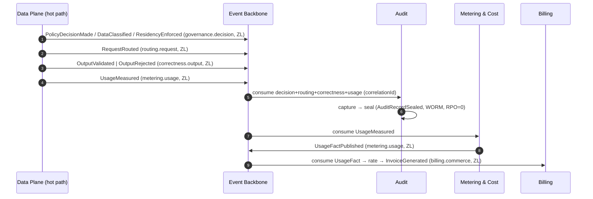
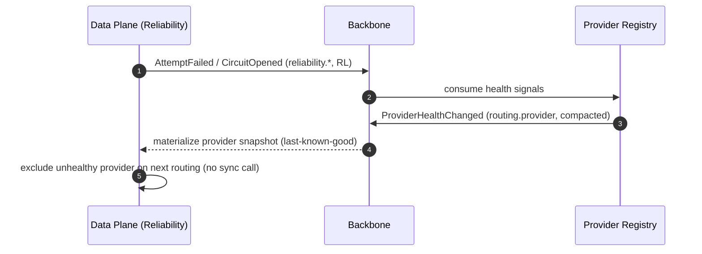

# 07 — Event Architecture

**Document:** Event Architecture Specification
**Project:** Reliability-First AI Gateway
**Status:** **Approved & Frozen (v1.1, 2026-07-20)** — **binding event-architecture standard**
**v1.1 changes:** applied the deep architecture-review fixes (see Appendix E) — EV-D3 (zero-loss WAL emission), EV-D1 compaction-key correction, one-partition-key-per-topic rule, refined event-security data rules + crypto-shredding, replay-safe idempotency, retention/telemetry clarifications, and added failure scenarios. Triggered consistency patch `06 → v1.2` (Administration events added to `06 §23`).
**Audience:** Architecture, Platform & Stream-aligned Teams, SRE, Security, Compliance, Auditors
**Classification:** Internal — Architecture Standard
**Builds on (approved, frozen):** `00`–`06` (esp. **`06 §23` Event Ownership Matrix** and **`06 §24` Data Ownership Matrix**), and the ADR register in `adr/` (referenced by ID; see `adr/000-ADR-Index.md`)

> **Authority & scope.** This document defines **how events behave** across the platform: taxonomy, contracts/envelope, topic strategy, versioning, routing, delivery/ordering/idempotency guarantees, dead-letter handling, replay, observability, security, and cross-service flows. **Event ownership** (which service produces/consumes each event, its topic, ordering key, idempotency key, and delivery class) is **already frozen** in `06 §23` — this document does **not** restate or re-own it; it elaborates the mechanics. Where this document and `06 §23` differ on ownership, `06 §23` governs; this document governs mechanics. It stays at architecture level — no code, no schemas (the *shape* of the envelope is described in business terms), no package layouts.

---

## Table of Contents
1. Executive Summary
2. Purpose & Scope
3. Constraints from the Frozen Documents
4. Event Taxonomy
5. Event Catalog (reference & summary)
6. Event Contract & Envelope Standard
7. Kafka Topic Strategy
8. Snapshot Distribution (resolving SOQ-5)
9. Event Versioning
10. Event Routing & Consumer Groups
11. Delivery Guarantees
12. Ordering Guarantees
13. Idempotency
14. Dead-Letter Queues & Retry
15. Replay Strategy
16. Event Observability
17. Event Security
18. Cross-Service Event Flows
19. Webhook Delivery (resolving SOQ-3)
20. Anti-Patterns
21. Risks & Open Questions
22. Traceability Matrix
23. Appendix

---

## 1. Executive Summary

The platform is event-driven off the hot path (AD-005): everything the request pipeline needs to tell the rest of the system — usage, telemetry, audit, security signals, governance decisions — leaves the Data Plane as an **asynchronous event** on a **Kafka-class durable log backbone** (AD-009), and everything the Data Plane needs *from* the control plane arrives as a **cached snapshot** (AD-022). This is what lets the platform achieve complete observability and audit **without adding synchronous latency** to requests (`NFR-LAT-001`) and **zero data loss** where it matters (`NFR-AUD/COST`, RPO=0).

This document turns that principle into a concrete event architecture with a small number of load-bearing decisions:

- **One event envelope for everything.** Every event — regardless of producer — carries the same standard metadata (identity, type, version, timestamps, correlation/causation, tenant, partition key, classification) with a domain-specific payload. This uniformity is what makes correlation, replay, security, and observability tractable across ~80 event types.
- **Family-grained, versioned topics.** Topics are `rfaig.<context>.<family>.v<major>` (frozen in `06 §23`), partitioned by the ordering key, with per-topic **delivery class** (ZL / RL / BE) that fixes replication, acknowledgement, and retention.
- **Effectively-once = at-least-once + idempotent consumers.** We do not chase exactly-once delivery across the whole system; we guarantee at-least-once delivery on durable topics and make consumers idempotent using the idempotency keys frozen in `06 §23`. On the producing side, stateful services use the **transactional outbox** pattern so a state change and its event publish are atomic.
- **Ordering is per-key, never global.** Each topic is ordered within a partition keyed by its business key (requestId, tenantId, providerId, …). There is no global order; causal reconstruction uses correlation/causation identifiers.
- **Snapshots ride compacted topics.** Configuration, policy, provider, identity-key, and secret snapshots are distributed as **log-compacted topics** the Data Plane materializes as last-known-good local caches — the event-architecture realization of AD-022, with a high-priority path for urgent security/invariant changes. *(Resolves SOQ-5.)*
- **DLQ + replay are first-class.** Every consumer group has a dead-letter path with bounded retry/backoff; the durable log enables **replay** for recovery and rebuild, executed under strict idempotency and side-effect isolation.
- **Security travels with the event.** Encryption in transit and at rest, topic-level authorization, tenant isolation carried in the envelope, and a hard rule that **secrets and unredacted regulated data never appear in event payloads** — classification is enforced at publish.

The result is an event fabric that is uniform, auditable, zero-loss where required, replayable, and secure — the nervous system connecting the 14 services of `06` without ever coupling the hot path to the control plane.

---

## 2. Purpose & Scope

**Purpose.** Give every team one authoritative model for producing and consuming events: the envelope they must emit, the topic they publish to, the guarantees they can rely on, how they stay idempotent, what happens to poison messages, and how flows compose across services.

**In scope.** Event taxonomy; envelope/contract standard; topic strategy and configuration; snapshot distribution; versioning; routing/consumer groups; delivery/ordering/idempotency; DLQ/retry; replay; event observability; event security; cross-service flows; webhook delivery.

**Out of scope (deferred).** Per-store data models and technology tuning (→ `08`); concrete schema definitions and code (→ standards + module docs); non-event synchronous contracts (→ `12-API-Standards.md`). Event *ownership* is fixed in `06 §23` and not re-decided here.

---

## 3. Constraints from the Frozen Documents

- **AD-005** — off-hot-path communication is event-driven; audit/accounting are durable, at-least-once, idempotent → zero loss.
- **AD-009** — a Kafka-class partitioned durable log is the backbone (behind a port; managed equivalents acceptable).
- **AD-022 / AD-013** — the Data Plane runs on cached, versioned, last-known-good snapshots; no synchronous control-plane call on the hot path.
- **AD-021** — tenant isolation is absolute and must be carried and enforced in event flows.
- **AD-015** — versioning is backward-compatible within a major version; breaking → new version.
- **AD-016 / `03` App. D** — invariant streams (audit, accounting, governance-decision, security, correctness, residency) have **zero error budget**: no loss, no silent drop.
- **`06 §23`** — the frozen Event Ownership Matrix: events, producers, consumers, ordering keys, idempotency keys, delivery classes, topics, versioning. **This document conforms to it.**
- **`06 §24`** — the frozen Data Ownership Matrix: who owns which store (source of the transactional-outbox producers).
- **`03` NFR-Q-001 / NFR-OBS/AUD/COST** — bounded queues with backpressure; complete observability; audit RPO=0; accounting accuracy.

---

## 4. Event Taxonomy

Events are classified along three orthogonal axes. The classification determines guarantees, retention, and security handling.

**Axis 1 — Event kind (what it represents):**
- **Lifecycle** — a business entity changed state (e.g., `TenantProvisioned`, `PolicyPublished`, `ProviderRetired`). Keyed by entity id.
- **Decision** — a governance/authorization outcome for a request (e.g., `PolicyDecisionMade`, `ResidencyEnforced`, `AuthorizationDenied`). Keyed by requestId. Feeds audit.
- **Interaction/Correctness** — a request-processing outcome (e.g., `RequestRouted`, `OutputRejected`, `StreamFailureSurfaced`, `AttemptFailed`). Keyed by requestId/streamId.
- **Accounting** — an authoritative measurement (`UsageMeasured`, `UsageFactPublished`). Keyed by requestId. Zero-loss.
- **Telemetry** — operational signal (metrics/traces/logs, `SLIThresholdBreached`). Sampled/aggregate; not a system of record.
- **Security** — a security-relevant signal (`PolicyViolationDetected`, `AuthorizationDenied`, `SecretRevoked`). Zero-loss; feeds detection & audit.
- **Financial** — commercial facts (`InvoiceGenerated`, `UsageRated`). Zero-loss.

**Axis 2 — Origin (where produced):**
- **Hot-path-emitted** — produced by the Data Plane pipeline modules (runtime producer = Data Plane; owner = context team). Must add near-zero latency. **ZL** hot-path events use the durable local WAL + fast local ack (EV-D3, Section 11); **RL/BE** hot-path events are fire-and-continue with an idempotent producer.
- **Management-emitted** — produced by a control-plane service on a state change. Uses the **transactional outbox** (the service owns a store per `06 §24`).

**Axis 3 — Delivery class (guarantee):** as frozen in `06 §23` — **ZL** (zero-loss, durable, idempotent, RPO=0), **RL** (reliable, at-least-once, graceful degradation), **BE** (best-effort, high-volume/sampled).

**Taxonomy → guarantee mapping (summary):**

| Kind | Typical class | Retention posture | Security sensitivity |
|---|---|---|---|
| Decision, Accounting, Security, Financial, Audit-relevant Lifecycle | **ZL** | Long / compliance-driven | High (governed payloads) |
| Interaction/Correctness (audit-relevant) | **ZL** | Medium-long | Medium |
| Reliability/operational Interaction | **RL** | Short-medium | Low-medium |
| Telemetry | **RL / BE** | Short | Low (no sensitive content) |

---

## 5. Event Catalog (Reference & Summary)

The **canonical event catalog is `06 §23`** (the Event Ownership Matrix) — ~80 domain events across 25 family topics. This document does not duplicate it. Summary by owning context:

| Context | Topics (from `06 §23`) | Dominant class |
|---|---|---|
| C1 Provider & Routing | `routing.provider`, `routing.request` | ZL/RL |
| C2 Reliability | `reliability.attempt`, `reliability.circuit`, `reliability.cache` | RL/BE |
| C3 Correctness | `correctness.output`, `correctness.stream`, `correctness.toolcall` | ZL |
| C4 Governance | `governance.policy`, `governance.decision` | ZL |
| C5 Metering | `metering.usage`, `metering.reconciliation` | ZL |
| C6/C7 Identity & Tenancy | `identity.principal`, `tenancy.lifecycle` | ZL |
| C8 Billing | `billing.commerce` | ZL |
| C9 Observability | `observability.sli` | RL/BE |
| C10 Audit | `audit.record`, `audit.report` | ZL |
| C11 Prompt | `prompt.asset` | RL/ZL |
| C12 Extensibility | `extensibility.plugin`, `extensibility.webhook` | ZL/RL |
| C14 Secrets | `secrets.lifecycle` | ZL |
| C15 Configuration | `config.snapshot`, `config.flag` | ZL |
| C16 Notification | `notification.delivery` | RL |
| C13 Administration | `admin.*` | RL |

Any new event or topic is added to `06 §23` first (ownership), then given mechanics here.

---

## 6. Event Contract & Envelope Standard

Every event on every topic carries a **uniform envelope** plus a domain payload. The envelope is the contract that makes correlation, security, replay, and observability universal. Described in business terms (not a schema):

**Envelope (metadata) — present on all events:**
- **Event Id** — globally unique; the ultimate idempotency anchor.
- **Event Type** — the specific event name (e.g., `OutputRejected`); the topic carries a family, the type disambiguates.
- **Schema Version** — major.minor of the payload contract (drives compatibility; Section 9).
- **Occurred-At** — business time the fact occurred (event time, for windowing/replay).
- **Recorded-At** — when published (for lag/latency observability).
- **Producer** — the emitting service/module identity.
- **Correlation Id** — the request/flow identity threaded across all related events (the shared kernel with tracing/audit; `NFR-TRC-001`).
- **Causation Id** — the id of the event/command that caused this one (causal chains).
- **Tenant Scope** — tenant (and where relevant workspace/project) — **mandatory**; carries AD-021 isolation into the event fabric.
- **Partition Key** — the ordering key from `06 §23` (requestId, tenantId, providerId, …).
- **Data Classification** — the sensitivity label of the payload (drives security handling; Section 17).
- **Payload** — the domain-specific business fields (defined per event; business terms only here).

**Contract rules:**
- The envelope is **stable and versioned independently** of payloads; envelope changes are rare and always backward-compatible.
- **Schema-registry-governed** — payload contracts are registered and compatibility-checked at publish and consume (Section 9).
- **No secrets, no unredacted regulated data** in any payload — enforced by classification and publish-time governance (Section 17, hard rule).
- **Self-describing** — Event Id, Type, Version, Correlation, Tenant, Partition Key, Classification are always present; a consumer can route, deduplicate, correlate, and secure any event using the envelope alone.

---

## 7. Kafka Topic Strategy

**Naming (frozen in `06 §23`):** `rfaig.<context>.<family>.v<major>`. Family-grained (related events share a topic; type in the envelope) to bound topic sprawl while keeping cohesive streams together.

**Partitioning:** partition by the **ordering key** (Section 12). Partition count is sized per topic to the producer/consumer throughput and desired parallelism; high-ingest topics (`metering.usage`, `audit.record`, correctness/decision, telemetry) get more partitions. Partition key never changes within a major version (it defines ordering).

**Delivery-class → topic configuration:**

| Class | Replication | Producer acks | Min in-sync replicas | Retention | Idempotent producer |
|---|---|---|---|---|---|
| **ZL** (audit, accounting, decision, security, financial, identity, tenancy, secrets, config, policy, correctness-output) | ≥ 3 | `all` | ≥ 2 | Long / compliance-driven; **tiered/durable**; audit → immutable/WORM sink | Required |
| **RL** (reliability, routing, provider, prompt, plugin, notification, admin, SLI) | ≥ 3 | `all` (or leader for low-value) | ≥ 2 | Medium | Required |
| **BE** (high-volume telemetry, cache-stored, analytics) | ≥ 2 | leader | 1 | Short | Optional |

**ZL durability contract:** replication ≥ 3, `acks=all`, `min.insync.replicas ≥ 2`, idempotent producers, and durable/tiered retention — this is how RPO=0 is realized on the log (AD-005/009, `NFR-AUD/COST`). Audit records are additionally sealed into a WORM object store downstream (`06 §24`).

**Compaction vs retention:** *event* topics use time/size retention (append-only history for replay). *Snapshot* topics use **log compaction** keyed by stable logical identity (last-known-good per identity) — Section 8.

**Kafka retention is operational, not compliance retention.** Topic retention exists for **replay, recovery, and operational lookback** and is **bounded** (days–weeks, class-dependent). It is **not** the system-of-record for compliance. Long-term/compliance retention lives in the **audit WORM store** (`06 §24`, sealed by the Audit Service) and other owning services' stores. **Regulated/PII data is therefore not retained for years on the log** — the log carries it only within its bounded operational window, under the same governance (Section 17), while the durable compliance copy lives in the governed audit store. This bounds the log's exposure surface.

**Raw telemetry rides the OpenTelemetry pipeline, not domain-event topics.** High-volume operational telemetry (metrics, traces, logs) flows via the OpenTelemetry pipeline (AD-011) to the Observability backend — it is **not** modeled as Kafka domain events. Only **domain-significant** observability events (e.g., `SLIThresholdBreached`) are on `observability.sli`. This keeps the domain-event fabric free of firehose volume and reserves it for business facts.

**Backpressure & bounded queues (`NFR-Q-001`):** producers apply bounded buffering with backpressure. For **RL/BE** emission the Data Plane never blocks the hot path — under backbone unavailability these buffer within bounds and the request completes (their loss under extreme pressure is acceptable by class). For **ZL** emission the durable local WAL (EV-D3) absorbs backbone stalls without blocking on a remote round-trip and without loss; only WAL saturation triggers fail-safe rejection. Sustained backbone loss is a Sev-level incident, but requests keep serving as long as ZL events remain durably captured (AD-017, EV-D3).

**Multi-region (AD-014):** topics are regionally partitioned; residency-constrained events (governed payloads) never cross into non-permitted regions — the envelope's Tenant Scope + Data Classification drive regional routing, consistent with `NFR-MR-001`.

---

## 8. Snapshot Distribution — resolving SOQ-5

The Data Plane runs on cached, versioned, last-known-good **snapshots** (AD-022) for configuration, policy, provider/route config, identity verification keys, and short-TTL secret material. This document fixes **how** they are distributed:

**Decision EV-D1 — Snapshots are distributed as log-compacted topics keyed by stable logical identity.** Each snapshot domain publishes to a **compacted** topic (`config.snapshot`, `governance.policy`, `routing.provider`, `identity.principal`(keys), `secrets.lifecycle`). **Critical:** the **compaction key is the stable logical identity of the snapshot** (e.g., `tenant+config-domain`, `policyScope`, `providerId`, `keyId`) — **never the version**. The **version travels in the value**, not the key. This is what makes compaction collapse to exactly **one latest value per logical identity = last-known-good**; keying by version would defeat compaction (every version a distinct key, nothing collapses). The Data Plane **consumes and materializes** the compacted topic into local caches continuously; on control-plane outage it keeps serving from the materialized cache (AD-022, AD-017).

- **Rollback is served by the owning service, not the compacted topic.** Because **compaction deliberately discards superseded versions**, a compacted topic **cannot** replay history — so version pinning/rollback is **not** available from it. The **immutable version history is the source-of-truth in the owning service's store** (e.g., Configuration Service store, `06 §24`, AD-013). To roll back, the owning service **re-publishes the desired prior version as the new latest** to the compacted topic (a forward-fix), and the Data Plane materializes it. Rollback is therefore a governed control-plane action, not a log-replay — an important, deliberate distinction.
- **High-priority path.** Security/invariant-critical changes (e.g., a revoked secret, an emergency policy) are published to a **priority partition/topic** consumed ahead of routine updates, bounding the propagation window (AD-022). Secret **revocation** additionally relies on short TTLs (`06 §9.6`).
- **Why compaction, not per-request pull.** It unifies the transport (one backbone, AD-009), gives the Data Plane a self-healing local materialization, and needs no synchronous control-plane call (AD-022, R-1). Snapshots are data-flow, not request/response.

This resolves **SOQ-5**: snapshot streams are compacted topics; delivery is at-least-once with last-known-good materialization; ordering is per-key.

---

## 9. Event Versioning

Follows AD-015 (backward compatibility within a major version):

- **Additive, backward-compatible evolution within a major version** — new optional payload fields only; consumers ignore unknown fields; producers never remove/repurpose fields within a major.
- **Schema registry with compatibility enforcement** — `BACKWARD` (or `FULL`) compatibility is enforced at publish and consume; an incompatible change is rejected before it can break consumers.
- **Breaking change → new topic version (`.vN`)** — a new major topic (`...v2`) is created; producers **dual-publish** to `v1` and `v2` during a migration window; consumers migrate; `v1` is deprecated per AD-015 windows (≥12 months Enterprise). No in-place breaking change ever.
- **Envelope versioning is independent** and rarer; envelope changes are always backward-compatible.
- **Deprecation is tracked** and gated by consumer migration telemetry (Section 16).

---

## 10. Event Routing & Consumer Groups

- **Pub/sub, consumer-group per consuming service.** Each consuming service subscribes with its own **consumer group**, so every service independently receives and tracks its own offsets — the same event fans out to Audit, Observability, Metering, etc., without coupling.
- **No broker-side content routing.** Routing is by **topic subscription** + envelope-based filtering **in the consumer** — the broker stays a dumb, fast pipe (smart endpoints, dumb pipes). This keeps the backbone simple and scalable.
- **Fan-out is explicit.** `06 §23` lists consumers per event; each becomes a consumer group. High-fan-out ZL events (e.g., `TenantProvisioned`, `PolicyPublished`) are consumed by many groups independently.
- **Consumer scaling.** A consumer group scales to its topic's partition count; high-ingest consumers (Metering, Audit, Observability) run partitioned consumer fleets (`06 §14`).
- **Ordered processing** within a group is per-partition (per-key), preserving Section 12 ordering.

---

## 11. Delivery Guarantees

- **At-least-once on all durable topics** (ZL, RL). Combined with **idempotent consumers** (Section 13) this yields **effectively-once processing** — the guarantee we actually make. We deliberately do **not** promise end-to-end exactly-once across heterogeneous services (fragile, costly); effectively-once via idempotency is simpler and robust (AD-016 prefers proven over clever).
- **Producer side:**
  - *Management-emitted (stateful services):* **transactional outbox** — the event is written to an outbox in the **same store transaction** as the state change (per `06 §24` ownership), then relayed to the backbone. This eliminates dual-write inconsistency and guarantees the event iff the state changed.
  - *Hot-path-emitted (stateless Data Plane):* see **EV-D3** below — the central zero-loss-vs-latency resolution.

**Decision EV-D3 — Zero-loss hot-path emission without blocking the request or making the Data Plane stateful.** A stateless Data Plane (AD-006) with no durable store cannot, by itself, guarantee RPO=0 for audit/usage while staying non-blocking if the backbone briefly stalls. We resolve the tension explicitly:
  - **ZL hot-path events are written to a node-local, replicated durable emit buffer (write-ahead buffer, WAL) with a fast local acknowledgement, then drained asynchronously to the backbone with `acks=all`.** The WAL is an **outbound-durability mechanism, not request-routing state** — it does not make a node non-disposable for routing (any node can serve any request; AD-006 holds), it only guarantees that an accepted ZL event is durably captured before the request completes. The WAL is replicated (node+peer / small quorum) so a single node loss does not lose captured events → **RPO=0 preserved**, latency stays within the emission budget (local durable write ≪ a remote `acks=all` round-trip).
  - **Fail-safe on saturation.** If the WAL cannot durably accept a ZL event (disk/replica failure *and* backbone unavailable), the request **fails safe — it is rejected** rather than served un-recordably. Rationale (AD-016): in a regulated system a request that cannot be durably audited/metered **must not be served**; correctness/compliance outrank availability for ZL-bound requests. This is a deliberate, recorded trade-off, and its rate is an SLO-tracked invariant signal.
  - **RL/BE hot-path events are fire-and-continue** (idempotent producer, best-effort/bounded buffer) — they never block and never fail a request; their loss under extreme pressure is acceptable by class.
  - **Effect:** the request path awaits only a **fast local durable write** for ZL (not a remote round-trip), the backbone drain is async with `acks=all`, and no request is ever served that could not be durably recorded.
- **Zero-loss (ZL):** RPO=0 via replication ≥3, `acks=all`, `min ISR ≥2`, idempotent producers, durable retention, and (for audit) WORM sealing. Any loss on a ZL stream is an **invariant violation** → Sev incident (zero error budget).
- **Best-effort (BE):** high-volume telemetry may drop under extreme pressure with graceful degradation; never used for decision/accounting/audit/security.
- **Backpressure:** bounded buffers; consumers apply backpressure rather than unbounded growth (`NFR-Q-001`).

---

## 12. Ordering Guarantees

- **One partition key per topic (topic-wide aggregate root).** A Kafka topic has exactly **one** partitioning scheme, so every event on a topic partitions by a **single, topic-wide key = the aggregate root** of that family — even where `06 §23` lists a *finer* per-event ordering/idempotency key. Reconciliation of the frozen `06 §23` keys:
  - `identity.principal.v1` → partition by **principalId** (a session belongs to a principal; `SessionIssued/Revoked` order within the principal). The finer `sessionId` serves **idempotency/dedup**, not partitioning.
  - `tenancy.lifecycle.v1` → partition by **organizationId** (the hierarchy root; org→tenant→workspace→project events order within the org subtree).
  - `billing.commerce.v1` → partition by **subscriptionId** (invoices order within their subscription).
  - `reliability.circuit.v1`, `routing.provider.v1` → partition by **providerId**; because provider cardinality is low (hot-partition risk), see the low-cardinality note below.
  - Where a family topic mixes genuinely independent aggregate types (e.g., `extensibility.plugin` carries plugin **and** SDK events), `07` **MAY split the family into per-aggregate topics** (`extensibility.plugin` / `extensibility.sdk`) — an event-architecture decision permitted by the `06 §23` matrix note. This split is applied where independent partitioning/ordering is required.
- **Distinction:** *partition key* (topic-wide, drives ordering) and *idempotency key* (per-event, drives dedup) are **different concerns** and may differ; `06 §23`'s per-event keys are idempotency keys, mapped to the topic-wide partition key above.
- **Low-cardinality partition-key mitigation.** Topics keyed by a low-cardinality root (provider health/circuit) risk **hot/under-utilized partitions**. Mitigation: these are RL/low-volume topics (health/circuit changes are infrequent), so skew is tolerable; if volume grows, add a **composite key** (`providerId+region` or `+scope`) to spread load while preserving per-provider ordering where it matters.
- **Per-key ordering, never global.** Kafka guarantees order **within a partition**. Events sharing the topic-wide key (e.g., all events for one `principalId`/`organizationId`/`requestId`) are strictly ordered; events across keys are not globally ordered.
- **Why not global order.** Global ordering serializes everything and destroys throughput/scalability. Business ordering only needs to hold **within an entity** — which per-key partitioning provides exactly.
- **Causal reconstruction across keys/topics** uses **Correlation Id** and **Causation Id** in the envelope (Section 6) — e.g., reconstructing a full request lifecycle that spans routing/reliability/correctness/decision/usage/audit topics, ordered by Occurred-At within the correlation.
- **Ordering-sensitive consumers** (e.g., tenancy lifecycle, policy versions, reconciliation) process per-partition in order; they must not parallelize within a key.
- **Snapshot topics** (compacted) order per key; the latest value wins — appropriate for last-known-good.

---

## 13. Idempotency

- **Every durable-topic consumer is idempotent**, keyed by the **idempotency key** frozen in `06 §23` (Event Id, or the business key such as requestId/entityId+version).
- **Patterns:**
  - *Natural idempotency* — the operation is inherently repeatable (e.g., materializing a snapshot; upserting a record by key).
  - *Dedup store* — consumers keep a bounded processed-key store (by Event Id / business key) to drop duplicates; sized to the retry/replay window.
  - *Version guard* — for lifecycle/versioned events, apply only if the incoming version is newer than the last applied (monotonic).
- **Replay-safe idempotency (mandatory for replay-critical consumers).** Audit, Metering, and any consumer whose state may be rebuilt by replay MUST use **natural or version-guarded idempotency** (upsert by business key / monotonic version) — **not** solely a TTL-bounded dedup cache. Rationale: a replay **older than the dedup cache's retention window** would reprocess events as new, causing duplicate effects. Dedup caches are an optimization layered on top (sized to the normal retry window); **correctness of replay must not depend on them.** Side-effecting consumers (webhooks, notifications, invoicing) additionally rely on replay-mode isolation (Section 15).
- **Effectively-once** is the composition: at-least-once delivery (Section 11) + idempotent processing = each business effect happens once even if the event is delivered multiple times.
- **Side-effecting consumers** (e.g., webhook delivery, notification, invoice generation) are especially strict — they guard against duplicate external actions using the idempotency key (no double webhooks/invoices), consistent with `NFR-RTY-001` (no duplicate consequential actions).

---

## 14. Dead-Letter Queues & Retry

- **Per-consumer-group DLQ.** Each consumer group has a dead-letter path. A message that cannot be processed after bounded retries is routed to a **DLQ topic** (`rfaig.<context>.<family>.dlq`) with the failure reason, original envelope, and attempt count preserved.
- **Retry with backoff.** Transient failures use **retry topics** with tiered exponential backoff (e.g., short → medium → long delay topics) before DLQ — decoupling retry delay from the main partition so head-of-line blocking is avoided.
- **Poison-message isolation.** A single un-processable message never blocks its partition indefinitely; after the retry budget it goes to DLQ and the consumer advances (except where strict per-key ordering forbids skipping — then the key is quarantined and alerted, preserving correctness over liveness for ZL streams).
- **ZL streams never silently drop.** For zero-loss topics, DLQ is a **holding area, not a discard** — messages are retained, alerted (Sev by class), and require explicit resolution/reprocessing. Audit/accounting/decision DLQ depth > 0 is an incident.
- **Alerting & observability.** DLQ depth, retry rates, and age are first-class metrics (Section 16); DLQ growth pages per burn-rate (`NFR-ALRT-001`).
- **Reprocessing.** DLQ messages are reprocessed (after fixing the cause) via controlled replay (Section 15), idempotently.

---

## 15. Replay Strategy

The durable log makes replay a first-class capability (a key benefit of AD-009):

- **Uses:** consumer recovery (rebuild a consumer's state from the log), audit/accounting reconstruction (`NFR-AUD/COST`), DLQ reprocessing, new-consumer bootstrap, and incident forensics.
- **Mechanism:** reset a consumer group's offsets to a chosen point (timestamp/offset) and re-consume; compacted snapshot topics replay to last-known-good per key.
- **Idempotent by construction.** Because all durable consumers are idempotent (Section 13), replay is safe — reprocessing produces no duplicate business effects.
- **Side-effect isolation.** Replay that must **not** re-trigger external side-effects (webhooks, notifications, invoices, provider calls) runs in a **replay mode** where side-effecting consumers are disabled or routed to a sink — only state-rebuilding consumers run. This prevents replay from, e.g., re-sending invoices.
- **Scope control.** Replay is bounded (by correlation, tenant, time window, or key) to avoid reprocessing the world; tenant-scoped replay respects isolation (AD-021).
- **Replay vs live is explicit.** Replay runs via a **separate consumer instance/deployment in replay mode** (distinct consumer group + a replay marker in the consuming context), so side-effecting consumers can be disabled and live processing is never disrupted. Consumers must be able to tell replay from live — an implicit offset reset on the live group is prohibited for side-effecting consumers.
- **Beyond-dedup-window replays are safe by design** because replay-critical consumers use natural/version-guarded idempotency (Section 13), not TTL'd dedup. Compacted **snapshot** topics cannot be replayed to a prior version (compaction discards history, Section 8) — historical snapshot recovery comes from the owning service's versioned store, not log replay.
- **Auditability.** Replays are themselves recorded (who, what scope, when) — a governed operation.

---

## 16. Event Observability

Events are observed like any other critical system (`NFR-OBS/MET/TRC/ALRT`):

- **Correlation-first tracing.** The envelope Correlation/Causation ids thread traces across event hops, so a request's full lifecycle — across routing, reliability, correctness, decision, usage, audit topics — is reconstructable end to end (`NFR-TRC-001`).
- **Core event metrics (per topic & consumer group):** producer throughput, **consumer lag**, processing latency, error rate, **DLQ depth/age**, retry rate, **partition skew** (hot-partition detection for low-cardinality keys), and (for ZL) a **loss detector** (produced vs consumed vs sealed reconciliation → must be zero).
- **Producer-durability metrics:** **transactional-outbox relay lag** (state-changed → published) per stateful service; **Data Plane WAL depth & drain lag** and **fail-safe-rejection rate** (EV-D3) — a rising WAL/fail-safe signal indicates backbone trouble before loss occurs.
- **Duplicate-processing indicators:** **consumer-group rebalance rate** (rebalances cause at-least-once redelivery, absorbed by idempotency — a spike warns of churn) and dedup-hit rate.
- **Schema/version telemetry:** per-version production/consumption (drives deprecation, Section 9).
- **SLO-backed alerting:** consumer lag beyond threshold, DLQ growth, ZL loss-detector > 0, backbone unavailability — all page per burn-rate (`NFR-ALRT-001`).
- **Audit of the fabric:** ZL event flow is itself auditable (`06 §23` audit topics) — the event system produces evidence of its own completeness (`NFR-AUD-001`).

---

## 17. Event Security

Security travels with the event (zero trust, AD-012):

- **Encryption:** in transit (TLS 1.2+/1.3) and at rest (AES-256) on the backbone and all sinks (`NFR-ENC-001`).
- **Topic-level authorization:** producers/consumers are authenticated service identities with least-privilege topic ACLs — a service may only produce to topics it owns (`06 §24`) and consume topics it's authorized for (deny-by-default, AD-012).
- **Tenant isolation in events:** every event carries Tenant Scope; consumers enforce isolation; cross-tenant consumption is impossible by authorization + envelope checks (AD-021, invariant). Isolation-violation detectors run on the fabric. **Dedicated/top-tier isolation:** for the Regulated/Mission-Critical tier requiring physical isolation (AD-021), events may be **physically isolated** — dedicated per-tenant topics, dedicated partitions, or a dedicated backbone cluster — rather than relying on logical isolation alone. This is a tier option, decided per customer (`03 §64`).
- **Hard rule 1 — secrets NEVER appear in any event, of any class, ever.** Absolute. Secret *events* (`secrets.lifecycle`) carry references, ids, and metadata only — never key/credential material (`06 §9.6`, `NFR-SEC-SM`). No exceptions, no tiers.
- **Rule 2 — regulated/PII data is confined to classified audit events under full governance.** Operational, telemetry, reliability, and routing events carry **no** regulated/PII payload — redacted/tokenized before emission (the Governance/redaction stage runs before emission on the hot path). **Audit events legitimately may carry regulated data** (that is the audit trail's compliance purpose in a regulated system) — but **only** when explicitly classified and always encrypted, access-governed, residency-confined, retention-bounded, and tamper-evident (`NFR-PRIV/AUD/MR`). The earlier blanket "no regulated data in any event" would have made the audit trail non-compliant; the correct rule distinguishes **secrets (never)** from **regulated data (governed, audit-only)**.
- **Crypto-shredding for erasure of immutable data.** Right-to-erasure / data-subject-deletion against **immutable** audit (WORM) and append-only logs is honored via **crypto-shredding**: regulated payloads are encrypted under **per-tenant / per-subject keys**; erasure destroys the key, rendering the data permanently unrecoverable **without mutating the immutable record**. This reconciles immutability/tamper-evidence with erasure obligations (a genuine compliance tension). Retention windows and legal-hold override are governed by the Audit/Governance services.
- **Residency:** governed-payload events are confined to permitted regions (Section 7, `NFR-MR-001`).
- **Immutability & tamper-evidence:** audit events are sealed WORM downstream; the log's append-only nature plus integrity checks provide tamper-evidence (`NFR-AUD-001`).
- **DLQ security:** DLQ messages inherit the same encryption, ACLs, tenant scope, and classification — a dead letter is not a security downgrade.

---

## 18. Cross-Service Event Flows

**Flow A — Canonical request (hot path → fabric).** Data Plane processes a request and emits, in correlation, a chain across topics; Audit and Metering consume; Billing follows.



**Flow B — Failover (health → routing).**


**Flow C — Snapshot propagation (control → data, compacted).**
```mermaid
sequenceDiagram
  autonumber
  participant PG as Policy & Governance
  participant CFG as Configuration
  participant BUS as Backbone (compacted)
  participant DP as Data Plane
  PG->>CFG: publish policy snapshot (via distribution substrate)
  CFG->>BUS: ConfigPublished (config.snapshot, compacted, ZL)
  BUS-->>DP: materialize last-known-good; pin version
  Note over DP: urgent security change → priority path, consumed ahead
```

**Flow D — Security signal (detection).** `PolicyViolationDetected` / `AuthorizationDenied` / `SecretRevoked` (ZL) → Audit (evidence) + Notification (alert) + Observability (detection), correlation-linked.

---

## 19. Webhook Delivery — resolving SOQ-3

**Decision EV-D2 — Customer-facing webhook delivery is owned by the Extensibility Service; internal alerting is owned by Notification.** They are distinct:

- **Extensibility Service** owns **customer webhooks**: subscriptions (`WebhookSubscribed`), and **outbound delivery** to customer endpoints. It consumes the events a customer subscribed to, delivers with **bounded retry/backoff**, guards **idempotent delivery** (no duplicate webhooks, Section 13), and routes permanent failures to the `extensibility.webhook.dlq` with `WebhookDeliveryFailed` (RL). Delivery workers scale independently (`06 §14`).
- **Notification Service** owns **internal/operational alerts** (budget, security, admin, SLI breaches) to internal channels — not customer webhooks.

This resolves **SOQ-3**: webhook delivery lives in Extensibility (customer-facing), separate from Notification (internal), each with its own DLQ, idempotency, and observability. Both obey the envelope/security rules (Section 17) — customer webhooks carry only permitted, classified, tenant-scoped payloads.

---

## 20. Anti-Patterns (MUST NOT)

- **Synchronous "events."** No domain event is request/response. Anything needing a synchronous answer is not an event (use the cached-snapshot or admin-sync patterns of `06 §11`).
- **Event on the hot-path critical section blocking the request.** Emission is fire-and-continue; the request never blocks on publish (AD-005/017).
- **Global ordering / single-partition topics for throughput streams.** Ordering is per-key only (Section 12).
- **Exactly-once theater.** Do not build fragile end-to-end exactly-once; use at-least-once + idempotency (Section 11).
- **Secrets or unredacted regulated data in payloads.** Hard rule (Section 17).
- **Silent drop on ZL streams.** Zero-loss topics never discard; DLQ holds and alerts (Section 14).
- **Shared consumer group across services.** Each service owns its consumer group and offsets (Section 10).
- **Breaking a topic in place.** Breaking change → new `.vN` topic + dual-publish (Section 9).
- **Replaying side-effects.** Replay runs with side-effecting consumers isolated (Section 15).
- **Cross-tenant consumption.** Impossible by ACL + envelope; any detection is Sev1 (Section 17, AD-021).
- **Keying a compacted snapshot topic by version.** Defeats compaction (nothing collapses to last-known-good); compaction key = stable logical identity, version in the value (Section 8).
- **Partitioning one topic by two different keys.** A topic has exactly one partition key = its aggregate root; finer per-event keys are for idempotency only (Section 12).
- **Regulated/PII data in operational or telemetry events.** Regulated data is audit-only, governed; secrets never (Section 17).
- **Fire-and-continue for ZL hot-path events.** ZL uses the durable WAL + fast local ack; only RL/BE fire-and-continue (EV-D3, Section 11).

---

## 21. Risks & Open Questions

**Risks.**
- **ER-1 — Backbone centrality.** Audit/metering depend on the backbone. *Mitigation:* replication≥3/acks=all/min-ISR, tiered durable storage, backpressure, RPO=0 config; requests keep serving if backbone degrades (AD-017).
- **ER-2 — Consumer lag on high-ingest ZL topics.** *Mitigation:* partitioned consumer fleets, lag SLO alerting, autoscaling consumers.
- **ER-3 — Schema drift / breaking changes.** *Mitigation:* registry compatibility enforcement, dual-publish migration, version telemetry.
- **ER-4 — DLQ growth on ZL streams.** *Mitigation:* zero-tolerance alerting, hold-not-discard, controlled reprocessing.
- **ER-5 — Compacted-snapshot staleness window.** *Mitigation:* priority path for urgent changes, short TTL for secrets, freshness monitoring (AD-022).
- **ER-6 — Replay side-effects.** *Mitigation:* replay mode isolates side-effecting consumers (Section 15).
- **ER-7 — Schema-registry outage.** If the registry is unreachable, producers/consumers must not stall. *Mitigation:* producers and consumers **cache validated schemas locally**; a registry outage does not stop production/consumption (existing schemas keep working); only *new* schema registration is blocked until restored.
- **ER-8 — Transactional-outbox relay failure/lag.** A stalled relay delays management events. *Mitigation:* relay-lag SLO + alerting (Section 16); the outbox is durable (events not lost, only delayed); idempotent consumers tolerate the eventual burst.
- **ER-9 — Data Plane WAL saturation.** Backbone + WAL both unavailable → ZL events cannot be captured. *Mitigation:* replicated WAL, drain monitoring; on saturation, **fail-safe reject** ZL-bound requests (EV-D3) rather than serve un-recordable traffic; fail-safe rate is an SLO-tracked invariant signal.
- **ER-10 — Consumer-group rebalance duplicates.** Rebalances cause at-least-once redelivery. *Mitigation:* idempotent consumers (Section 13) make this a non-event; rebalance-rate metric warns of churn (Section 16).
- **ER-11 — Low-cardinality partition skew.** Provider-keyed topics can hot-partition. *Mitigation:* low-volume RL class tolerates skew; composite key if volume grows (Section 12).

**Open questions (for later docs).**
- **EOQ-1** — Exact partition counts and retention per topic (capacity-calibrated in `08`/`32`).
- **EOQ-2** — Schema registry technology and governance workflow (`09`).
- **EOQ-3** — Transactional-outbox relay mechanism per stateful service (`08`/`09`).
- **EOQ-4** — Tiered/long-term retention & WORM sealing details for audit (`08`).
- **EOQ-5** — Cross-region topic topology per residency regime (`08`/`16`, ties to `04` AOQ-6).
- **EOQ-6** — Dedup-store sizing and technology per consumer (`08`).
- **EOQ-7** — Data Plane WAL technology, replication factor, drain-lag SLO, and fail-safe-rate target (EV-D3) — capacity/latency-calibrated in `08`/`32` and the reliability standards.

---

## 22. Traceability Matrix

| Event-architecture concern | Section | BR | NFR | ADR | PRB |
|---|---|---|---|---|---|
| Event-driven off hot path | 1, 4 | BR-010/011 | NFR-LAT/OBS/AUD | AD-005 | PRB-011/020 |
| Backbone (Kafka-class) | 7 | BR-010/011/012 | NFR-Q/AUD/COST | AD-009 | PRB-011/012 |
| Envelope/correlation | 6, 16 | BR-010/011 | NFR-OBS/TRC | AD-005/011 | PRB-011 |
| Snapshot distribution (compacted) | 8 | BR-003/027 | NFR-AV/CFG | AD-022/013 | PRB-030/008 |
| Versioning | 9 | BR-007/036 | NFR-VER/IF | AD-015 | PRB-021/022 |
| Delivery/ordering/idempotency | 11–13 | BR-004/011/012 | NFR-RTY/AUD/COST | AD-005/016 | PRB-009/011/012 |
| DLQ/retry | 14 | BR-004 | NFR-Q/RTY/ALRT | AD-005 | PRB-009/020 |
| Replay | 15 | BR-011/012 | NFR-AUD/COST/DR | AD-005/009 | PRB-011/012 |
| Event observability | 16 | BR-010 | NFR-OBS/MET/TRC/ALRT | AD-011/005 | PRB-011 |
| Event security | 17 | BR-018/019/020/021 | NFR-ENC/PRIV/SEC/MR/AUD | AD-012/021 | PRB-013/014/015/029 |
| Webhook delivery | 19 | BR-028/029/030 | NFR-RTY/PERF-003 | AD-004 | PRB-025/026 |
| Cross-service flows | 18 | BR-003/010/011/012 | NFR-AV/AUD/COST | AD-005/017 | PRB-008/011/012 |

**Coverage note.** Every mechanism traces to the frozen ownership in `06 §23`/`§24` and to BR/NFR/ADR/PRB. New events/topics enter via `06 §23` (ownership) then here (mechanics).

---

## 23. Appendix

**A. Decisions recorded here.** EV-D1 (snapshots via compacted topics **keyed by stable logical identity**; rollback served by owning service, not the log — resolves SOQ-5); EV-D2 (webhook delivery in Extensibility, internal alerts in Notification — resolves SOQ-3); **EV-D3 (zero-loss hot-path emission via a replicated node-local durable WAL + fast local ack + async `acks=all` drain, with fail-safe rejection on saturation — resolves the RPO=0-vs-latency tension).**

**B. Delivery-class quick reference.** ZL = zero-loss (repl≥3, acks=all, min-ISR≥2, idempotent, durable, RPO=0) for audit/accounting/decision/security/financial/identity/tenancy/secrets/config/policy/correctness-output. RL = reliable at-least-once for reliability/routing/provider/prompt/plugin/notification/admin/SLI. BE = best-effort for high-volume telemetry/analytics.

**C. Relationship to other documents.** Consumes `06 §23`/`§24` (frozen ownership) as inputs; feeds `08-Data-Architecture.md` (stores, retention, dedup, outbox, TSD, WORM), `09-Technology-Decisions.md` (registry, backbone specifics), `13-Security-Standards.md` (event security detail), `14-Observability-Standards.md` (event metrics/tracing), and module docs. Does not modify frozen documents.

**D. Maintenance.** Living document until frozen on review. New events/topics: add to `06 §23` first (ownership), then specify mechanics here. Delivery-class, ordering-per-key, idempotency, no-secrets-in-payloads, and no-silent-drop-on-ZL are stable invariants and may not be weakened without revisiting the frozen documents.

---

**E. Architecture Review Log (v1.0 → v1.1).** Deep Principal-Architect review; findings and resolutions:

| # | Severity | Finding | Resolution |
|---|---|---|---|
| R-1 | 🔴 Critical | Zero-loss (RPO=0) vs non-blocking hot path unresolved for a stateless Data Plane | **EV-D3** — replicated node-local durable WAL + fast local ack + async `acks=all` drain; fail-safe reject on saturation (§4, §7, §11) |
| R-2 | 🔴 Critical | Compacted snapshots keyed by version defeat compaction; rollback impossible from a compacted log | **EV-D1 corrected** — compaction key = stable logical identity, version in value; rollback served by owning service's versioned store (§8) |
| R-3 | 🔴 Critical | One topic partitioned by two different keys (identity/tenancy) — undefined ordering | One-partition-key-per-topic rule (aggregate root); finer keys → idempotency only; split option for mixed aggregates (§12) |
| R-4 | 🔴 Critical | Blanket "no regulated data in any event" breaks audit's compliance purpose | Split rules: **secrets never (absolute)**; **regulated/PII audit-only, governed**; operational/telemetry none (§17) |
| R-5 | 🟠 High | `06 §24` referenced `admin.*` topics absent from `06 §23` | Patched `06 → v1.2`: added §23.10 Administration events |
| R-6 | 🟠 High | Right-to-erasure vs immutable audit unaddressed | **Crypto-shredding** (per-tenant/subject keys; destroy key to erase) (§17) |
| R-7 | 🟠 High | Replay older than dedup window breaks idempotency | **Replay-safe idempotency** mandatory (natural/version-guarded, not TTL dedup) (§13, §15) |
| R-8 | 🟡 Med | Kafka retention conflated with compliance retention | Retention is operational/bounded; compliance copy in audit WORM store (§7) |
| R-9 | 🟡 Med | Raw high-volume telemetry conflated with domain events | Telemetry via OTel pipeline (AD-011); only SLI events on the topic (§7) |
| R-10 | 🟡 Med | Missing failure scenarios | Added ER-7 (registry outage), ER-8 (outbox lag), ER-9 (WAL saturation), ER-10 (rebalance dup), ER-11 (skew) (§21) |
| R-11 | 🟡 Med | Dedicated-tier tenant isolation only logical | Physical topic/partition/cluster isolation option for top tier (§17) |

All findings resolved and reflected inline. Document is internally consistent and production-ready as of v1.1.

---

*End of document — 07-Event-Architecture.md (v1.1, frozen)*
