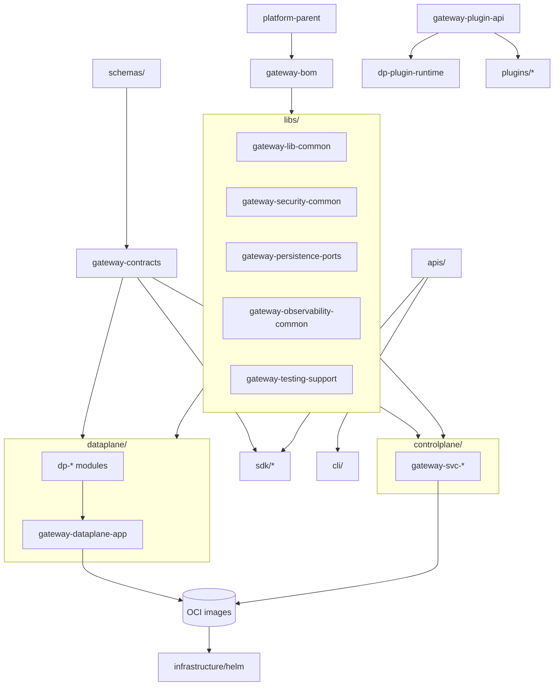
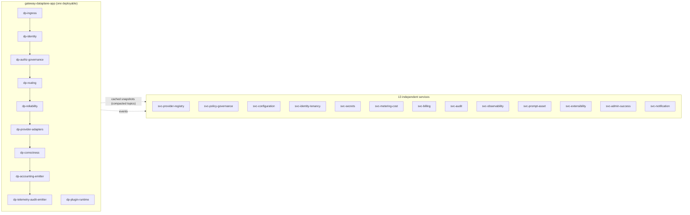
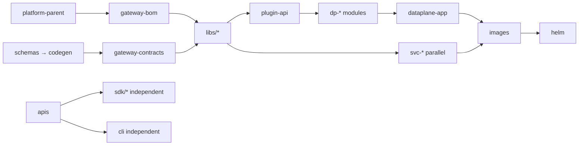
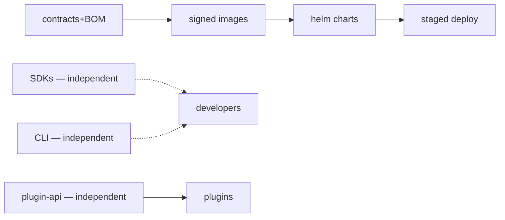

# 10 — Repository Structure

**Document:** Repository Structure & Monorepo Standard
**Project:** Reliability-First AI Gateway
**Status:** **Approved & Frozen (v1.0, 2026-07-20)** — **binding repository standard**
**Finalized before freeze:** permanent package namespace `io.reliabilityai.gateway` applied consistently (§9); `09` TDOQ-3 resolved — schema/contract format standard (§7); Repository Governance section (§16). Frozen after the §22 consistency review passed with no contradictions.
**Audience:** All Engineering, Platform, Release Engineering, SRE, Security, Developer Experience
**Classification:** Internal — Engineering Standard
**Builds on (approved, frozen):** `00`–`09` and ADRs **AD-001…AD-023** (esp. AD-002 ports, AD-006/020 data plane, AD-015 versioning, AD-023 Java 21 + Spring Boot). Nothing here may contradict them.

> **Authority & scope.** This document defines the **permanent repository structure**: the directory layout, the Maven multi-module topology, module boundaries, package/artifact naming, versioning, build/release/CI order, governance, evolution, and migration. It must support 100+ engineers across multiple product teams for a 10-year horizon, with independent SDK releases, Kubernetes/on-prem/SaaS/multi-region deployment, and future plugins and commercial editions. It contains **no application code** — only structure, rules, and governance. Technologies are fixed by `09`/AD-023: **Java 21, Spring Boot, Spring Cloud Gateway, Maven, PostgreSQL, MongoDB, Valkey, Kafka, OpenTelemetry, Micrometer, Docker, Kubernetes, Terraform, GitHub Actions.**

---

## Table of Contents
1. Executive Summary
2. Purpose & Scope
3. Constraints from the Frozen Documents
4. Repository Organization — Three Approaches Compared (and the Decision)
5. Complete Directory Tree
6. Top-Level Directory Specifications
7. Maven Multi-Module Structure (Parent POM, BOM, Dependency Management)
8. Module Boundaries & the Modular Monolith
9. Package & Artifact Naming
10. Version Strategy
11. Dependency Graph
12. Module Graph
13. Build Graph & Build Order
14. Release Graph & Release Order
15. CI/CD Pipeline Order
16. Repository Governance Rules
17. Repository Evolution Strategy
18. Migration Strategy (split-to-repo & open-core)
19. Anti-Patterns
20. Scalability Bottlenecks (Self-Challenge)
21. Review Checklist & Repository Readiness Checklist
22. Internal Consistency Review
23. Traceability
24. Appendix

---

## 1. Executive Summary

The repository is a **single platform monorepo** — one Git repository containing the backend (a Maven multi-module JVM platform realizing the modular-monolith Data Plane and the thirteen independent Control-Plane services from `06`), the admin frontend, multi-language client SDKs, the CLI, first-party plugins and the plugin SDK, API specifications and canonical schemas, infrastructure-as-code (Helm/Docker/Terraform), the full test and benchmark suites, security artifacts, documentation, the ADR register, and research.

We compared **three organization models** — polyrepo, monorepo, and hybrid (§4) — and selected **monorepo with independent release trains, plus an open-core escape hatch.** The decisive factor is `06`/AD-020: the Data Plane is a **single deployable modular monolith owned by many teams**, which is inherently one build and cannot be a polyrepo; a monorepo also gives atomic cross-cutting changes, one source of truth for shared contracts/schemas, and unified tooling — while **independent release trains** preserve the required independent SDK/CLI/plugin release cadences, and an **open-core split** cleanly supports future commercial editions.

The design honors the frozen architecture directly: modules map 1:1 to `06` bounded contexts and services; the Data-Plane in-process modules (`06 §10`) are Maven modules composed into one deployable with **enforced, non-bypassable boundaries** (ArchUnit + Maven enforcer + API/impl visibility) that substitute for the network boundaries a microservice would provide; store ownership follows `08 §24`; event schemas live in `schemas/` and generate the shared `gateway-contracts` artifact per `07`; ports (AD-002) keep every technology (`09`) swappable.

The document specifies, for every top-level directory, its Purpose, Ownership, Allowed/Forbidden contents, Dependencies, and Naming/Versioning/Build/Testing/Release rules; the Parent POM + BOM + dependency-management scheme; package/artifact naming; the version strategy (a coordinated **platform release train** for the backend + **independent SemVer** for SDKs/CLI/plugin-API/Helm); the dependency/module/build/release graphs; the CI/CD order; governance (CODEOWNERS mapped to the `06` team topology, trunk-based development, merge queue, signed/provenanced artifacts); an evolution and migration strategy (including split-to-repo and open-core); anti-patterns; a self-challenge on scalability bottlenecks at 100+ engineers with concrete mitigations; and review/readiness checklists. It closes with an internal consistency review against `06`/`07`/`08`/`09` and the ADRs.

---

## 2. Purpose & Scope

**Purpose.** Give every engineer an unambiguous answer to: *where does my code live, what may it depend on, how is it named/versioned/built/released, who owns it, and how does the repository grow safely over a decade?*

**In scope.** Repository layout; Maven topology; module boundaries; naming; versioning; build/release/CI order; governance; evolution/migration; anti-patterns; scalability; checklists.

**Out of scope.** Application code; coding style (`11`); API/interface definitions (`12`, `apis/`); concrete pipelines/IaC content (`16`); capacity numbers (`32`). This document defines the *container and rules*, not the contents.

---

## 3. Constraints from the Frozen Documents

- **AD-020 / `06 §10`** — the Data Plane is **one deployable modular monolith**; hot-path stages are **in-process modules**, not network services. → the repo must model in-process modules with enforced boundaries and a single deployable.
- **AD-017 / `06`** — thirteen **independent Control-Plane services**, each store-per-service (`08 §24`). → one Maven module + one deployable per service.
- **AD-002** — everything external is behind a **port**; adapters are swappable. → ports in libs, adapters in modules/services.
- **AD-015 / `03` NFR-VER** — backward compatibility, deprecation windows, independent external-contract lifecycles. → independent SDK/CLI/plugin-API versioning.
- **AD-023 / `09`** — **Java 21 + Spring Boot + Maven**; the full stack. → Maven multi-module; per-language toolchains for non-JVM SDKs/frontend.
- **`07`** — event schemas & contracts (schema registry, topic `.vN`). → `schemas/` is the source; `gateway-contracts` is generated.
- **`08 §24`** — store ownership per service; no shared DB. → module boundaries forbid cross-service store access.
- **AD-016** — reliability-first: proven, boring tooling; strong enforcement. → conservative, well-understood repo tooling with hard boundary enforcement.

---

## 4. Repository Organization — Three Approaches Compared

| Criterion | **A. Polyrepo** (repo per service/SDK) | **B. Monorepo** (single repo) | **C. Hybrid** (monorepo core + split repos) |
|---|---|---|---|
| Data-Plane modular monolith (one deployable, many teams) | ❌ **Impossible** — one deployable can't span repos | ✅ Natural (one build, module boundaries) | ✅ (core in monorepo) |
| Atomic cross-cutting change (contract + producers + consumers) | ❌ Multi-repo choreography, drift | ✅ One PR, atomic | ✅ within core |
| Shared contracts/schemas single source | ❌ Duplicated/published-and-lagged | ✅ One source, generate | ✅ within core |
| Independent SDK release cadence | ✅ Native | ✅ via independent release trains | ✅ split SDK repos |
| Unified tooling / CI / standards | ❌ Duplicated per repo | ✅ One set | ⚠ mostly |
| Build scale at 100+ eng | ✅ Small per-repo builds | ⚠ Needs affected-build + cache + merge queue | ⚠ core needs same |
| Ownership isolation | ✅ Strong (repo = team) | ⚠ Needs CODEOWNERS discipline | ✅/⚠ |
| Commercial editions (open-core) | ⚠ possible | ⚠ needs license gating | ✅ **clean** (private overlay repo) |
| Onboarding / discoverability | ❌ Many repos to find | ✅ One place | ⚠ mostly one place |
| 10-year maintainability | ⚠ tooling drift across repos | ✅ consistent, but scale-managed | ✅ |

**Decision (RD-1): Monorepo with independent release trains, plus an open-core escape hatch.**
- **Monorepo** is *required* because the Data-Plane modular monolith (AD-020) is one deployable across many teams — polyrepo cannot express it — and because atomic cross-cutting contract changes and a single source of truth for schemas are first-order benefits for a reliability-first platform.
- **Independent release trains** (per-artifact tagging/versioning within the monorepo) preserve independent **SDK/CLI/plugin-API** release cadences (the main polyrepo advantage) without the polyrepo cost.
- **Open-core escape hatch:** future **commercial editions** live in a **separate private overlay repository** that consumes the published core artifacts (BOM/images/SDKs) — clean separation of OSS core from commercial add-ons without contaminating the core repo.
- **Split-to-repo migration** (§18) is available if any component's cadence/ownership ever diverges enough to justify its own repo — the monorepo is the default, not a cage.

**Why not pure polyrepo (A):** cannot model the modular monolith; contract drift; duplicated tooling; painful atomic changes. **Why not force-everything-hybrid now (C):** premature splitting adds coordination cost before it's needed; we adopt the monorepo and split *only when evidence demands* (§17–18).

---

## 5. Complete Directory Tree

```text
reliability-first-ai-gateway/                 # monorepo root
├── README.md · LICENSE · SECURITY.md · CONTRIBUTING.md · CODEOWNERS · .gitignore · .gitattributes
├── pom.xml                                   # root aggregator POM (backend reactor entry)
├── .github/                                  # CI/CD, workflows, templates, policies
│   ├── workflows/                            #   build.yml, test.yml, security.yml, release-*.yml, e2e.yml, chaos.yml
│   ├── ISSUE_TEMPLATE/ · PULL_REQUEST_TEMPLATE.md
│   └── dependabot.yml · CODEOWNERS (mirror)
├── docs/                                     # 00–37 numbered docs + docs/modules/ + standards
├── adr/                                      # 000-ADR-Index.md + ADR-001..023 (+ future)
├── research/                                 # competitors, github-analysis, reddit-analysis,
│                                             #   customer-interviews, market-research, benchmarks,
│                                             #   patents, design-notes, experiments
├── backend/                                  # Maven multi-module JVM platform (Java 21 + Spring Boot)
│   ├── pom.xml                               #   backend aggregator
│   ├── platform-parent/                      #   parent POM (java 21, spring boot BOM import, plugin mgmt)
│   ├── bom/                                  #   gateway-bom (internal + curated third-party versions)
│   ├── libs/                                 #   shared libraries (ports, common, security, obs, testing)
│   │   ├── gateway-lib-common/                 #     envelope, correlation, tenant/scope value objects
│   │   ├── gateway-contracts/                  #     GENERATED from schemas/ (events, published language)
│   │   ├── gateway-security-common/            #     zero-trust primitives, crypto/key abstractions (AD-012)
│   │   ├── gateway-persistence-ports/          #     persistence port interfaces (AD-002/AD-010)
│   │   ├── gateway-observability-common/       #     OTel/Micrometer conventions
│   │   └── gateway-testing-support/            #     Testcontainers fixtures, test doubles
│   ├── dataplane/                            #   the ONE deployable modular monolith (AD-020)
│   │   ├── gateway-dataplane-app/              #     assembly/bootstrap → the deployable image
│   │   └── modules/                          #     in-process modules (06 §10), one per hot-path stage
│   │       ├── gateway-dp-ingress/             #       Spring Cloud Gateway ingress, TLS, admission
│   │       ├── gateway-dp-identity/            #       AuthN + tenant-scope resolution (C6/C7)
│   │       ├── gateway-dp-authz-governance/    #       PEP + data-handling/redaction/residency (C4)
│   │       ├── gateway-dp-routing/             #       provider/model routing (C1)
│   │       ├── gateway-dp-reliability/         #       retry/failover/rate-limit/circuit/cache (C2)
│   │       ├── gateway-dp-provider-adapters/   #       provider ACL adapters (AD-007)
│   │       ├── gateway-dp-correctness/         #       structured-output/streaming/tool-call (C3)
│   │       ├── gateway-dp-accounting-emitter/  #       usage measurement/emission (C5)
│   │       ├── gateway-dp-telemetry-audit-emitter/ #   OTel + audit event emission (C9/C10) + WAL (EV-D3)
│   │       └── gateway-dp-plugin-runtime/      #       sandboxed plugin execution (AD-004)
│   ├── controlplane/                         #   independent services (one module → one deployable each)
│   │   ├── gateway-svc-provider-registry/      #     C1 mgmt
│   │   ├── gateway-svc-policy-governance/      #     C4 (PDP)
│   │   ├── gateway-svc-configuration/          #     C15 (co-deployable w/ policy per SB-D1)
│   │   ├── gateway-svc-identity-tenancy/       #     C6+C7
│   │   ├── gateway-svc-secrets/                #     C14
│   │   ├── gateway-svc-metering-cost/          #     C5 mgmt
│   │   ├── gateway-svc-billing/                #     C8
│   │   ├── gateway-svc-audit/                  #     C10
│   │   ├── gateway-svc-observability/          #     C9
│   │   ├── gateway-svc-prompt-asset/           #     C11
│   │   ├── gateway-svc-extensibility/          #     C12
│   │   ├── gateway-svc-admin-success/          #     C13
│   │   └── gateway-svc-notification/           #     C16
│   └── plugin-sdk/
│       └── gateway-plugin-api/                 #   plugin extension-point API (AD-004) — independent version
├── frontend/                                 # admin portal (TypeScript/React, own toolchain)
│   └── admin-portal/
├── sdk/                                      # multi-language client SDKs — INDEPENDENT releases (AD-015)
│   ├── java/          (Maven; gateway-sdk-java)
│   ├── python/        (own build; gateway-sdk-python)
│   ├── typescript/    (own build; @reliabilityai/sdk)
│   └── go/            (own module; gateway-sdk-go)
├── cli/                                      # command-line tool (independent release)
├── plugins/
│   ├── official/                             # first-party plugins (built on gateway-plugin-api)
│   └── marketplace/                          # marketplace metadata/manifests (C12)
├── examples/                                 # example apps per SDK / use case (docs-tested)
├── apis/                                     # API SPECIFICATIONS (interface contracts)
│   ├── dataplane/     (OpenAPI — request contract)
│   ├── controlplane/  (OpenAPI — admin/control contracts)
│   └── events/        (AsyncAPI — Kafka topics, mirrors 06 §23/07)
├── schemas/                                  # CANONICAL event & data schemas (SOURCE of contracts, 07)
│   ├── events/        (Avro/Protobuf/JSON-Schema per topic; generates gateway-contracts)
│   └── config/        (config/policy snapshot schemas, AD-013/022)
├── infrastructure/
│   ├── helm/          (umbrella chart + per-service subcharts)
│   ├── docker/        (Dockerfiles, base images, image policy)
│   └── terraform/     (reusable modules + per-environment stacks)
├── scripts/                                  # dev/build/release/codegen automation
├── testing/                                  # cross-cutting test suites (beyond per-module unit tests)
│   ├── integration/ · e2e/ · performance/ · security/ · chaos/
├── benchmarks/                               # benchmark harness + versioned baselines (NFR calibration)
└── security/                                 # threat models, security policies, scanning config, SBOM policy
```

> **Note on overlaps (deliberate, distinct):** `apis/` = interface *specifications*; `schemas/` = canonical event/data *schemas* (source of generated contracts). `testing/performance` = perf *scenarios/gates*; `benchmarks/` = the perf *harness + baselines*. `testing/security` = security *test suites*; `security/` = security *policy/threat-models/scanning config*. `infrastructure/{helm,docker,terraform}` are specified individually in §6.

---

## 6. Top-Level Directory Specifications

> Per directory: **Purpose · Ownership · Allowed · Forbidden · Dependencies · Naming · Versioning · Build · Testing · Release.** Ownership maps to the `06 §16` team topology via `CODEOWNERS`.

### docs/
- **Purpose:** all numbered documentation (00–37) + `docs/modules/` + standards. **Ownership:** Product/Architecture (per-doc CODEOWNERS). **Allowed:** Markdown, diagrams (Mermaid), doc assets. **Forbidden:** code, secrets, large binaries (→ LFS/asset store). **Dependencies:** none (source of truth). **Naming:** `NN-Title.md`. **Versioning:** in-doc version headers; frozen docs immutable except by superseding. **Build:** docs lint (markdown/link check). **Testing:** link/reference validation in CI. **Release:** versioned with the repo; no separate artifact.

### adr/
- **Purpose:** the ADR register + individual ADRs. **Ownership:** Architecture Council. **Allowed:** `000-ADR-Index.md`, `ADR-0NN-*.md`. **Forbidden:** anything non-ADR. **Dependencies:** none. **Naming:** `ADR-0NN-Kebab-Title.md`; ID `AD-0NN`. **Versioning:** immutable once Accepted; changed only by superseding. **Build:** index-consistency check (every ADR file ↔ index row). **Testing:** cross-reference lint. **Release:** with repo.

### research/
- **Purpose:** market/competitor/customer/benchmark/patent research + design notes/experiments. **Ownership:** Product/Strategy/Research. **Allowed:** research docs, datasets (LFS), notebooks (non-production). **Forbidden:** production code, customer PII (regulated — governed), secrets. **Dependencies:** none. **Naming:** topic-scoped subfolders. **Versioning:** with repo; datasets via LFS/DVC. **Build/Testing:** none (excluded from platform build). **Release:** internal only; never shipped.

### backend/ (Maven multi-module — see §7)
- **Purpose:** the JVM platform (Data Plane monolith + 13 Control-Plane services + shared libs + plugin API). **Ownership:** Platform + stream-aligned teams per module (`06 §16`). **Allowed:** Java 21 Maven modules, Spring Boot apps, `pom.xml`, resources. **Forbidden:** non-JVM builds; cross-module internal imports; cross-service store access (`08`); secrets. **Dependencies:** `libs/` (via `gateway-bom`); no service depends on another service's internals (events/contracts only). **Naming:** §9. **Versioning:** platform release train (§10). **Build:** Maven reactor (§13). **Testing:** unit + slice + module boundary (ArchUnit) + integration (Testcontainers). **Release:** platform train → OCI images (§14).

### frontend/
- **Purpose:** admin portal (C13 UI). **Ownership:** Frontend + Admin/Success. **Allowed:** TypeScript/React app, its own `package.json`/lockfile. **Forbidden:** JVM build; business logic that belongs in services; secrets. **Dependencies:** consumes control-plane APIs (`apis/controlplane`) + SDK (TS). **Naming:** `@reliabilityai/admin-portal`. **Versioning:** independent SemVer (UI cadence). **Build:** Node toolchain (path-filtered CI). **Testing:** unit + component + accessibility (WCAG AA, `03` NFR-A11Y) + e2e. **Release:** independent (static assets/container).

### sdk/
- **Purpose:** multi-language client SDKs (Java/Python/TS/Go). **Ownership:** Developer Experience (Enabling team). **Allowed:** per-language SDK source + build; generated from `apis/`. **Forbidden:** provider-specific logic (neutrality); server business logic; secrets. **Dependencies:** `apis/` (contract) only; not `backend/` internals. **Naming:** `gateway-sdk-java`, `gateway-sdk-python`, `@reliabilityai/sdk`, `gateway-sdk-go`. **Versioning:** **independent SemVer per language** (AD-015 deprecation windows). **Build:** per-language toolchain, path-filtered. **Testing:** contract tests against `apis/`; compat matrix (`03` NFR-SDK). **Release:** **independent release trains** (Maven Central / PyPI / npm / Go module).

### cli/
- **Purpose:** operator/developer CLI. **Ownership:** Developer Experience. **Allowed:** CLI source (Java/native, or Go for a single binary — DX call), build. **Forbidden:** embedding server logic; secrets. **Dependencies:** control-plane/admin APIs + SDK. **Naming:** `gateway-cli`. **Versioning:** independent SemVer. **Build:** own pipeline (native image optional). **Testing:** CLI integration/e2e. **Release:** independent (binaries per OS/arch).

### plugins/
- **Purpose:** first-party plugins (`official/`) + marketplace metadata (`marketplace/`, C12). **Ownership:** Ecosystem (Enabling). **Allowed:** plugins built on `gateway-plugin-api`; manifests. **Forbidden:** plugins that bypass core guarantees (AD-004); privileged access. **Dependencies:** `gateway-plugin-api` only. **Naming:** `gateway-plugin-<name>`. **Versioning:** per-plugin SemVer against a `gateway-plugin-api` version. **Build:** against published plugin API. **Testing:** sandbox/security + additive-only boundary tests (AD-004). **Release:** independent; vetted (C12).

### examples/
- **Purpose:** runnable example apps per SDK/use case. **Ownership:** Developer Experience. **Allowed:** small example projects; docs-tested. **Forbidden:** production credentials; copy-paste of internal code. **Dependencies:** **published** SDKs only (as a real consumer would). **Naming:** `examples/<lang>/<use-case>`. **Versioning:** track SDK versions. **Build:** compiled/tested in CI against published SDKs. **Testing:** examples must build & run (docs-as-tests). **Release:** with docs; not a shipped artifact.

### apis/
- **Purpose:** interface **specifications** — **OpenAPI 3.1** (data-plane request + control-plane) and **AsyncAPI** (events, carrying **Avro** payloads; mirrors `06 §23`/`07`). **Ownership:** Architecture + owning context teams. **Allowed:** OpenAPI 3.1 (REST), AsyncAPI (events). See the Schema & Contract Format Standard (§7). **Forbidden:** implementation; provider-specific surface. **Dependencies:** `schemas/` for payload types. **Naming:** `apis/<plane>/<context>.yaml`. **Versioning:** contract SemVer + AD-015 deprecation; breaking → new major (`/v2`). **Build:** spec lint + backward-compat check (drives SDK/codegen). **Testing:** contract tests (provider/consumer). **Release:** published spec + generated SDK stubs.

### schemas/
- **Purpose:** **canonical** event & data schemas — the *source* of `gateway-contracts` and registry entries (`07 §9`). **Ownership:** owning context teams (event owners per `06 §23`). **Allowed:** **Apache Avro** (Kafka events) + **JSON Schema** (config/policy snapshots) — per the Schema & Contract Format Standard (§7, resolves TDOQ-3). **Forbidden:** hand-written duplicate contract code (generate instead). **Dependencies:** none (source). **Naming:** `schemas/events/<context>/<family>.vN.*`. **Versioning:** per `07 §9` (backward-compatible in-major; breaking → `.vN`). **Build:** codegen → `gateway-contracts`; registry compatibility check. **Testing:** schema-compat CI gate. **Release:** with the platform contracts artifact + registry.

### infrastructure/helm/
- **Purpose:** Kubernetes packaging (umbrella + per-service charts). **Ownership:** Platform/SRE. **Allowed:** Helm charts, values per environment/tier. **Forbidden:** secrets in values (→ external secret refs); baked-in credentials. **Dependencies:** references published OCI images by version. **Naming:** `helm/gateway-<service>` + `helm/gateway-platform` (umbrella). **Versioning:** **independent chart SemVer**, pinning app versions. **Build:** helm lint + template + policy checks. **Testing:** chart install tests (kind/ephemeral). **Release:** charts published to an OCI/Helm registry.

### infrastructure/docker/
- **Purpose:** container build definitions + base images + image policy. **Ownership:** Platform/SRE + Security. **Allowed:** Dockerfiles, hardened base images, distroless/GraalVM-slim variants. **Forbidden:** secrets; unpinned/untrusted base images. **Dependencies:** built backend artifacts. **Naming:** image `reliabilityai/gateway-<artifact>:<version>`. **Versioning:** image tag = platform/artifact version + digest pinning. **Build:** reproducible builds, SBOM, signing (SLSA provenance). **Testing:** container scan (Trivy-class), CVE gate. **Release:** signed images to the registry.

### infrastructure/terraform/
- **Purpose:** IaC (reusable modules + per-environment stacks) for cloud/on-prem/multi-region. **Ownership:** Platform/SRE. **Allowed:** Terraform modules, environment configs. **Forbidden:** **state in the repo**; secrets; hardcoded account ids. **Dependencies:** none on backend build. **Naming:** `terraform/modules/<name>`, `terraform/env/<env>`. **Versioning:** module SemVer; env pins module versions. **Build:** `fmt`/`validate`/plan + policy (OPA/tfsec). **Testing:** plan checks + drift detection. **Release:** applied via CD; state in a remote backend (not VCS).

### scripts/
- **Purpose:** dev/build/release/codegen automation. **Ownership:** Platform/DX. **Allowed:** shell/portable scripts, Make/justfile. **Forbidden:** business logic; secrets; environment-specific hardcoding. **Dependencies:** repo tooling. **Naming:** verb-scoped (`build-*`, `release-*`, `gen-*`). **Versioning:** with repo. **Build/Testing:** shellcheck; scripts tested in CI. **Release:** none.

### testing/
- **Purpose:** cross-cutting suites beyond per-module unit tests: `integration/ e2e/ performance/ security/ chaos/` (maps to `03 §50–55`). **Ownership:** QA/SRE/Security + owning teams. **Allowed:** test suites, harnesses, fixtures. **Forbidden:** production data/PII; secrets. **Dependencies:** built artifacts + `gateway-testing-support`. **Naming:** `testing/<kind>/<area>`. **Versioning:** with platform. **Build:** run per CI stage (§15). **Testing:** these *are* tests. **Release:** none (gates, not artifacts).

### benchmarks/
- **Purpose:** performance benchmark harness + **versioned baselines** (NFR calibration, `03`/`32`). **Ownership:** Performance/SRE. **Allowed:** benchmark harness (JMH-class), baseline results, load profiles. **Forbidden:** ad-hoc perf hacks in product code. **Dependencies:** built artifacts. **Naming:** `benchmarks/<scenario>`. **Versioning:** baselines versioned per platform release. **Build:** run on schedule/nightly (not per-PR). **Testing:** regression vs baseline gates. **Release:** internal reports feeding `32`.

### security/
- **Purpose:** threat models, security policies, scanning config, SBOM policy, dependency/licensing policy (`09` posture). **Ownership:** Security. **Allowed:** threat models, policy-as-code, scanner config, SECURITY.md. **Forbidden:** secrets, exploit payloads against third parties. **Dependencies:** none. **Naming:** topic-scoped. **Versioning:** with repo. **Build:** policy checks wired into CI (`security.yml`). **Testing:** security policy tests. **Release:** none.

### .github/
- **Purpose:** CI/CD workflows, templates, dependabot, CODEOWNERS mirror. **Ownership:** Platform/Release Engineering. **Allowed:** GitHub Actions workflows, templates, policy. **Forbidden:** secrets (use GitHub Secrets/OIDC); self-modifying privileged workflows without review. **Dependencies:** all (orchestrates). **Naming:** `workflows/<stage>.yml`. **Versioning:** with repo; pinned action SHAs. **Build:** workflow lint. **Testing:** pipeline dry-runs. **Release:** n/a.

---

## 7. Maven Multi-Module Structure (Parent POM, BOM, Dependency Management)

- **Root aggregator (`/pom.xml`)** — reactor entry for `backend/` (frontend/SDK-non-JVM/CLI build outside Maven).
- **`platform-parent/` (Parent POM)** — the single parent for all backend modules: pins **Java 21**, imports the **Spring Boot dependency BOM**, configures build plugins (compiler, Spring Boot, Surefire/Failsafe, JaCoCo, ArchUnit, Enforcer, SpotBugs, checkstyle, SBOM/CycloneDX, container/Jib). All modules `<parent>` this.
- **`bom/` (`gateway-bom`)** — the **internal + curated third-party dependency-management BOM**: declares versions for all `gateway-*` modules and approved third-party libraries (Kafka client, Postgres/Mongo/Valkey drivers, OTel/Micrometer, etc., per `09`). Consumers (services, SDK-java, plugins) import this BOM so versions are managed centrally, never hardcoded per module.
- **`libs/`** — shared, focused libraries (no god-lib): `gateway-lib-common`, `gateway-contracts` (generated from `schemas/`), `gateway-security-common`, `gateway-persistence-ports`, `gateway-observability-common`, `gateway-testing-support`.
- **`dataplane/`** — `gateway-dataplane-app` (the single deployable) aggregates the `dp-*` **modules** via compile dependencies; modules expose **API packages** and hide `internal` packages (enforced by ArchUnit + Maven, §8).
- **`controlplane/`** — one `gateway-svc-*` module per service, each a Spring Boot application producing its own image and owning its own store (`08`).
- **`plugin-sdk/gateway-plugin-api`** — the stable plugin extension API, independently versioned.

**Dependency-management rules:** modules declare dependencies **without versions** (managed by `gateway-bom` + Spring BOM); the Enforcer plugin **bans** unmanaged versions, duplicate/conflicting deps, and disallowed licenses (`09` posture). Third-party additions require a BOM change (reviewed by Platform + Security).

---

### Schema & Contract Format Standard (resolves `09` TDOQ-3)

Formats are **fixed** as follows; `schemas/` and `apis/` conform, and `gateway-contracts` is generated from them:

| Surface | Format | Tooling | Why this format |
|---|---|---|---|
| **Kafka events** (`06 §23`, `07`) | **Apache Avro** | **Apicurio** registry (TD-008) | Compact binary encoding + **registry-enforced schema evolution** (backward/forward compatibility) — exactly what `07 §9` requires for zero-loss, versioned, high-throughput ZL streams; native Kafka + Apicurio integration; smallest wire footprint for the highest-volume path. |
| **REST APIs** (data-plane request contract, control-plane admin) | **OpenAPI 3.1 + JSON Schema** | OpenAPI toolchain | OpenAPI 3.1 is the HTTP-contract standard and is **fully JSON-Schema-aligned** (3.1 adopts JSON Schema 2020-12), giving one type system across REST payloads; drives SDK codegen (`sdk/`), contract tests, and docs. |
| **AI structured output** (schema-constrained model output, `03` NFR-SO, C3) | **JSON Schema** | JSON Schema validators | The lingua franca for constraining/validating LLM structured output; provider-neutral; **shares the OpenAPI 3.1 type system**, so declared output schemas and API schemas use one type model — enabling end-to-end validation. |
| **Config/policy snapshots** (AD-013/022) | **JSON Schema** | validators | Consistent with the JSON-Schema type system; human-readable, versionable config contracts. |

**Why the split (not one format everywhere):** Avro is optimal on the **binary, high-throughput, evolution-critical event backbone** but poor for human-facing REST/AI-output contracts; JSON Schema / OpenAPI 3.1 is optimal for **HTTP APIs and LLM structured-output validation** but heavier on the wire for millions of events/day. **Avro for events + JSON Schema/OpenAPI 3.1 for REST & AI output** is right-tool-per-surface, and OpenAPI 3.1's adoption of JSON Schema 2020-12 yields a **single shared type system** across the non-event surfaces. All are open standards (no lock-in) and align with TD-008 (Apicurio, Apache-2.0). **This resolves `09` TDOQ-3.**

---

## 8. Module Boundaries & the Modular Monolith

The Data Plane is **one deployable** (`gateway-dataplane-app`) composed of in-process modules (`06 §10`). Because there is no network boundary, boundaries are **enforced structurally**:

- **API/impl separation per module:** each `dp-*` module exposes a small **`api` package** (its published in-process contract) and keeps everything else in **`internal`** packages. Other modules may depend **only** on `api`.
- **ArchUnit tests (compile-gated):** forbid (a) any import of another module's `internal` packages; (b) any cross-service store access (`08`); (c) any import that bypasses a port (AD-002); (d) any dependency cycle among modules. These run in CI and **fail the build** on violation — the structural substitute for network isolation (`06 §10`, AD-020).
- **Maven module visibility:** `dp-*` modules depend on `libs/` and (narrowly) on sibling `api` artifacts only; the Enforcer bans undeclared/forbidden dependencies.
- **Control-plane services** may depend on `libs/` and `gateway-contracts` but **never** on another service's module or store — integration is via events/published-language only (`06`/`07`/`08`).
- **Ownership:** each module has a CODEOWNERS entry mapping to its `06 §16` stream-aligned team; the Platform team owns `gateway-dataplane-app` (assembly) and the Tier-0 release train.

This makes the modular monolith **modular by enforcement**, not by convention — the key to AD-020 not decaying into a big ball of mud over 10 years.

---

## 9. Package & Artifact Naming

- **Base package:** `io.reliabilityai.gateway` (the permanent, fixed package namespace). Structure: `io.reliabilityai.gateway.<area>.<context>[.api|.internal]`, e.g. `io.reliabilityai.gateway.dataplane.correctness.api`, `io.reliabilityai.gateway.controlplane.billing.internal`, `io.reliabilityai.gateway.lib.common`.
- **Maven coordinates:** `groupId = io.reliabilityai.gateway`; `artifactId` = `gateway-<layer>-<name>`:
  - Libs: `gateway-lib-common`, `gateway-contracts`, `gateway-security-common`, `gateway-persistence-ports`, `gateway-observability-common`, `gateway-testing-support`.
  - Data-plane modules: `gateway-dp-<stage>` (e.g., `gateway-dp-correctness`); app: `gateway-dataplane-app`.
  - Services: `gateway-svc-<context>` (e.g., `gateway-svc-billing`).
  - Plugin API: `gateway-plugin-api`; plugins: `gateway-plugin-<name>`.
  - SDKs: `gateway-sdk-java`, `gateway-sdk-python`, `@reliabilityai/sdk`, `gateway-sdk-go`; CLI: `gateway-cli`.
- **Container images:** `reliabilityai/gateway-<artifact>:<version>@<digest>` (e.g., `reliabilityai/gateway-dataplane`, `reliabilityai/gateway-svc-billing`).
- **Helm charts:** `gateway-platform` (umbrella), `gateway-<service>` (subcharts).
- **Rule:** names are stable and unique; renames are breaking changes (AD-015) requiring deprecation.

---

## 10. Version Strategy

- **Platform release train (backend):** the Data Plane + 13 services + libs are versioned and released **together as a coordinated platform version** (SemVer `MAJOR.MINOR.PATCH`, e.g., `1.4.2`). Services remain **independently deployable** within a compatible platform version, but are **built/tested/released as one train** so cross-service compatibility is guaranteed and customers reason about **one platform version**. *(Self-challenge: fully-independent per-service versioning maximizes team autonomy but multiplies the compatibility matrix (13² pairwise) — untenable for a reliability-first platform; the train is the deliberate, simpler choice, with the split-to-repo escape hatch (§18) if a service ever needs its own cadence.)*
- **Independently-versioned artifacts (own SemVer + cadence):** each **SDK** (per language), **CLI**, **`gateway-plugin-api`**, **Helm charts**, and **Terraform modules** — these are external-facing contracts with AD-015 deprecation windows and must not be gated on the platform train.
- **`gateway-bom`** pins the compatible set (internal + third-party) for a platform version; SDKs/plugins import it.
- **Contracts/schemas:** versioned per `07 §9` (backward-compatible in-major; breaking → new topic/contract version) — decoupled from but tracked by the platform version.
- **Tags:** platform tags `vX.Y.Z`; artifact tags `sdk-java-vX.Y.Z`, `cli-vX.Y.Z`, `plugin-api-vX.Y.Z`, `helm-<svc>-vX.Y.Z` (independent release trains within the monorepo).

---

## 11. Dependency Graph



**Rules:** dependencies point **inward/toward libs+contracts**; no service→service, no module→another module's `internal`, no cycles (§8). SDKs/CLI depend on `apis/` (contracts), never on backend internals.

---

## 12. Module Graph



Modules ↔ `06` contexts are 1:1 (see §23 traceability). The data-plane modules are ordered as the pipeline (`06 §16`) but coupled only via each other's `api` packages.

---

## 13. Build Graph & Build Order

**Maven reactor topological order (backend):**
1. `platform-parent` (POM) → 2. `gateway-bom` → 3. `gateway-contracts` (after `schemas/` codegen) → 4. `libs/*` → 5. `gateway-plugin-api` → 6. `dp-*` modules → 7. `gateway-dataplane-app` → 8. `gateway-svc-*` (parallelizable; independent of each other).
**Independent builds (own toolchains, path-filtered CI):** `frontend/`, `sdk/{python,typescript,go}` (`sdk/java` in Maven), `cli/`, `infrastructure/{helm,docker,terraform}`.



**Affected-build rule (scalability):** CI builds **only changed modules + their dependents** (`mvn -pl <changed> -am`) with a **remote build cache**; full reactor runs on `main` and nightly.

---

## 14. Release Graph & Release Order

**Platform release train (coordinated):**
1. Freeze schemas/contracts → publish `gateway-contracts` + registry entries.
2. Publish `gateway-bom` for the platform version.
3. Build & sign **OCI images** (dataplane + svc-*) with SBOM + provenance.
4. Publish **Helm charts** pinning the image versions.
5. Promote through environments (staging → e2e → prod) per `16`.

**Independent release trains (own cadence, gated by AD-015 compat):**
- SDKs (Maven Central / PyPI / npm / Go), CLI (binaries), `gateway-plugin-api`, first-party plugins.



**Rule:** never release an image without its BOM/contracts; never break an SDK/plugin-API without a new major + deprecation window (AD-015).

---

## 15. CI/CD Pipeline Order (`.github/workflows`)

1. **Pre-commit/PR gates:** format/lint (checkstyle, spotless, markdown/spec lint), **ArchUnit module-boundary check**, dependency/license policy (`09`), commit signing.
2. **Compile** (affected modules + dependents).
3. **Unit + slice tests** (Spring slices) + coverage gate (JaCoCo).
4. **Static analysis / security:** SpotBugs, SAST, **SCA + SBOM (CycloneDX)**, secret scanning.
5. **Integration tests** (Testcontainers: PostgreSQL/MongoDB/Valkey/Kafka) — path-filtered.
6. **Package**: build images (Jib/Docker), **container scan** (CVE gate), **sign + SLSA provenance**.
7. **Publish** snapshots/artifacts.
8. **Deploy** to ephemeral/staging (Helm on kind/managed K8s).
9. **E2E tests** (against staging).
10. **Performance** (nightly, vs `benchmarks/` baselines) and **Chaos/DR** (scheduled, `03 §53`) — not per-PR.
11. **Promote/Release** (platform train or independent artifact) with approvals.

**Merge queue** serializes `main` integration; **path filters** run only affected pipelines; **required checks** enforce gates 1–6 before merge.

---

## 16. Repository Governance

Governs how the repository is changed, reviewed, versioned, and released. Enforced by CODEOWNERS, branch protection, CI gates (§15), and policy-as-code.

### 16.1 CODEOWNERS Policy
- Every path maps to exactly one **owning team** per the `06 §16` topology (Core Platform, Security Platform, stream-aligned per context, DX/Ecosystem, SRE, Frontend, Commercial, Customer Success).
- Ownership is authoritative for approval. Cross-cutting paths — `libs/`, `schemas/`, `apis/`, `adr/`, `security/`, `platform-parent/`, `bom/` — require their platform/architecture/security owners.
- A PR spanning multiple owners requires **all** affected owners' approval. CODEOWNERS is itself an owned, reviewed file.

### 16.2 Branch Protection
- `main` is protected: **no direct pushes, no force-push**, linear history via **merge queue**.
- Required to merge: passing CI gates 1–6 (§15), up-to-date branch, all conversations resolved, **signed commits**, signed tags.
- Required reviews: **≥1 CODEOWNER + ≥1 peer**; **≥2 CODEOWNERS** for `libs/`, `schemas/`, `apis/`, `security/`, `adr/`, `bom/`, `platform-parent/`, and any `dp-*` module-boundary change.

### 16.3 Pull Request Requirements
- Small, single-purpose PRs; **Conventional Commits**; linked issue/ADR where applicable.
- Must pass: format/lint, **ArchUnit boundary checks**, unit+slice tests + coverage gate, SAST/SCA/**SBOM**, secret + **license scans** (`09` posture — no SSPL/BSL/AGPL on distributed components without review).
- Structure-review checklist (§21) satisfied; **no secrets, no committed generated code, no large binaries** (LFS), **no unmanaged dependency versions** (`gateway-bom`).
- Breaking changes follow §16.8.

### 16.4 ADR Requirements
- A **new ADR is required** for any decision that changes an architectural boundary, alters a technology selection, changes the Data-Plane co-location boundary (`06` AOQ-1), introduces a cross-cutting pattern, or strengthens/affects an invariant.
- ADRs follow the register format (`adr/000-ADR-Index.md`), are approved by the **Architecture Council**, and are **immutable once Accepted** (changed only by a superseding ADR).
- A PR implementing an ADR references its ID; a PR that **contradicts an Accepted ADR is blocked** until a superseding ADR is Accepted.

### 16.5 API Compatibility Rules
- **Events (Avro/Apicurio):** backward/forward-compatible within a major, enforced by the **registry compatibility gate** (`07 §9`); breaking → new topic `.vN` + dual-publish (§14).
- **REST (OpenAPI 3.1):** additive/backward-compatible within a major, enforced by a **spec-diff compatibility check** in CI; breaking → new major path (`/v2`).
- **SDK / `gateway-plugin-api`:** semantic-version-gated; breaking → new major + deprecation window (§16.9).
- All compatibility gates are **build-failing** (`03` NFR-VER/IF, AD-015).

### 16.6 Semantic Versioning
- External artifacts (SDKs, CLI, `gateway-plugin-api`, Helm charts, Terraform modules) use **SemVer** `MAJOR.MINOR.PATCH` on **independent trains** (§10); the **platform** uses SemVer as a coordinated train.
- **MAJOR** = breaking; **MINOR** = additive/backward-compatible; **PATCH** = fixes. **No breaking change without a MAJOR bump.** Pre-1.0 artifacts still respect breaking-change signaling.

### 16.7 Module Ownership
- Each Maven module (`dp-*`, `gateway-svc-*`, `libs/*`), SDK, and plugin has **exactly one owning team** (CODEOWNERS).
- Owners are accountable for the module's **boundaries (ArchUnit), tests, versioning conformance, and on-call**.
- **Core Platform** owns `gateway-dataplane-app` (assembly) and the Tier-0 release train; stream-aligned teams own their `dp-*` modules as internal libraries (`06 §10`).

### 16.8 Breaking Change Policy
- A breaking change (contract/API/schema/behavior) requires: (a) a **MAJOR** bump on the affected artifact; (b) an **ADR** if it changes an architectural boundary; (c) a **migration guide**; (d) a **deprecation period** on the old major (§16.9); (e) owner + architecture (+ security if relevant) approval.
- **Invariants may never be broken.** Tenant isolation, no-silent-delivery, audit integrity, non-exposure, residency, and no-bypass (`03` App. D; AD-016/018/021) are absolute — **no version bump legitimizes weakening an invariant.**

### 16.9 Deprecation Lifecycle
- **Announce → Deprecate → Sunset.** A deprecated contract/API/SDK-major is marked with a documented **sunset date**, honoring support windows of **≥ 12 months (Enterprise) / ≥ 6 months (Business)** (AD-015).
- During the window, deprecated and successor versions run **concurrently** (multiple supported majors); migration guidance is published; **usage telemetry tracks migration**.
- Removal only **after** the window and when telemetry shows migration complete (or per contractual terms).

### 16.10 Release Approval Workflow
- **Platform train:** RC cut → CI gates 1–11 pass (incl. e2e; nightly perf/chaos green) → **Release Manager + Platform lead approval** → sign + SBOM + provenance → **staged promotion** (staging → prod) with change-freeze/rollback plan (`16`/`29`).
- **Independent artifacts (SDK/CLI/plugin/Helm):** owner approval + compatibility gate + SemVer check → publish to the respective registry.
- **Regulated/tiered releases:** additional **compliance sign-off** where required (`03` COMP).
- Every release produces an **immutable release record** + SBOM + provenance.

### 16.11 Additional Standing Rules
- **Boundary enforcement:** ArchUnit + Maven Enforcer gate module/service/store boundaries (§8) — build-failing.
- **Dependency/licensing governance:** additions go through `gateway-bom` + Security review (`09` licensing posture).
- **Supply-chain security:** pinned action SHAs, SBOM per artifact, artifact signing + provenance, secret scanning, Dependabot.
- **Frozen-doc rule:** `docs/` frozen documents and `adr/` Accepted ADRs are immutable except by superseding.
- **Codegen rule:** generated code (contracts, SDK stubs) is **generated at build**, not committed (except a published surface explicitly marked).
- **Trunk-based development:** short-lived branches, small PRs, feature flags; no long-lived forks.

---

## 17. Repository Evolution Strategy

- **Default:** grow **within** the monorepo — new services/modules/plugins/SDsK are added under the existing structure with their CODEOWNERS and pipelines.
- **Add a Control-Plane service:** new `gateway-svc-*` module + store (`08`) + Helm subchart + CODEOWNERS + events in `schemas/`/`06 §23` first.
- **Add a Data-Plane module:** new `dp-*` module with `api`/`internal` split + ArchUnit boundary + wired into `gateway-dataplane-app` (ADR if it changes the co-location boundary, `06` AOQ-1).
- **Add an SDK language / plugin:** new `sdk/<lang>` or `plugins/<name>` with independent release train.
- **Split trigger (to §18):** split a component to its own repo **only** when (a) its release cadence must diverge materially and durably from the platform train, **or** (b) monorepo build/CI scale exceeds mitigations (§20), **or** (c) ownership/security isolation demands it. Splitting is evidence-driven, not aspirational.
- **Commercial editions:** delivered via **open-core** — a **separate private overlay repo** consuming published core artifacts (BOM/images/SDKs), never by forking or contaminating the core.

---

## 18. Migration Strategy (split-to-repo & open-core)

- **Split a directory to its own repo (if §17 trigger fires):** extract with `git filter-repo` (preserve history); stand up its own CI mirroring the monorepo standards; consume the core via the **published `gateway-bom` + contracts/SDK artifacts** (no source coupling); keep shared **contracts in the core (or a dedicated contracts repo)** as the single source; update CODEOWNERS and release trains. Because dependencies were already **artifact-based** (BOM/contracts), splitting is a packaging change, not a redesign — the monorepo was built to make this cheap.
- **Open-core commercial overlay:** private repo depends on published OSS core artifacts; adds commercial modules/plugins/services behind license gating; released on its own train; never merged into the core.
- **Reversibility:** a split component can be re-absorbed by `git subtree` if the trigger reverses.

---

## 19. Anti-Patterns (MUST NOT)

- **Cross-module `internal` imports** on the Data Plane (bypassing `api`) — breaks AD-020 modularity (ArchUnit-blocked).
- **Service reading another service's code or store** — violates `06`/`08` (integrate via events/contracts).
- **A "shared everything" god-lib** — keep `libs/` focused; no dumping ground.
- **Lockstep-versioning external artifacts** (SDK/CLI/plugin) with the platform — kills independent releases (AD-015).
- **Per-service independent versioning of the platform** — 13² compatibility matrix; use the train (§10).
- **Committed generated code / large binaries** — generate at build; use LFS/artifact store.
- **Terraform state in the repo** — remote backend only.
- **Secrets in the repo** (values, env, IaC) — external secret refs only.
- **Circular module/service dependencies** — enforced-forbidden.
- **Unpinned dependencies / unpinned CI actions** — supply-chain risk.
- **Provider-specific logic in SDKs/core** — violates neutrality (`00`).

---

## 20. Scalability Bottlenecks (Self-Challenge)

Honest interrogation of the monorepo at 100+ engineers, with mitigations:

| Bottleneck | Risk | Mitigation |
|---|---|---|
| **Full-reactor build time** | Slow CI as backend grows | **Affected-module builds** (`-pl -am`), **remote build cache**, parallel `svc-*`, incremental compile; full build only on `main`/nightly |
| **CI throughput / queue** | 100+ eng saturate runners | **Path-filtered workflows**, self-hosted/elastic runners, test sharding, **merge queue** to serialize integration |
| **Merge contention on `main`** | Conflicts, slow merges | Small PRs, trunk-based, merge queue, CODEOWNERS-scoped reviews |
| **Repo size / clone time** | Large history/assets | **Sparse checkout + partial clone**, **Git LFS** for datasets/binaries, prune generated artifacts |
| **Review bottleneck** | CODEOWNERS overload | Per-module owners, tiered review (heavier for `libs`/`schemas`/`security`), automation for routine changes |
| **Data-Plane single deployable, many teams** | Coordination on one artifact | **Enforced module boundaries + contract tests** (§8), independent module testability, platform-owned release train |
| **Cross-cutting contract change breadth** | Large blast-radius PRs | Atomic in monorepo (a strength) + contract-owner approval + compat CI gate |
| **Platform train slows autonomous teams** | Velocity drag | Feature flags + independent deployability within a version; **split-to-repo escape hatch** (§18) if durable divergence |
| **Multi-language toolchains in one repo** | Tooling sprawl | Path-scoped pipelines per language; shared standards; **Bazel considered** and **rejected** (Maven per AD-023; revisit only if build scale demands — recorded as a future option) |

**Verdict:** every bottleneck has a proven mitigation; none is disqualifying. The monorepo scales to the stated org size with disciplined tooling, and the split-to-repo/open-core hatches bound the tail risk.

---

## 21. Review Checklist & Repository Readiness Checklist

**PR / structure review checklist:**
- [ ] Code is in the correct directory/module per §5–6; ownership (CODEOWNERS) correct.
- [ ] No `internal` cross-module imports; no service→service/store coupling (ArchUnit passes).
- [ ] Dependencies managed via `gateway-bom` (no hardcoded versions); license policy passes.
- [ ] Naming (§9) correct; no renames without deprecation.
- [ ] Contracts/schemas changed in `schemas/`/`apis/` first; compat gate passes (`07 §9`, AD-015).
- [ ] Tests at the right level (unit/slice in-module; integration/e2e/perf/security/chaos in `testing/`).
- [ ] No secrets, no committed generated code, no large binaries (LFS if needed).
- [ ] Versioning follows §10 (platform train vs independent artifact).
- [ ] Docs/ADRs updated if a decision changed (frozen docs untouched).

**Repository readiness checklist (before first release):**
- [ ] Parent POM + `gateway-bom` in place; all backend modules inherit/import them.
- [ ] All 13 services + data-plane app build via reactor in correct order (§13).
- [ ] ArchUnit boundary suite green (§8); Enforcer green.
- [ ] CI stages 1–11 wired (§15); merge queue + branch protection on.
- [ ] Independent release trains configured (SDK/CLI/plugin-api/Helm).
- [ ] Image signing + SBOM + provenance; container/CVE gates on.
- [ ] Helm umbrella + per-service charts lint/install-test green.
- [ ] Terraform modules validate; remote state configured (no state in repo).
- [ ] CODEOWNERS maps every path to a `06 §16` team.
- [ ] Consistency review (§22) passed.

---

## 22. Internal Consistency Review

Verification against the frozen documents (no contradictions found):

| Frozen source | Requirement | This document | ✓ |
|---|---|---|---|
| AD-020 / `06 §10` | Data Plane = one deployable, in-process modules | `gateway-dataplane-app` aggregates `dp-*` modules; boundaries enforced (§8) | ✅ |
| AD-017 / `06` | 13 independent CP services, store-per-service | one `gateway-svc-*` per service; no cross-service store access (§6/§8) | ✅ |
| AD-002 | ports/adapters, swappable tech | ports in `libs/`, adapters in modules; boundary-enforced | ✅ |
| AD-023 / `09` | Java 21 + Spring Boot + Maven + stack | Maven multi-module; per-language toolchains for non-JVM (§5/§7) | ✅ |
| AD-015 / `03` NFR-VER | independent external contract lifecycles | independent SDK/CLI/plugin-api/Helm release trains (§10/§14) | ✅ |
| `07 §9` | schema-first contracts, compat | `schemas/` → `gateway-contracts`; compat CI gate (§6/§15) | ✅ |
| `08 §24` | store ownership, no shared DB | forbidden cross-service store access; per-service charts (§6/§8/§19) | ✅ |
| AD-016 | proven, enforced, reliability-first | conservative tooling + hard boundary/security enforcement (§16/§20) | ✅ |
| `06 §16` | team topology ownership | CODEOWNERS maps to teams (§16) | ✅ |
| `00` neutrality | no provider lock-in | no provider logic in SDKs/core; multi-cloud IaC (§6/§19) | ✅ |
| Namespace (this doc) | permanent, consistent package/coords | `io.reliabilityai.gateway` package + groupId; `gateway-*` artifacts; `reliabilityai/gateway-*` images; `@reliabilityai` npm (§9) — applied consistently, 0 placeholders remain | ✅ |
| `09` TDOQ-3 | schema/contract formats fixed | Avro (events/Apicurio) + OpenAPI 3.1/JSON Schema (REST) + JSON Schema (AI output/config) (§7) | ✅ |
| Governance (`06 §16`, AD-015) | ownership, compat, versioning, deprecation, release | Repository Governance §16.1–16.11 (CODEOWNERS, branch protection, PR, ADR, API-compat, SemVer, module ownership, breaking-change, deprecation, release approval) | ✅ |

**No architectural contradictions.** The structure is a faithful, enforceable realization of the frozen architecture. Ready to freeze after your review.

---

## 23. Traceability Matrix

| Repo element | Maps to | Frozen source |
|---|---|---|
| `dp-*` modules | `06` C1–C10 hot-path modules | `06 §10`, AD-020 |
| `gateway-svc-*` | `06` C1/C4–C16 services | `06 §9`, AD-017 |
| `libs/gateway-persistence-ports` | ports (AD-002) | AD-002/AD-010 |
| `schemas/` → `gateway-contracts` | event/data contracts | `07 §9`, `06 §23` |
| `apis/` | interface specs | `12` (upcoming), `07` |
| `infrastructure/helm|docker|terraform` | deployment | `04 §34`, AD deployment, `16` |
| `sdk/*`, `cli/`, `plugin-sdk` | external contracts | AD-015, `06` C12 |
| `plugins/` | extensibility | AD-004, `06` C12 |
| `testing/`, `benchmarks/`, `security/` | verification | `03 §50–55` |
| version strategy | compat/lifecycle | AD-015 |
| governance/CODEOWNERS | ownership | `06 §16` |

---

## 24. Appendix

**A. Decisions recorded here.** RD-1 (monorepo + independent release trains + open-core escape hatch); the platform-train vs per-service-versioning trade-off (§10); Bazel considered-and-deferred (§20, Maven per AD-023).

**B. Base-package namespace.** `io.reliabilityai.gateway` is the **permanent, fixed** package namespace and Maven `groupId`. A rename would be a breaking change (AD-015) and is out of scope. Artifact prefix is `gateway-` (e.g., `gateway-svc-billing`); container images `reliabilityai/gateway-<name>`; npm scope `@reliabilityai`.

**C. Relationship to other documents.** Realizes `06`/`07`/`08`/`09` and the ADRs; feeds `11`–`16` (standards assume this layout), the module docs (`17`–`28`), and operations (`29`–`33`). Does not modify frozen documents.

**D. Maintenance.** Living document until frozen on review. New directories/modules follow §6/§17 with a traceability entry (§23). Monorepo-with-release-trains, enforced module boundaries, store-per-service, and independent external-artifact versioning are stable rules; changing them requires revisiting the frozen documents.

---

*End of document — 10-Repository-Structure.md*
